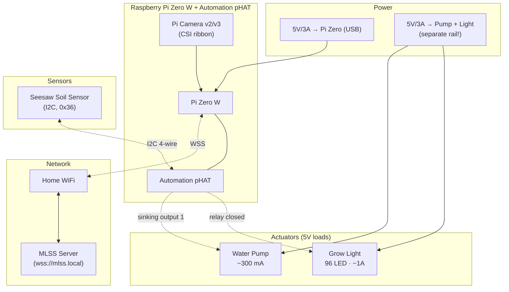

# Plant Grow Unit — Hardware & Wiring

> Each remote **Plant Grow Unit** runs on a Raspberry Pi Zero W with a Pimoroni Automation pHAT, an Adafruit STEMMA soil sensor, a 5V water pump, a 5V grow light, and a Pi camera. Units phone home to the main MLSS over an authenticated WebSocket. This document covers everything you need to wire one up; the system architecture, software, and configuration live in the [design spec](superpowers/specs/2026-05-03-plant-grow-unit-system-design.md).

## Table of contents

- [Bill of Materials](#bill-of-materials)
- [Block diagram](#block-diagram)
- [Pi Zero + Automation pHAT terminal map](#pi-zero--automation-phat-terminal-map)
- [Wiring — Soil sensor (Adafruit Seesaw, I2C)](#wiring--soil-sensor-adafruit-seesaw-i2c)
- [Wiring — Grow light (96 LED, 5V, on relay)](#wiring--grow-light-96-led-5v-on-relay)
- [Wiring — Water pump (5V, on sinking output)](#wiring--water-pump-5v-on-sinking-output)
- [Wiring — Pi camera](#wiring--pi-camera)
- [Power](#power)
- [Assembly checklist](#assembly-checklist)
- [First-light bench test](#first-light-bench-test)
- [Future-proofing & spare capacity](#future-proofing--spare-capacity)
- [Notes & known gotchas](#notes--known-gotchas)

---

## Bill of Materials

| # | Item | Qty | Notes |
|---|---|---|---|
| 1 | Raspberry Pi Zero W (or Zero 2 W) | 1 | Pi Zero 2 W preferred — quad-core, much smoother for picamera2. The Zero W (single core ARMv6) works but is slow. |
| 2 | microSD card, 16 GB+, A1 class | 1 | For the OS only; images/data go back to the MLSS server. |
| 3 | Pimoroni Automation pHAT | 1 | **Discontinued** — if you don't already have one, see [alternatives](#future-proofing--spare-capacity). 1× relay + 3× sinking outputs + 3× ADC + 3× buffered inputs. |
| 4 | Adafruit STEMMA Soil Sensor (Seesaw) | 1 | I2C capacitive moisture + temperature. Default I2C address `0x36`. 4-pin JST PH cable included. |
| 5 | 5V DC water pump (small hobby diaphragm or peristaltic) | 1 | Target ≤ 500 mA stall current. Examples: Pimoroni mini pump, generic submersible 5V hobby pumps. |
| 6 | 5V LED grow light, 96 LED, USB-powered | 1 | The cable will be cut and wired direct (USB connector removed). Approx 300 mA – 1 A draw. |
| 7 | Raspberry Pi Camera Module v2 or v3 | 1 | Connect to the Pi Zero's CSI port via the **Zero-specific narrower ribbon cable** (15-pin to 22-pin) — this is **not** the cable that ships with the camera. |
| 8 | 5V/3A USB-C or microUSB power supply | 1 | Powers the Pi. |
| 9 | Separate 5V/3A power supply for actuators | 1 | Drives pump + grow light. **Don't try to power them from the Pi's 5V rail** — the Pi will brown out under inrush. |
| 10 | Flyback diode (1N4007 or similar) | 1 | Across the pump terminals — protects the relay from inductive spike on switch-off. |
| 11 | Hookup wire (22 AWG), heatshrink, screwdriver | as needed | The Automation pHAT terminals are screw-down. |
| 12 | Project enclosure / 3D-printed mount | 1 | Optional for prototype, recommended for production. Camera + light + pot want a fixed geometry. |

---

## Block diagram



---

## Pi Zero + Automation pHAT terminal map

The Automation pHAT mounts on the Pi Zero's 40-pin GPIO header. It exposes screw-terminal blocks for all I/O — you wire your components to these terminals, never directly to the Pi. The `automationhat` Python library abstracts the underlying GPIO, so you write `automationhat.relay.one.on()` rather than juggling pin numbers.

### Terminal blocks on the pHAT

| Block | Channels | Function | Used by this project |
|---|---|---|---|
| **RELAY** | 1× | NC / COM / NO terminals — switches a load on a separate power rail | **Grow light** |
| **OUT 1, 2, 3** | 3× | Open-collector sinking outputs, 24V tolerant, ~500 mA each | **OUT 1 → Pump** (OUT 2, 3 spare for future) |
| **IN 1, 2, 3** | 3× | Buffered digital inputs, 24V tolerant. Low ≤1V, high 3-24V | Spare (future float switch?) |
| **ADC 1, 2, 3** | 3× | Analog inputs 0–24V, 12-bit | Spare (future ambient light divider?) |
| **+5V, GND** | several | Reference rails — **do not source significant current from these** | I2C only |

### What the pHAT uses electrically

- **I2C bus** (GPIO 2/3) — used by the pHAT's onboard ADC and shared with the Seesaw soil sensor on the same bus
- **Various GPIO pins** for relay + outputs + inputs — abstracted by the `automationhat` library, no need to remember
- **No conflict with the camera** — CSI is a separate connector

> **Library reference:** [github.com/pimoroni/automation-hat](https://github.com/pimoroni/automation-hat). The same library handles both the full Automation HAT and the pHAT — code that uses `relay.one` and `output.one` works on either.

---

## Wiring — Soil sensor (Adafruit Seesaw, I2C)

The Seesaw soil sensor uses I2C and shares the bus with the pHAT's onboard ADC. Default I2C address `0x36`; selectable to `0x37`, `0x38`, or `0x39` via solder jumpers if you ever want multiple Seesaws on one Pi (we don't, for one-plant-per-unit, but useful to know).

### Wiring table

| Seesaw pin | Wire colour (ships pre-fitted JST PH) | Connect to | Function |
|---|---|---|---|
| **GND** | Black | pHAT **GND** terminal | Ground |
| **VIN** | Red | pHAT **+5V** terminal | Power (Seesaw accepts 3-5 V) |
| **SDA** | Blue / White | Pi **GPIO 2 (pin 3)** — accessible on pHAT solder pad or via I2C breakout | I2C data |
| **SCL** | Yellow / Green | Pi **GPIO 3 (pin 5)** — accessible on pHAT solder pad or via I2C breakout | I2C clock |

> **Practical note:** the Automation pHAT terminal blocks don't expose I2C SDA/SCL on screw terminals — they're on Pi pins 3 and 5 (GPIO 2 and 3). Easiest options:
> - Cut the JST connector off and solder the SDA/SCL wires to the Pi's GPIO 2/3 header pins (the pHAT passes them through)
> - Or use a small I2C breakout board piggybacked on the GPIO header
> - Or splice into a Pimoroni Breakout Garden / Adafruit STEMMA QT cable if you have one
>
> Whichever route, **keep the I2C cable short** (< 30 cm) — long unshielded I2C is unreliable.

### Confirming the sensor

Once wired up and the Pi booted with I2C enabled:

```bash
sudo apt install -y i2c-tools
sudo i2cdetect -y 1
```

You should see `36` in the address grid. If you don't, check polarity (red/black are easy to swap on cut JST) and verify I2C is enabled in `raspi-config → Interface Options → I2C`.

---

## Wiring — Grow light (96 LED, 5V, on relay)

The grow light is USB-powered (5V) but the USB connector is cut off and the bare wires are wired into the relay. The relay handles the higher current (96 LEDs ≈ 0.5–1 A peak) cleanly.

### Step 1 — identify the wires after cutting

After cutting the USB connector, you'll typically have:
- **Red** = 5V power
- **Black** = ground
- (USB data wires — green and white — are unused; trim them off)

If the cable colours are non-standard, **measure with a multimeter before connecting**: with the USB plug intact and powered, identify which wires read 5V vs. ground.

### Step 2 — wire through the relay

The relay switches the **5V supply line**, not the ground. Ground returns directly to the actuator PSU.

| Wire | Connect to | Notes |
|---|---|---|
| Light **Red (+5V)** | pHAT **RELAY → COM** terminal | Common contact |
| pHAT **RELAY → NO** terminal | Actuator PSU **+5V** | Closed when relay energised → light on |
| Light **Black (GND)** | Actuator PSU **GND** | Direct, no switching |

> **Why NO (Normally Open) and not NC:** when the Pi is off or the service crashes, NO leaves the light **off**. Failsafe-to-dark is the right default — leaving a grow light on indefinitely cooks the plant.

### Step 3 — verify rating

The pHAT's relay is rated for up to **2 A**. The grow light at 96 LEDs nominally draws 300 mA – 1 A. **Recommended:** before final assembly, plug the light into a USB power meter and note the steady-state draw and the inrush spike at switch-on. If steady is > 1.5 A or inrush > 2.5 A, add an inrush-limiting NTC thermistor in series with COM to protect the relay contacts.

---

## Wiring — Water pump (5V, on sinking output)

The pump runs from the actuator PSU's 5V rail; OUT 1 (a sinking output, i.e. open-collector transistor) provides the path to ground when activated. Sinking outputs are well-suited to small DC motor loads.

### Wiring table

| Wire | Connect to | Notes |
|---|---|---|
| Pump **Red (+5V)** | Actuator PSU **+5V** | Direct |
| Pump **Black (GND)** | pHAT **OUT 1** terminal | Sinking output pulls this to GND when on |
| **Flyback diode (1N4007 or similar)** | Cathode (banded end) → Pump red wire; Anode → Pump black wire | **Mandatory** — protects OUT 1 from the inductive back-EMF spike when the pump motor switches off |

```
            +5V (PSU)
              │
              ├─── Pump (+) ───┐
              │                │
              │            (motor)
              │                │
              │      ┌── Pump (─) ──── pHAT OUT 1
              │      │                  (transistor → GND when on)
              │     ─┤
              └─────┤◄│  flyback diode (cathode marked stripe)
                    └─
```

> **Why the flyback diode matters:** when the pump's motor switches off, the collapsing magnetic field generates a brief reverse voltage spike (often 30-100 V on a 5 V motor) that can fry the pHAT's switching transistor. The flyback diode shorts that spike harmlessly.

### Verify the pump rating

Sinking outputs on the pHAT can handle ~500 mA continuous. Most small 5 V hobby pumps draw 100–400 mA running and 400–800 mA at startup. Measure your specific pump:

```bash
# With pump wired but the output not energised yet
# Use a multimeter inline on the pump red wire to read current as you trigger via:
python3 -c "import automationhat; automationhat.output.one.on(); import time; time.sleep(1); automationhat.output.one.off()"
```

If your pump exceeds 500 mA continuous, you'll need to drive it via a small external relay or MOSFET module instead of OUT 1 directly.

---

## Wiring — Pi camera

The Pi camera connects via the CSI ribbon to the Pi Zero's smaller-than-standard camera connector.

| Connector | Cable | Notes |
|---|---|---|
| Pi Camera Module (v2 or v3) | **Zero-specific 22-pin to 15-pin ribbon** | The thin cable shipped with most cameras is for full-size Pis; the Zero needs the narrower one. Sold separately. |
| Pi Zero CSI port | (other end of the same cable) | Lift the small black retaining clip on the connector, slide the cable in with **the silver contacts facing the PCB**, push the clip back down. |

After booting, enable the camera in `raspi-config → Interface Options → Camera`, then verify:

```bash
libcamera-hello -t 2000           # 2-second preview window
libcamera-jpeg -o test.jpg        # capture single frame
```

> **Mounting:** for grow-unit usage, the camera should view the plant area from above or at a slight angle. A 3D-printed bracket holding the camera 20-40 cm above the pot at a 30° angle works well for a single tomato/basil pot. For a microgreens tray, mount the camera centred above the tray. Lock the geometry — if the camera moves between photos, the timelapse is useless.

---

## Power

Power is the most common cause of grief in projects like this. Two rules:

1. **The Pi Zero gets its own 5V/3A supply via USB.**
2. **The pump and grow light get their own separate 5V/3A supply** wired through the actuator side of the relay/sinking outputs. **Do not try to power them from the Pi's 5V GPIO pin** — the inrush will brown out the Pi mid-write and corrupt the SD card.

### Power wiring summary

| Source | Powers | Wire to |
|---|---|---|
| **PSU 1: 5V/3A → microUSB** | Raspberry Pi Zero W | Pi Zero microUSB-PWR socket |
| **PSU 2: 5V/3A → terminal block** | Pump + Grow light | Common +5V terminal on actuator side; both share GND |
| (Optional) **Common ground** between PSU 1 and PSU 2 | — | Tie GND of both PSUs together at the pHAT GND terminal. Keeps signal references aligned. **Do not tie +5V together.** |

### Safety

- Use a fused or polyfuse-protected PSU (most quality ones are)
- Mount the actuator PSU in the enclosure; keep mains separate from the Pi
- Cable-strain-relief everything that leaves the enclosure (water pump tubing especially)
- **Water + mains electricity:** the actuator PSU should be class-II (double-insulated) and ideally on its own RCD/RCBO. Pump tubing should be sized to prevent the pot ever overflowing into the enclosure

---

## Assembly checklist

Before powering on for the first time:

- [ ] Pi Zero W + Automation pHAT seated firmly on GPIO header (40 pins all engaged)
- [ ] Pi camera ribbon: silver contacts facing the PCB, retaining clip closed, no twist
- [ ] Soil sensor cable: red→VIN/+5V, black→GND, no swap
- [ ] Grow light: red→COM, NO→PSU+5V, black→PSU GND, **NO terminal not COM-NC** (failsafe to dark)
- [ ] Pump: red→PSU+5V, black→OUT 1, **flyback diode fitted across pump terminals (cathode to red)**
- [ ] Actuator PSU and Pi PSU **GND tied together** (one wire between them at the pHAT GND terminal)
- [ ] +5V **not** tied between PSUs
- [ ] microSD card flashed with Pi OS Lite, WiFi + SSH preconfigured in Imager advanced options
- [ ] `/boot/mlss-grow.yaml` dropped on SD card boot partition (template in the design spec)
- [ ] I2C enabled in `raspi-config`
- [ ] Camera enabled in `raspi-config`
- [ ] Project enclosure: ventilation slot for Pi heat, separate compartment for pump tubing/water if possible

---

## First-light bench test

Once the unit boots and connects to WiFi, SSH in and run these one at a time. Each should succeed before moving on.

```bash
# 1. I2C bus is alive and Seesaw responds
sudo apt install -y i2c-tools python3-pip
sudo i2cdetect -y 1
# expect: '36' (Seesaw soil sensor)

# 2. Read soil sensor
pip3 install --user adafruit-circuitpython-seesaw
python3 -c "
from board import SCL, SDA
from busio import I2C
from adafruit_seesaw.seesaw import Seesaw
ss = Seesaw(I2C(SCL, SDA), addr=0x36)
print('moisture raw:', ss.moisture_read())
print('temp °C:', round(ss.get_temp(), 2))
"

# 3. Test the relay (light on for 2s, then off)
sudo apt install -y python3-automationhat
python3 -c "
import automationhat, time
automationhat.relay.one.on(); time.sleep(2); automationhat.relay.one.off()
print('Relay test complete — did the grow light flash?')
"

# 4. Test the pump (run 1s)
python3 -c "
import automationhat, time
automationhat.output.one.on(); time.sleep(1); automationhat.output.one.off()
print('Pump test complete — did you hear/see it run?')
"

# 5. Camera capture
libcamera-jpeg -o /tmp/firstlight.jpg
ls -la /tmp/firstlight.jpg
# expect: a JPEG, > 0 bytes
```

If all five pass, the hardware is good. The `mlss-grow` software install (covered in the design spec) is the next step.

---

## Future-proofing & spare capacity

After this project's required wiring, the following remain spare on the Automation pHAT:

| Spare resource | Quantity | Possible future use |
|---|---|---|
| Sinking outputs OUT 2, OUT 3 | 2 | Reservoir solenoid valve · cooling fan · misting nozzle |
| Buffered inputs IN 1, IN 2, IN 3 | 3 | Reservoir float-level switches (low / medium / high) |
| ADC inputs 1, 2, 3 | 3 | Ambient light divider · pH probe (with ext. amp) · TDS probe |
| I2C bus | shared | Additional I2C sensors at non-conflicting addresses (AHT20 air T/H = 0x38, TSL2591 lux = 0x29, BMP280 pressure = 0x76, etc.) |

The capability auto-detect on the unit (designed in from day 1 — see the design spec's "Optional sensor capability model" section) means **adding any of these sensors later is plug-and-play**: wire it up, restart the `mlss-grow` service, the dashboard auto-renders a new tile.

### What to do if the Automation pHAT isn't available

The Pimoroni Automation pHAT is **discontinued** as of late 2024. If you're starting fresh, sensible alternatives that fit a Pi Zero form factor:

| Alternative | Relays | Outputs | Notes |
|---|---|---|---|
| Pimoroni Inventor HAT Mini | 0 | 4× motor drivers | Better for pump (PWM control) but no relay; needs external relay for grow light |
| Waveshare RPi Relay Board (B) | 3 | 0 | Three relays only; no analog/digital inputs; would also need a separate I2C breakout for soil sensor |
| Generic 1-channel 5V relay module + DIY transistor for pump | 1 | DIY | Cheapest; most assembly work; no I2C/ADC integration |
| Sourcing a used Automation pHAT | 1 | 3 | eBay, Reddit /r/raspberry_pi, Pimoroni's outlet — often available second-hand |

The software design abstracts actuators behind an `Actuator` ABC, so swapping the pHAT for a different relay board is a firmware change in `grow_unit/src/mlss_grow/actuators/`, not a system rewrite.

---

## Notes & known gotchas

- **Pi Zero W (BCM2835, single core, ARMv6) is slow** for `picamera2`. Photo capture takes 2–5 seconds; not a problem at a 30-min cadence but don't expect realtime preview. **Pi Zero 2 W (BCM2710, quad core, ARMv7) is 5–10× faster** and worth the extra few pounds.
- **Python wheels on ARMv6 (Zero W)** sometimes need building from source. Use [piwheels.org](https://www.piwheels.org/) as your pip index — `pip install --extra-index-url https://www.piwheels.org/simple ...` — for prebuilt ARMv6 wheels. ARMv7 (Zero 2 W) gets standard manylinux wheels, no piwheels needed.
- **The Seesaw I2C address (0x36) does not conflict with the Automation pHAT's onboard ADC** — they're on different addresses. Both can share the bus.
- **WiFi reliability on Pi Zero W is mediocre** at distance. If the unit is far from the router, consider a small directional antenna or moving the router. The local safety loop continues without WiFi (per the reliability design), but you'd lose telemetry.
- **SD card lifetime**: this unit writes very little to its own SD card (config + logs only — telemetry and images go straight to MLSS). An A1-class 16 GB card lasts indefinitely. Avoid no-name cards; they fail silently.
- **Pump priming**: peristaltic pumps self-prime; cheap diaphragm pumps often don't. If your pump won't push water on first activation, you may need to manually fill the inlet tubing before commissioning.

---

*See also: the [system design spec](superpowers/specs/2026-05-03-plant-grow-unit-system-design.md) for software architecture, WebSocket protocol, data model, and onboarding flow.*
