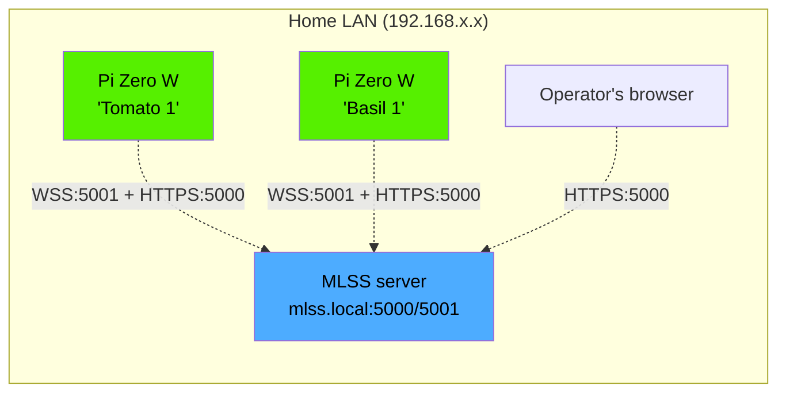

# Plant Grow Unit — Setup guide

End-to-end walkthrough: from a clean MLSS install + a Pi Zero in a box, to
a plant being watered and photographed automatically.

> **Hardware reference:** [PLANT_GROW_UNIT_HARDWARE.md](PLANT_GROW_UNIT_HARDWARE.md)
> for BOM, wiring tables, and the bench test sequence.

> **Day-to-day operation** is in [PLANT_GROW_UNIT_USAGE.md](PLANT_GROW_UNIT_USAGE.md).
> **How it works under the hood** is in [PLANT_GROW_UNIT_ARCHITECTURE.md](PLANT_GROW_UNIT_ARCHITECTURE.md).

---

## Network topology

A grow unit lives on the same LAN as the MLSS server — there is no
internet exposure assumed by the threat model:



The MLSS server uses a self-signed cert pinned at install time (TOFU).
LAN-only deployment; no internet exposure assumed. Each grow unit holds
its own argon2-hashed bearer token + a copy of the MLSS server cert at
`/etc/mlss/server.crt`.

---

## Prerequisites

Before starting, check this table:

| What | Why | How to verify |
|---|---|---|
| **Wheels built on the MLSS server** | install.sh downloads `mlss_grow` + `mlss_contracts` wheels from the server's `static/grow_dist/`. They're gitignored and rebuilt on the server. | `ls static/grow_dist/*.whl` shows two `.whl` files; `curl -ks https://<mlss>:5000/api/grow/dist/latest` returns JSON with `mlss_grow` + `mlss_contracts` keys. If empty, run `bash scripts/build_grow_wheel.sh` on the MLSS server first. |
| **MLSS server running** at `https://mlss.local:5000` | Grow unit needs somewhere to enroll, send telemetry, fetch config | Open the dashboard; you should see the existing air-quality view |
| **Admin login** to the MLSS dashboard | The first-boot enrollment-key reveal is gated by `require_role("admin")` | Sign in; navigate to `/grow` — you should see the empty-state panel rather than a 403 |
| **Pi Zero W (or Pi Zero 2 W)** flashed with Raspberry Pi OS Lite | Host for the firmware | `cat /etc/os-release` shows Raspberry Pi OS; SSH works |
| **WiFi configured** on the Pi (Imager advanced options or `wpa_supplicant.conf`) | Firmware connects to MLSS over your home WiFi | `ip addr show wlan0` shows an IP; `ping mlss.local` works |
| **Camera + soil sensor (optional but recommended) wired** per [PLANT_GROW_UNIT_HARDWARE.md](PLANT_GROW_UNIT_HARDWARE.md) | Camera on CSI ribbon, Seesaw on I2C `0x36` | `sudo i2cdetect -y 1` shows `36`; `libcamera-jpeg -o test.jpg` works |
| **Pump + grow light (optional)** wired per HARDWARE doc | Required for automated watering / light schedule. Sensors-only is fine to start with — see [Sense-only mode](#sense-only-mode-deploy-without-the-actuator-psu-yet) below | Bench-tested with the snippets in HARDWARE.md → "First-light bench test" |
| **Automation pHAT** seated on the Pi GPIO header (optional) | Required for pump + light. Skip if running sense-only | `python3 -c "import automationhat"` succeeds |

**Bench-tested** before the firmware install: ideally each component has
been verified individually with the snippets in
[HARDWARE.md → First-light bench test](PLANT_GROW_UNIT_HARDWARE.md#first-light-bench-test).
This catches wiring errors early, before they're hidden behind the
`mlss-grow.service` boot logs.

---

## First unit walkthrough

### Step 0: Build the firmware wheels (one-time, on the MLSS server)

The Pi installer downloads pre-built wheels from `https://<mlss>:5000/api/grow/dist/`. The wheels are gitignored (built artifacts shouldn't be in git) so each MLSS server has to build them once after pulling the code:

```bash
# On the MLSS server, in the project root:
bash scripts/build_grow_wheel.sh
```

Sanity-check:

```bash
ls -la static/grow_dist/
# Should show: mlss_contracts-X.Y.Z-py3-none-any.whl, mlss_grow-X.Y.Z-py3-none-any.whl, mlss-grow.service
```

Re-run this after every `git pull` that touched `grow_unit/` or `contracts/` — `bin/deploy` (see below) handles this for you.

### Step 0.5: Make sure the server's TLS cert covers `mlss.local`

This is the most common foot-gun for first deployments. The firmware
pins the MLSS cert at install time and verifies hostnames on every
TLS connection. **The cert MUST include the hostname (or IP) the Pi
will use to reach the server in its Subject Alternative Name list.**

Check what your current cert covers (on the MLSS server):

```bash
openssl x509 -in certs/cert.pem -text -noout | grep -A1 "Subject Alternative Name"
```

You'll see something like:

```
X509v3 Subject Alternative Name:
    DNS:mlss-monitor, DNS:localhost, IP:127.0.0.1, IP:192.168.0.203
```

If `mlss.local` is **not** listed (the default cert doesn't include
it), regenerate with the hostnames + IPs every Pi will use:

```bash
poetry run python scripts/generate_certs.py \
    --hostname mlss.local \
    --hostname mlss-monitor \
    --hostname localhost \
    --ip 192.168.0.203 \
    --force
sudo systemctl restart mlss-monitor
sudo journalctl -u mlss-monitor -n 5  # verify clean startup
```

(Replace `192.168.0.203` with your MLSS server's actual LAN IP.
`hostname -I` on the server gives it.)

Re-verify the new cert:

```bash
openssl x509 -in certs/cert.pem -text -noout | grep -A1 "Subject Alternative Name"
# Should now show: DNS:mlss.local, DNS:mlss-monitor, DNS:localhost,
#                  IP:127.0.0.1, IP:192.168.0.203
```

If you regenerated the cert AFTER Pis were already enrolled, each
Pi has the OLD pinned cert and needs to re-pin — see
[Re-pinning the server cert](#re-pinning-the-server-cert) below.

### Step 0.75: Make sure the Pi can resolve `mlss.local`

Pi OS Lite **ships** avahi-daemon (which resolves `.local` hostnames
via mDNS) but on a fresh install it can take 30+ seconds after boot
before resolution works, and on some routers/switches IPv4 multicast
is blocked entirely. If you see `Could not resolve host: mlss.local`
during install or in `journalctl`, two options:

**Option A (recommended): add an `/etc/hosts` entry on each Pi.**
Robust against any DNS / mDNS / avahi flakiness.

```bash
# On the Pi:
echo "192.168.0.203 mlss.local" | sudo tee -a /etc/hosts
```

(Substitute your MLSS server's LAN IP. `hostname -I` on the server
gives it; or `ping mlss.local` from a working machine and read the IP.)

Then update `/boot/mlss-grow.yaml` to use the hostname:

```yaml
mlss_host: mlss.local              # not 192.168.0.203 directly
```

Why prefer the hostname over the bare IP: the cert SAN almost
certainly has `DNS:mlss.local` (after Step 0.5 above) but may not
have your LAN IP, and that IP can change when your DHCP lease
rolls over. Hostname stays stable.

**Option B: troubleshoot mDNS on the Pi.** Slower path but avoids
the hosts-file maintenance burden. Ensure avahi is running:

```bash
sudo systemctl status avahi-daemon
sudo apt install -y avahi-daemon avahi-utils libnss-mdns

# Confirm mdns is in the hosts resolution path:
grep ^hosts /etc/nsswitch.conf
# Should show: hosts: files mdns4_minimal [NOTFOUND=return] dns

# Test directly:
avahi-resolve -n mlss.local
```

If `avahi-resolve` returns the right IP but `getent hosts mlss.local`
still fails, that's the nsswitch path — fix `nsswitch.conf` so `mdns4_minimal`
appears before `dns`.

### 1. Get your household enrollment key

**Sign in as an admin user first.** The enrollment-key reveal endpoint
(`/api/grow/enrollment-key/peek-once`) is gated by `require_role("admin")` —
viewers and controllers will get a 403 and the empty-state panel will not
display the key. The reason: the enrollment key authorises
`POST /api/grow/enroll`, which is idempotent by `hardware_serial`. Anyone
holding the key can re-enroll a known serial and rotate that unit's
bearer token, so only admins should ever see it.

Open the MLSS dashboard at `https://mlss.local:5000/grow`. Because no units are enrolled yet, you'll see the empty-state onboarding panel with the enrollment key shown once. **Copy it now and save it somewhere safe** — it's only displayed on first visit, and only to admins.

If you missed it (or are setting up after others have already enrolled units), you'll need to rotate the key via Settings → Grow (this is a Phase 2 feature; for now, edit `app_settings.grow_enrollment_key_hash` directly via SQLite or recreate the DB).

### 2. Drop `/boot/mlss-grow.yaml` on the SD card

Before ejecting the Pi's SD card from your laptop, the boot partition is FAT32 and writeable from any OS. Create the file:

```yaml
# Required
mlss_host: mlss.local              # hostname or IP of the MLSS server
enrollment_key: <paste-the-key>    # household key from step 1

# Plant identity (all optional; sensible defaults)
plant:
  name: Tomato 1                   # display label in the dashboard; defaults to "Unit <serial-tail>"
  type: tomato                     # one of: tomato, basil, lettuce, microgreens, pepper, generic; default 'generic'
  medium: soil                     # one of: soil, coco, rockwool, custom; default 'soil'

# Optional connectivity overrides (rare — defaults are normally fine)
# mlss_port_https: 5000            # HTTPS port for enroll + config + install; default 5000
# mlss_port_wss: 5001              # WSS port for the persistent telemetry channel; default 5001
# verify_ssl: true                 # set false ONLY for dev with no pinned cert; default true once /etc/mlss/server.crt exists
```

**Required vs optional at a glance:**

| Field | Required | Default | Notes |
|---|---|---|---|
| `mlss_host` | Yes | — | Hostname or IP — must be reachable from the Pi at boot |
| `enrollment_key` | Yes | — | Get from the empty-state UI as an admin (step 1). Deleted from disk after first successful enroll |
| `plant.name` | No | `Unit <serial>` | Cosmetic label for the dashboard |
| `plant.type` | No | `generic` | Controls which `grow_plant_profiles` row supplies default tunables |
| `plant.medium` | No | `soil` | Controls calibration defaults from `grow_medium_defaults` |

If WiFi wasn't pre-configured by Raspberry Pi Imager's advanced options, also drop `wpa_supplicant.conf` (standard Pi flow).

### 3. Boot the Pi + install the firmware

Insert the SD card and power on. Once the Pi has joined WiFi, SSH in:

```bash
ssh pi@<pi-zero-ip>
```

Then run the install one-liner:

```bash
curl -k https://mlss.local:5000/api/grow/install.sh | sudo bash
```

This will:

1. apt-install Python 3.11+, libcamera-apps, i2c-tools, build-essential
2. Create the `mlss-grow` system user
3. Download both wheels (and the systemd unit) from the MLSS server
4. **Verify each downloaded artifact's SHA256** against the manifest at
   `/api/grow/dist/latest` — defends against LAN MITM tampering with
   wheels or the unit file (a tampered unit could expand the firmware's
   privileges, drop `NoNewPrivileges`, etc.). The script aborts if any
   hash doesn't match.
5. **Pin the MLSS server cert** at `/etc/mlss/server.crt` (Trust On First
   Use). Subsequent enrolment + WS + config-pull calls verify against
   this pinned cert, so a future LAN MITM with a swapped cert is
   rejected even if the original `curl -k` install line was unverified.
6. Create a venv at `/opt/mlss-grow/.venv`, install both wheels
7. Drop the systemd unit at `/etc/systemd/system/mlss-grow.service`
8. Enable + start the service

The first run of the service reads `/boot/mlss-grow.yaml`, posts to `/api/grow/enroll` (verifying against the pinned `/etc/mlss/server.crt`), gets a per-unit token, saves it to `/etc/mlss/grow.token` (mode 0600), and **deletes the YAML** so the enrollment key isn't sitting on the SD card.

### 4. Watch it appear in the dashboard

Refresh `https://mlss.local:5000/grow`. Within ~60 seconds, your unit appears as a card with status **Nominal**. Click **Open** to see live readings.

Tail the unit's logs if anything's misbehaving:

```bash
ssh pi@<pi-zero-ip>
sudo journalctl -u mlss-grow -f
```

---

## Adding additional units

For unit #2 onwards, repeat steps 2–4 above with the same enrollment key (one key serves all units in your household). About 3 minutes per unit.

---

## Redeploying the MLSS server (after a `git pull`)

Use `bin/deploy` from the project root on the MLSS server:

```bash
bin/deploy
```

This is the canonical deploy command. It runs `git pull --ff-only`, refreshes
production Python deps with `poetry install --without dev`, rebuilds the grow
firmware wheels (only when `grow_unit/`, `contracts/`, or
`scripts/build_grow_wheel.sh` changed since the last deploy — or always on the
first run), restarts `mlss-monitor`, and tails the most recent journal
entries. `set -euo pipefail` aborts on any step's failure so you don't ship
a partially-deployed server.

If you skip `bin/deploy` and run `git pull && sudo systemctl restart
mlss-monitor` by hand, you'll miss the wheel rebuild — Pis enrolling for the
first time after a grow-firmware change will get the **previous** wheel
versions until the next time `scripts/build_grow_wheel.sh` runs.

---

## Sense-only mode (deploy without the actuator PSU yet)

The unit is **safe to deploy with only the Pi powered** — no second
USB port to the load rail, no wires to the pump, no wires to the grow
light. The Pi itself, the camera, and any I2C sensors all run from the
single PSU on Port 1; you finish the actuator side later when you're
ready.

What you'll see in the dashboard immediately:

- The unit's tile renders with live moisture / temperature / lux as
  normal
- Photos capture and upload at the configured cadence
- The **Water 5s** and **Toggle light** buttons are **greyed out**, with
  a tooltip saying "no evidence the actuator is responding — check
  power and wiring"

This is driven by the [capability health watchdog](PLANT_GROW_UNIT_USAGE.md#sense-only-mode-greyed-out-actuator-buttons):
when a command is pushed to an actuator, the server records the
timestamp; if no follow-up evidence (a `grow_watering_events` row for
pump, a telemetry frame with `light_state=1` for light) arrives within
30 seconds, the channel is marked `unresponsive` and the buttons
disable themselves.

### Adding the actuator PSU later

1. Power down the Pi cleanly (`sudo shutdown -h now`).
2. Wire Port 2 of your USB power adapter through a USB-A breakout into the
   load rail terminal block; tie load-rail GND to the pHAT GND
   terminal.
3. Wire pump red → load-rail +5V via flyback diode → pump black →
   pHAT OUT 1; light red → pHAT RELAY COM, NO terminal → load-rail
   +5V, light black → load-rail GND. Full wiring tables:
   [HARDWARE.md → Wiring sections](PLANT_GROW_UNIT_HARDWARE.md#wiring--soil-sensor-adafruit-seesaw-i2c).
4. Power on. The firmware needs no reconfiguration — the next pump
   pulse or light toggle will succeed, the watchdog flips the channel
   from `unresponsive` back to `connected`, and the buttons un-grey
   themselves on the next page refresh.

There's nothing to toggle on the server side. The watchdog is lazy —
it only consults its memory dict on each `GET /api/grow/units/<id>`,
so when fresh evidence arrives the button comes back automatically.

---

## Token rotation

There are two credentials in play, rotated independently:

### Per-unit bearer token

Each unit has its own argon2-hashed `grow_units.bearer_token_hash`
stored on the unit at `/etc/mlss/grow.token` (mode 0600, owned by
`mlss-grow`). Rotate when:

- You suspect the SD card was compromised
- You've cloned an SD image to a new Pi (the new unit will fail
  authentication; you need a fresh token)
- Routine periodic rotation (yearly is fine for a home deployment)

**To rotate** for a known unit:

```bash
# On the Pi:
sudo rm /etc/mlss/grow.token
sudo systemctl restart mlss-grow
```

The firmware boots, sees no token, falls back to re-reading
`/boot/mlss-grow.yaml` (which is gone after the first enroll). To
re-enroll cleanly: drop a fresh `mlss-grow.yaml` on `/boot/` with the
current household enrollment key, restart the service, and the
firmware re-POSTs to `/api/grow/enroll`. Because enroll is idempotent
by `hardware_serial`, the existing `grow_units` row updates its
`bearer_token_hash` and the same dashboard tile keeps its history
intact.

### Household enrollment key

`app_settings.grow_enrollment_key_hash` authorises **new**
`POST /api/grow/enroll` calls (and idempotent re-enrolls of known
serials, which is why it's admin-only). Rotate via
**Settings → Grow → Rotate enrollment key** in the dashboard. The new
raw key is shown once after rotation.

Rotating the household key does **not** invalidate existing per-unit
tokens — those keep working. To revoke a specific unit, set
`grow_units.is_active=0` directly in SQLite or via the (Phase 4)
fleet management UI.

---

## Decommission a unit

When you're retiring a Pi (broken, repurposed, plant died):

1. **In the dashboard:** open the unit's detail page → **Configure** tab →
   **Diagnostics** subtab → **Danger zone** → **Deactivate unit**. This
   sets `grow_units.is_active=0`, server-side. The unit's per-unit token
   stops authenticating new WS upgrades immediately. Historical telemetry
   and photos are kept for analysis.
2. **On the Pi (optional):** wipe the on-disk credentials:
   ```bash
   sudo systemctl stop mlss-grow
   sudo systemctl disable mlss-grow
   sudo rm -rf /etc/mlss/grow.token /etc/mlss-grow /var/lib/mlss-grow
   ```
   The pinned `/etc/mlss/server.crt` can stay if you'll redeploy this Pi
   to your fleet later.
3. **To permanently delete history** for the unit (after you've extracted
   anything you want for ML training): `DELETE FROM grow_units WHERE
   id=<n>` cascades to telemetry, photos, watering events, capabilities,
   light windows, and errors via `ON DELETE CASCADE` — see
   [DATABASE.md](DATABASE.md). One-shot operation; double-check the unit
   ID first.

---

## Re-pinning the server cert

If you regenerate the MLSS server cert (Step 0.5) AFTER Pis were
already enrolled, each Pi still has the OLD pinned cert at
`/etc/mlss/server.crt` and will fail TLS verification on every
connection. Refresh on each Pi:

```bash
sudo bash -c '
set -o pipefail
TLS_DUMP=$(echo | openssl s_client -servername mlss.local -connect mlss.local:5000 2>/dev/null)

if ! echo "$TLS_DUMP" | grep -q "BEGIN CERTIFICATE"; then
    echo "ERROR: openssl s_client did not return a certificate" >&2
    echo "$TLS_DUMP" | head -10 >&2
    exit 1
fi

NEW_CERT=$(echo "$TLS_DUMP" | openssl x509 -outform PEM)

if [[ -z "$NEW_CERT" ]] || ! echo "$NEW_CERT" | grep -q "BEGIN CERTIFICATE"; then
    echo "ERROR: openssl x509 extraction failed" >&2
    exit 1
fi

echo "$NEW_CERT" > /etc/mlss/server.crt
chmod 644 /etc/mlss/server.crt
echo "Pinned new cert. SAN entries:"
openssl x509 -in /etc/mlss/server.crt -text -noout | grep -A1 "Subject Alternative Name"
'

sudo systemctl restart mlss-grow
sudo journalctl -u mlss-grow -f
```

The script aborts with a clear error if `openssl s_client` returns
nothing (which silently produces an empty cert file otherwise — a
classic foot-gun).

## Troubleshooting

| Symptom | Likely cause | Fix |
|---|---|---|
| `curl: (6) Could not resolve host: mlss.local` during install | mDNS not working on the Pi | See [Step 0.75](#step-075-make-sure-the-pi-can-resolve-mlsslocal). Quickest fix: `echo "<server-ip> mlss.local" \| sudo tee -a /etc/hosts` |
| `KeyError: 'mlss_grow'` from install.sh's python3 step | Wheels not built on the MLSS server | On the server: `bash scripts/build_grow_wheel.sh`, then re-run install on the Pi |
| `Permission denied: '/tmp/tmp.abcd1234'` (or similar random suffix) during pip install | Old install.sh — TMP dir mode 0700 blocked the unprivileged user | `git pull` on the server, rebuild wheels, retry |
| `No matching distribution found for Pillow<11.0,>=10.0` | Old install.sh — `--no-index` blocked PyPI for transitive deps | `git pull` on the server, rebuild wheels, retry |
| `No such file or directory: '/.../contracts'` during pip install | Wheel METADATA had build-host's absolute path baked in | `git pull` on the server, rebuild wheels (the build script now strips this), retry |
| `IP address mismatch, certificate is not valid for '192.168.0.203'` | Connecting via IP but cert SAN only has DNS names | Use the hostname (`mlss.local`) in `mlss_host`; ensure cert SAN covers it (Step 0.5) |
| `Hostname mismatch, certificate is not valid for 'mlss.local'` | Cert SAN doesn't include `mlss.local` | Regenerate the cert (Step 0.5) and re-pin on each Pi (above) |
| `NO_CERTIFICATE_OR_CRL_FOUND` | Pi's `/etc/mlss/server.crt` is empty/corrupt | Re-pin on the Pi (above). Common cause: re-pinned BEFORE the server was restarted with the new cert |
| `ModuleNotFoundError: No module named 'board'` | Adafruit Blinka wasn't installed (old marker missed armv6l) | `git pull` on the server, rebuild wheels, full reinstall on the Pi: `sudo rm -rf /opt/mlss-grow && curl -k <install-url> \| sudo bash` |
| `ModuleNotFoundError: No module named 'picamera2'` | apt missed it OR venv lacks `--system-site-packages` | `git pull`, rebuild, full reinstall (the install.sh now does both) |
| `ValueError: No Hardware I2C on (scl,sda)=(3, 2). Make sure I2C is enabled.` | Pi's I2C interface not enabled in raspi-config | `sudo raspi-config nonint do_i2c 0 && sudo reboot`. install.sh does this automatically on a fresh install but pre-existing Pis may have skipped it. |
| `Watchdog timeout (limit 30s)` killing mlss-grow every 30s | Old firmware never sent `WATCHDOG=1` notify pings (now fixed). Still seen on pre-fix builds | `git pull` on server, rebuild wheels, upgrade firmware on the Pi: `sudo systemctl stop mlss-grow && /opt/mlss-grow/.venv/bin/pip install --upgrade --force-reinstall --no-deps <wheel-url> && sudo systemctl start mlss-grow` |
| `'Picamera2' object has no attribute 'metadata'` on snap-photo | Old firmware called wrong picamera2 API (now fixed) | Same upgrade as above |
| Snap-photo returns 202 + `{"queued": true}` but Latest photo panel never updates | Server can't write to `/var/lib/mlss/grow_images/` (default needs root). Server log shows `FileNotFoundError: ... '/var/lib/mlss/grow_images'` | `git pull` on server (default now `data/grow_images/`, project-relative, gunicorn-writable). OR set `MLSS_GROW_IMAGES_DIR` env to a path the service user can write to. OR `sudo mkdir -p /var/lib/mlss/grow_images && sudo chown <service-user> /var/lib/mlss/grow_images` if you really want the system path. |
| Unit doesn't appear in dashboard after install | WiFi not joined | `journalctl -u mlss-grow -f` on the Pi; check for connect errors |
| Card shows "Offline" with no recent telemetry | WS connection dropped | Restart the service: `sudo systemctl restart mlss-grow`. Check WiFi signal. |
| Soil sensor not detected at boot | I2C cable polarity or address conflict | `sudo i2cdetect -y 1` should show `36`. Swap red/black at JST connector if missing. |
| Photos not appearing | Camera not enabled in raspi-config OR ribbon cable backwards | `sudo raspi-config` → Interface Options → Camera. Then `libcamera-jpeg -o test.jpg`. The CSI ribbon's blue side faces the USB ports on the Pi. |
| Pump runs continuously | Wiring backwards (NC instead of NO on relay) | Swap relay output terminal — failsafe is dark/dry, so NO must be open at rest. |

---

## See also

- [PLANT_GROW_UNIT_HARDWARE.md](PLANT_GROW_UNIT_HARDWARE.md) — wiring, BOM, bench tests
- [PLANT_GROW_UNIT_USAGE.md](PLANT_GROW_UNIT_USAGE.md) — day-to-day operation
- [PLANT_GROW_UNIT_ARCHITECTURE.md](PLANT_GROW_UNIT_ARCHITECTURE.md) — how it works under the hood
- [DATABASE.md](DATABASE.md) — schema reference for both server + buffer DBs
