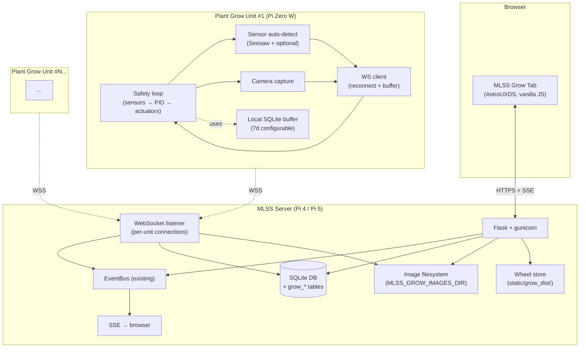

# Plant Grow Unit System — Design Spec

**Date:** 2026-05-03
**Branch:** `feature/plant-grow-units`
**Hardware reference:** [`docs/PLANT_GROW_UNIT_HARDWARE.md`](../../PLANT_GROW_UNIT_HARDWARE.md)
**Status:** Draft for review

---

## Table of contents

- [1. Goals and non-goals](#1-goals-and-non-goals)
- [2. System overview](#2-system-overview)
- [3. Repo and package structure](#3-repo-and-package-structure)
- [4. Data model](#4-data-model)
- [5. Authentication and enrollment](#5-authentication-and-enrollment)
- [6. WebSocket protocol](#6-websocket-protocol)
- [7. Onboard logic (Pi Zero firmware)](#7-onboard-logic-pi-zero-firmware)
- [8. Reliability and offline behaviour](#8-reliability-and-offline-behaviour)
- [9. Image storage and ML training joinability](#9-image-storage-and-ml-training-joinability)
- [10. UI design](#10-ui-design)
- [11. AstroUXDS components used](#11-astrouxds-components-used)
- [12. Phasing](#12-phasing)
- [13. Future work (Phases 4 and 5)](#13-future-work-phases-4-and-5)
- [14. Deferred items / roadmap](#14-deferred-items--roadmap)
- [15. Testing strategy](#15-testing-strategy)
- [16. Open questions and risks](#16-open-questions-and-risks)

---

## 1. Goals and non-goals

### Primary goals

1. **Grow plants reliably** by providing each plant with its own remote Pi Zero W controller that handles soil moisture sensing, watering, lighting, and time-lapse photography.
2. **Centralised dashboard on MLSS** showing all units as cards with at-a-glance health, soil moisture, light state, and the latest photo.
3. **Configurable from MLSS** — plant type, phase, watering tunables, light schedule, photo interval, all editable via the existing MLSS web UI.
4. **Survives MLSS outages** — units keep watering and lighting on a local safety loop with sane defaults. Telemetry is buffered locally and replayed on reconnect.
5. **Joinable telemetry + images** for future ML training — every photo is associated with the closest telemetry reading at capture time, indexed by `(unit_id, timestamp_utc)`.
6. **Scales smoothly to 20–30 units** on a household LAN. Adding unit N is a 3-minute SD-flash + drop-YAML operation.
7. **Reusable and consistent with existing MLSS** — same AstroUXDS look, same auth model, same data-source ABC pattern, same Flask blueprint structure.

### Non-goals

1. **Not a commercial product.** Pi Zero W on a home WiFi for 1–30 plants. No multi-tenant, no public PyPI in MVP.
2. **Not optimising hardware cost per plant** — one Pi per plant is the design (the chosen Automation pHAT only has 1 relay anyway).
3. **No active environmental control of the grow space air** in this scope (that's MLSS proper). The grow unit cares about its plant; MLSS cares about the room.
4. **No multi-plant per unit** in MVP. The schema (`grow_units` row = growing area, with a free-text label) accommodates the user labelling a tray of microgreens as one growing area, but the hardware only supports one set of pump/light/sensor.
5. **No multi-channel actuator routing** (e.g. branching one pump to multiple solenoid valves). Future work if needed.
6. **No live video stream.** Photo cadence at intervals down to ~1 minute is supported; live MJPEG/HLS is out of scope (would require redesigning camera handling and wouldn't survive Pi Zero CPU).

---

## 2. System overview

### Architecture



### Channel summary

Each unit holds **one** persistent WebSocket connection to MLSS (`wss://mlss.local:5000/api/grow/{unit_id}/ws`). All traffic flows over it:

| Direction | Frame type | Payload | Cadence |
|---|---|---|---|
| Unit → MLSS | text | telemetry | every 30s |
| Unit → MLSS | text | events (watering pulse, sensor degraded, error) | event-driven |
| Unit → MLSS | binary | image (JSON header + JPEG bytes) | every 30 min default |
| Unit → MLSS | text | capabilities (initial + on change) | on connect + on change |
| MLSS → Unit | text | command (identify, water_now, light_override, snap_photo, reload_config) | event-driven |
| MLSS → Unit | text | config push (full or delta) | when admin saves config |

### Process model

- **MLSS server**: existing Flask + background threads + event bus. Adds a new WebSocket listener thread (one per accepted unit connection). All grow-related Flask blueprints live under `mlss_monitor/routes/api_grow_*.py`.
- **Pi Zero unit**: a single systemd service `mlss-grow.service` running an asyncio event loop with: WS client task, safety-loop task, sensor-poll task, camera-capture task, and buffer-flush task.

---

## 3. Repo and package structure

Single repo with strict per-package dependency isolation. Three independently-installable Poetry packages share contracts via a fourth package.

```
mars-air-quility/
├── pyproject.toml              # MLSS server (existing, Poetry-managed)
├── mlss_monitor/               # server source (existing, untouched scope-wise)
│   └── routes/
│       ├── api_grow_units.py   # NEW — REST endpoints for fleet view
│       ├── api_grow_ws.py      # NEW — WebSocket listener
│       ├── api_grow_dist.py    # NEW — serves install.sh + wheels
│       └── pages.py            # MODIFIED — adds /grow route
│
├── grow_unit/                  # NEW — firmware package
│   ├── pyproject.toml          # Poetry; declares mlss-contracts as path dep
│   └── src/mlss_grow/
│       ├── service.py          # systemd entry point
│       ├── safety_loop.py      # PID watering + light schedule + photo cadence
│       ├── ws_client.py        # WS connection lifecycle, buffer replay
│       ├── enrol.py            # first-boot enrollment flow
│       ├── camera.py           # picamera2 wrapper
│       ├── sensors/
│       │   ├── base.py         # Sensor ABC (.detect / .channels / .read)
│       │   ├── seesaw.py       # Adafruit Seesaw soil sensor (REQUIRED)
│       │   └── __init__.py     # REGISTERED_SENSORS list
│       └── actuators/
│           ├── base.py         # Actuator ABC
│           └── automation_phat.py
│
├── contracts/                  # NEW — shared schemas (pydantic only)
│   ├── pyproject.toml          # only pydantic
│   └── src/mlss_contracts/
│       ├── ws_messages.py      # Telemetry, Command, Config, PhotoFrame, Capability
│       ├── capabilities.py     # Channel enum
│       ├── plant_profiles.py   # PlantProfile schema
│       └── enums.py            # Phase, MediumType, Severity
│
├── database/
│   └── grow_schema.py          # NEW — grow_* table creation; called by init_db
│
├── tests/
│   ├── test_grow_*.py          # MLSS server-side tests
│   ├── grow_unit/              # NEW — firmware tests
│   └── contracts/              # NEW — schema tests
│
├── scripts/
│   ├── build_grow_wheel.sh     # NEW — builds mlss_grow + mlss_contracts wheels
│   └── deploy.sh               # MODIFIED — runs build_grow_wheel.sh after pull
│
├── static/
│   ├── css/grow.css            # NEW — Grow tab styles + reusable components
│   ├── grow_dist/              # NEW — wheel storage (gitignored)
│   └── js/grow/
│       ├── fleet.mjs           # Grow tab top-level
│       ├── unit_detail.mjs     # Per-unit detail page
│       ├── components/
│       │   ├── filter-bar.mjs        # NEW reusable
│       │   ├── stat-tile.mjs         # NEW reusable
│       │   ├── status-pill.mjs       # NEW reusable
│       │   ├── schedule-bar.mjs      # NEW reusable
│       │   └── sensor-event-chart.mjs # NEW reusable (Plotly wrapper)
│
└── templates/
    ├── grow_fleet.html         # NEW
    └── grow_unit_detail.html   # NEW
```

### Per-package dependencies

**`pyproject.toml` (root, MLSS server):** existing deps + `websockets` (server-side WS) + `mlss-contracts` (path dep). Does **not** install `picamera2`, `RPi.GPIO`, `adafruit-circuitpython-seesaw`.

**`grow_unit/pyproject.toml`:** `websockets`, `picamera2`, `adafruit-circuitpython-seesaw`, `RPi.GPIO`, `psutil`, `mlss-contracts` (path dep). Does **not** install Flask, gunicorn, authlib, Plotly, the inference engine, or any sensor library MLSS needs but the unit doesn't.

**`contracts/pyproject.toml`:** `pydantic` only.

### How it gets to the Pi Zero

1. On every MLSS deploy (`scripts/deploy.sh`), `scripts/build_grow_wheel.sh` runs. It builds two wheels:
   - `contracts/dist/mlss_contracts-X.Y.Z-py3-none-any.whl`
   - `grow_unit/dist/mlss_grow-X.Y.Z-py3-none-any.whl`
2. Both wheels copied to `mlss_monitor/static/grow_dist/` (gitignored).
3. MLSS HTTP route `GET /api/grow/dist/<filename>` serves them with the same auth as the rest of the API.
4. Pi Zero install script (next section) downloads both and `pip install`s them with `--no-index --find-links`.

### CI

- Root `pytest` runs MLSS server tests (uses root Poetry env)
- `cd grow_unit && pytest ../tests/grow_unit` runs firmware tests with markers to skip Pi-only deps in CI
- `cd contracts && pytest ../tests/contracts` for schema tests
- A change in `contracts/` triggers all three test suites; otherwise only the affected one

---

## 4. Data model

All new tables live in the existing MLSS SQLite database. Created by `database/grow_schema.py`, called from `database/init_db.py::create_db()`. Migrations follow the existing `try ALTER TABLE ... except: pass` pattern.

### Core tables

```sql
-- The hardware unit + its growing area metadata + cached state
CREATE TABLE grow_units (
  id                          INTEGER PRIMARY KEY AUTOINCREMENT,
  hardware_serial             TEXT UNIQUE NOT NULL,        -- /proc/cpuinfo serial
  label                       TEXT NOT NULL,               -- "Tomato 3" or "Microgreens A"
  description                 TEXT,
  sown_at                     DATETIME,
  enrolled_at                 DATETIME NOT NULL,
  bearer_token_hash           TEXT NOT NULL,               -- argon2 hash; raw token never stored
  is_active                   INTEGER NOT NULL DEFAULT 1,
  -- Phase
  current_phase               TEXT NOT NULL DEFAULT 'vegetative'
                                CHECK(current_phase IN
                                  ('seedling','vegetative','flowering','fruiting','dormant')),
  phase_set_by                TEXT NOT NULL DEFAULT 'user'
                                CHECK(phase_set_by IN ('user','image_classifier')),
  phase_set_at                DATETIME NOT NULL,
  -- Plant + medium
  plant_type                  TEXT NOT NULL DEFAULT 'generic',  -- FK by name to grow_plant_profiles
  medium_type                 TEXT NOT NULL DEFAULT 'soil'
                                CHECK(medium_type IN ('soil','coco','rockwool','custom')),
  -- Sensor calibration (NULL → use medium default)
  soil_dry_raw                INTEGER,
  soil_wet_raw                INTEGER,
  -- Per-unit overrides (NULL → use plant_profile or global default)
  light_phase_override_json   TEXT,
  watering_target_override    REAL,
  watering_kp_override        REAL,
  watering_ki_override        REAL,
  watering_kd_override        REAL,
  soak_window_min_override    INTEGER,
  pulse_min_s_override        REAL,
  pulse_max_s_override        REAL,
  photo_interval_min_override INTEGER,
  -- Reliability
  buffer_retention_days       INTEGER,             -- NULL → use global default
  -- Connection state cache (updated by WS listener)
  last_seen_at                DATETIME,
  last_telemetry_at           DATETIME,
  last_known_state_json       TEXT                 -- denormalised cache: latest soil_pct, light_state,
                                                   -- pump_state, photo_path, status (online/stale/offline)
                                                   -- updated by WS listener on every telemetry frame and
                                                   -- on connection state change; lets the fleet view render
                                                   -- without joining grow_telemetry per-card
);
CREATE INDEX idx_grow_units_active ON grow_units(is_active, last_seen_at DESC);

-- What sensors and actuators a unit declares it has
CREATE TABLE grow_unit_capabilities (
  unit_id      INTEGER NOT NULL REFERENCES grow_units(id) ON DELETE CASCADE,
  channel      TEXT NOT NULL,                       -- 'soil_moisture', 'soil_temp_c', 'pump', 'light', etc.
  hardware     TEXT,                                -- 'Adafruit_Seesaw_4026'
  is_required  INTEGER NOT NULL DEFAULT 0,
  unit_label   TEXT,                                -- '%', '°C'
  installed_at DATETIME NOT NULL,
  details_json TEXT,                                -- {"i2c_address":"0x36"}
  PRIMARY KEY (unit_id, channel)
);

-- Time-series telemetry. Wide table; NULL = sensor not present on this unit.
CREATE TABLE grow_telemetry (
  id                  INTEGER PRIMARY KEY AUTOINCREMENT,
  unit_id             INTEGER NOT NULL REFERENCES grow_units(id),
  timestamp_utc       DATETIME NOT NULL,                    -- sub-second precision
  -- Required (every unit reports these)
  soil_moisture_raw   INTEGER NOT NULL,
  soil_moisture_pct   REAL,                                 -- computed from raw via calibration
  light_state         INTEGER NOT NULL,                     -- 0=off, 1=on
  pump_state          INTEGER NOT NULL,                     -- 0=idle
  -- Optional (NULL when unit lacks the sensor)
  soil_temp_c         REAL,
  ambient_lux         REAL,
  air_temp_c          REAL,
  air_humidity_pct    REAL,
  reservoir_level_pct REAL
);
CREATE INDEX idx_grow_telemetry_unit_time ON grow_telemetry(unit_id, timestamp_utc DESC);

-- Watering events (separate from telemetry for cleaner ML labelling)
CREATE TABLE grow_watering_events (
  id                  INTEGER PRIMARY KEY AUTOINCREMENT,
  unit_id             INTEGER NOT NULL REFERENCES grow_units(id),
  timestamp_utc       DATETIME NOT NULL,
  trigger             TEXT NOT NULL CHECK(trigger IN ('pid','manual','identify_test')),
  duration_s          REAL NOT NULL,
  soil_pct_before     REAL,
  soil_pct_after_5min REAL,                                 -- backfilled 5 min later
  triggered_by        TEXT,                                 -- username for manual; 'system' for pid
  pid_error           REAL,                                 -- captured for tuning
  pid_p_term          REAL,
  pid_i_term          REAL,
  pid_d_term          REAL
);
CREATE INDEX idx_grow_watering_unit_time ON grow_watering_events(unit_id, timestamp_utc DESC);

-- Photo metadata. File on disk at MLSS_GROW_IMAGES_DIR + file_path.
CREATE TABLE grow_photos (
  id                       INTEGER PRIMARY KEY AUTOINCREMENT,
  unit_id                  INTEGER NOT NULL REFERENCES grow_units(id) ON DELETE CASCADE,
  taken_at                 DATETIME NOT NULL,        -- UTC, sub-second
  file_path                TEXT NOT NULL,            -- RELATIVE: "unit_001/2026-05-03/063015.jpg"
  width_px                 INTEGER NOT NULL,
  height_px                INTEGER NOT NULL,
  size_bytes               INTEGER NOT NULL,
  jpeg_quality             INTEGER,
  shutter_us               INTEGER,
  iso                      INTEGER,
  white_balance            TEXT,
  -- Future image classifier outputs
  classified_phase         TEXT,
  classifier_confidence    REAL,
  classified_at            DATETIME,
  -- ML join key — denormalised at ingest time for cheap training queries
  telemetry_id             INTEGER REFERENCES grow_telemetry(id)
);
CREATE INDEX idx_grow_photos_unit_time ON grow_photos(unit_id, taken_at DESC);
CREATE INDEX idx_grow_photos_telemetry ON grow_photos(telemetry_id);

-- Plant profiles: shipped defaults + user-customised. Keyed by (plant_type, phase).
CREATE TABLE grow_plant_profiles (
  id                    INTEGER PRIMARY KEY AUTOINCREMENT,
  plant_type            TEXT NOT NULL,
  phase                 TEXT NOT NULL,
  -- Watering
  target_moisture_pct   REAL NOT NULL,
  deadband_pct          REAL NOT NULL DEFAULT 5,
  kp                    REAL NOT NULL DEFAULT 0.4,
  ki                    REAL NOT NULL DEFAULT 0,
  kd                    REAL NOT NULL DEFAULT 0,
  min_pulse_s           REAL NOT NULL DEFAULT 2,
  max_pulse_s           REAL NOT NULL DEFAULT 8,
  soak_window_min       INTEGER,                       -- NULL → use global default (30)
  -- Light
  default_light_hours   REAL NOT NULL DEFAULT 16,
  -- Metadata
  is_shipped            INTEGER NOT NULL DEFAULT 0,
  notes                 TEXT,
  UNIQUE(plant_type, phase)
);

-- Per-(unit, phase) light windows. Multiple windows per phase allowed.
CREATE TABLE grow_light_windows (
  id           INTEGER PRIMARY KEY AUTOINCREMENT,
  unit_id      INTEGER NOT NULL REFERENCES grow_units(id) ON DELETE CASCADE,
  phase        TEXT NOT NULL,
  start_hh_mm  TEXT NOT NULL,                            -- '06:00'
  end_hh_mm    TEXT NOT NULL,                            -- '12:00'
  sort_order   INTEGER NOT NULL DEFAULT 0
);
CREATE INDEX idx_glw_unit_phase ON grow_light_windows(unit_id, phase);

-- Shipped medium calibration defaults (seeded at install)
CREATE TABLE grow_medium_defaults (
  medium_type TEXT PRIMARY KEY,
  dry_raw     INTEGER NOT NULL,
  wet_raw     INTEGER NOT NULL
);
-- Seed: ('soil', 200, 1500), ('coco', 250, 1700), ('rockwool', 300, 1900)

-- Errors from grow units. Separate from `inferences` so they don't pollute
-- the air-quality Incidents tab.
CREATE TABLE grow_errors (
  id            INTEGER PRIMARY KEY AUTOINCREMENT,
  unit_id       INTEGER REFERENCES grow_units(id) ON DELETE CASCADE,
  timestamp_utc DATETIME NOT NULL,
  severity      TEXT NOT NULL CHECK(severity IN ('info','warning','critical')),
  kind          TEXT NOT NULL,                       -- 'sensor_degraded', 'offline', 'storage_low', 'auth_failed'
  message       TEXT NOT NULL,
  details_json  TEXT,
  resolved_at   DATETIME
);
CREATE INDEX idx_grow_errors_unit_time ON grow_errors(unit_id, timestamp_utc DESC);
CREATE INDEX idx_grow_errors_unresolved ON grow_errors(resolved_at) WHERE resolved_at IS NULL;
```

### `app_settings` keys (added)

| Key | Default | Notes |
|---|---|---|
| `grow_enrollment_key_hash` | (random at install) | argon2 hash of household enrollment key |
| `grow_default_soak_window_min` | `30` | Admin-configurable global default |
| `grow_default_buffer_retention_days` | `7` | Used when `grow_units.buffer_retention_days IS NULL` |
| `grow_images_dir` | `/var/lib/mlss/grow_images` | Override of `MLSS_GROW_IMAGES_DIR` env var |
| `grow_disk_warn_pct` | `90` | Disk-fill threshold for `grow_storage_low` error |
| `grow_holiday_mode` | `0` | When `1`: bumps `grow_default_buffer_retention_days` to 30, doubles photo intervals to save bandwidth, suppresses non-critical email/notification fan-out (when those exist). One-click toggle in Settings → Grow. |

> **Override precedence — applies generally for any tunable that exists at multiple levels:**
> ```
> resolved_value = grow_units.<field>_override
>                  ?? grow_plant_profiles.<field>  (selected by plant_type + current_phase)
>                  ?? app_settings.grow_default_<field>
>                  ?? hard-coded fallback
> ```
> So `soak_window_min` resolves as `grow_units.soak_window_min_override` → `grow_plant_profiles.soak_window_min` → `app_settings.grow_default_soak_window_min` (= 30) → 30. The same cascade applies to PID tunables, pulse min/max, and buffer retention. NULL means "fall through to next level" everywhere.

> **`MLSS_GROW_IMAGES_DIR` resolution order:** `app_settings.grow_images_dir` → `MLSS_GROW_IMAGES_DIR` env var → `/var/lib/mlss/grow_images` (built-in default). DB setting wins (admin-controlled via UI, persists, no restart needed); env var is the deployment-configurable fallback; the built-in default exists for fresh installs that haven't set either.

### Shipped plant profile seeds

Inserted on first run if `grow_plant_profiles` is empty. `is_shipped=1` so they're identifiable. Users can override per unit, or edit the profile directly (changes persist).

| plant_type | phase | target % | kp | min/max pulse | soak (NULL = 30) | light hours |
|---|---|---|---|---|---|---|
| `tomato` | seedling | 60 | 0.3 | 1 / 4 | 30 | 16 |
| `tomato` | vegetative | 55 | 0.4 | 2 / 8 | 30 | 16 |
| `tomato` | flowering | 50 | 0.4 | 2 / 8 | 60 | 12 |
| `tomato` | fruiting | 50 | 0.4 | 2 / 8 | 60 | 12 |
| `basil` | vegetative | 60 | 0.4 | 2 / 6 | 30 | 14 |
| `lettuce` | vegetative | 65 | 0.3 | 2 / 6 | 30 | 14 |
| `microgreens` | seedling | 70 | 0.3 | 1 / 4 | 20 | 16 |
| `pepper` | vegetative | 55 | 0.4 | 2 / 8 | 45 | 16 |
| `generic` | seedling | 60 | 0.3 | 1 / 4 | 45 | 16 |
| `generic` | vegetative | 55 | 0.4 | 2 / 8 | 45 | 16 |
| `generic` | flowering | 50 | 0.4 | 2 / 8 | 60 | 12 |

---

## 5. Authentication and enrollment

### Two-credential model

| Credential | Scope | Lifetime | Stored where |
|---|---|---|---|
| **Household enrollment key** | All units in the household | Long-lived; rotation supported | argon2-hashed in `app_settings`; raw shown once at MLSS install |
| **Per-unit bearer token** | Single unit | Long-lived; per-unit rotation supported | argon2-hashed in `grow_units.bearer_token_hash`; raw stored on the unit at `/etc/mlss/grow.token` (mode 0600) |

Rotating the enrollment key does **not** invalidate existing per-unit tokens — only blocks new enrollments with the old key.

### First-boot config file

The Pi Zero looks for **`/boot/mlss-grow.yaml`** on first boot. The user drops this on the SD card boot partition (FAT32 — accessible from any OS) before insertion.

```yaml
mlss_host: mlss.local                       # or IP
enrollment_key: 7f3a9b2c-8d4e-1f5a-...      # from MLSS install screen
wifi:                                        # optional — skip if WiFi pre-configured by Imager
  ssid: HomeWiFi
  psk: pass1234
plant:
  name: Tomato 3                            # admin can rename later
  type: tomato                              # optional; defaults to 'generic'
  medium: soil                              # optional; defaults to 'soil'
```

### Enrollment flow

1. Pi Zero boots, joins WiFi.
2. `mlss-grow.service` reads `/boot/mlss-grow.yaml` — if no `/etc/mlss/grow.token` exists, runs the enrollment task.
3. Reads the unit's hardware serial from `/proc/cpuinfo`.
4. `POST https://{mlss_host}:5000/api/grow/enroll` with `{enrollment_key, hardware_serial, plant: {...}}`.
5. MLSS validates the enrollment key (argon2 verify), checks `hardware_serial` doesn't already exist (idempotency: re-enrolling an existing unit returns the existing token rather than failing).
6. MLSS generates a 256-bit token, hashes with argon2, inserts into `grow_units` with `is_active=1`, returns `{unit_id, token}`.
7. Pi Zero stores token at `/etc/mlss/grow.token` (mode 0600, owned by `mlss-grow` user). **Deletes `/boot/mlss-grow.yaml`** to avoid leaving the enrollment key on the SD card.
8. Service opens WebSocket to `wss://{mlss_host}:5000/api/grow/{unit_id}/ws` with `Authorization: Bearer {token}`.
9. MLSS validates the token (argon2 verify), accepts upgrade.
10. Unit immediately sends a `capabilities` message declaring its detected sensors and actuators.
11. MLSS persists the capability set, broadcasts a "new unit" event over the existing event bus → SSE → browser. Card appears in the Grow tab.

### Distribution (local-only for now)

Pi Zero install command (one line, typed once per unit):

```bash
curl -k https://mlss.local:5000/api/grow/install.sh | sudo bash
```

The install script:
1. Validates Pi OS Lite + Python 3.11+
2. `apt install -y python3-venv libcamera-apps i2c-tools`
3. Creates `mlss-grow` system user
4. Downloads `mlss_contracts-X.whl` and `mlss_grow-X.whl` from MLSS
5. Creates venv at `/opt/mlss-grow/.venv`, `pip install --no-index --find-links /tmp/wheels mlss-grow`
6. Drops `mlss-grow.service` systemd unit
7. Sets up `/etc/mlss/` directory with permissions
8. `systemctl enable --now mlss-grow.service`

Install script is idempotent — running it again upgrades to the latest wheels served by MLSS.

### Security posture

- TLS 1.2+ for all unit↔MLSS traffic (existing self-signed cert)
- Bearer tokens never logged; argon2 hash stored, raw token only sent during enrollment response
- Token rotation endpoint: `POST /api/grow/{unit_id}/rotate-token` (admin only). Returns new token; unit re-enrolls automatically on next handshake failure with stale token
- Enrollment key rotation: `POST /api/grow/enrollment-key/rotate` — generates new key, invalidates old. Existing units unaffected.
- Threat model: home LAN. No defence against root on the Pi (token sits at rest on SD card; same is true for an mTLS key)

---

## 6. WebSocket protocol

### Connection lifecycle

- Unit opens `wss://mlss.local:5000/api/grow/{unit_id}/ws` with `Authorization: Bearer {token}` header
- MLSS validates token; rejects with 401 if invalid (unit triggers re-enrollment after 3 consecutive 401s)
- On accept, unit sends `capabilities` message immediately
- Both sides exchange `ping`/`pong` frames every 20s (`websockets` library default — handles automatically)
- On dropped connection, unit reconnects with exponential backoff: 1s → 2s → 4s → ... → 60s cap, ±20% jitter

### Message envelope (text frames)

All text messages are JSON with a `type` discriminator. Defined as Pydantic models in `contracts/src/mlss_contracts/ws_messages.py`.

```python
class WSMessage(BaseModel):
    type: Literal['telemetry','event','capabilities','command','config','ack']
    ts: datetime  # UTC, sub-second
    payload: dict  # type-specific, see below
```

### Unit → MLSS messages

```python
class TelemetryPayload(BaseModel):
    soil_moisture_raw: int
    soil_moisture_pct: float | None       # computed locally if calibrated
    light_state: bool
    pump_state: bool
    # All optional — present only if unit has the sensor
    soil_temp_c: float | None = None
    ambient_lux: float | None = None
    air_temp_c: float | None = None
    air_humidity_pct: float | None = None
    reservoir_level_pct: float | None = None

class EventPayload(BaseModel):
    kind: Literal[
        'watering_pulse', 'sensor_degraded', 'sensor_recovered',
        'config_applied', 'identify_complete', 'safety_cap_hit',
        'startup', 'shutdown', 'buffer_replay_started',
        'buffer_replay_complete'
    ]
    details: dict     # kind-specific

class CapabilitiesPayload(BaseModel):
    capabilities: list[Capability]
    firmware_version: str
    hardware_serial: str

class Capability(BaseModel):
    channel: str
    hardware: str
    is_required: bool
    unit_label: str | None
    details: dict | None
```

### Image upload (binary frames)

```
[4 bytes BE]      header_length
[header_length]   JSON header (UTF-8): {"taken_at":"...", "width":1920, "height":1080,
                                        "jpeg_quality":85, "shutter_us":..., "iso":...}
[remaining]       raw JPEG bytes
```

Server parses header, writes JPEG to `MLSS_GROW_IMAGES_DIR/{unit_id_padded}/{YYYY-MM-DD}/{HHMMSS}.jpg`, inserts row into `grow_photos` with the closest `grow_telemetry.id` for the same unit (within ±60s window).

### MLSS → Unit messages

```python
class CommandPayload(BaseModel):
    name: Literal[
        'identify', 'water_now', 'light_override',
        'snap_photo', 'reload_config', 'reboot'
    ]
    args: dict | None = None      # e.g. {"duration_s": 10} for identify

class ConfigPayload(BaseModel):
    plant_type: str
    current_phase: str
    light_windows: list[LightWindow]
    watering: WateringConfig         # PID tunables resolved from profile + overrides
    photo_interval_min: int
    photo_active_hours: tuple[int, int] | None
    soil_calibration: SoilCalibration
    buffer_retention_days: int
```

### Acknowledgements

Commands receive an `ack` from the unit:

```python
class AckPayload(BaseModel):
    in_reply_to_command: str       # command name
    success: bool
    error: str | None = None
    extra: dict | None = None      # e.g. {"actual_duration_s": 9.97} for identify
```

---

## 7. Onboard logic (Pi Zero firmware)

### Sensor and actuator abstractions

Both follow the same ABC pattern as MLSS's existing `DataSource`:

```python
class Sensor(ABC):
    @classmethod
    @abstractmethod
    def detect(cls, i2c_bus) -> 'Sensor | None':
        """Probe the I2C bus; return instance if hardware present, None otherwise."""

    @abstractmethod
    def channels(self) -> list[str]:
        """e.g. ['soil_moisture', 'soil_temp_c']"""

    @abstractmethod
    def read(self) -> dict[str, float]:
        """e.g. {'soil_moisture': 612, 'soil_temp_c': 21.4}"""

    def healthy(self) -> bool:
        """Last read was within sane bounds."""

class Actuator(ABC):
    @abstractmethod
    def on(self): ...
    @abstractmethod
    def off(self): ...
    @abstractmethod
    def state(self) -> bool: ...
    @abstractmethod
    def pulse(self, seconds: float): ...   # capped to safety_cap_seconds
```

`grow_unit/src/mlss_grow/sensors/__init__.py` registers known sensor classes. On startup the unit walks the registry, calls `.detect()` on each, builds the capability list from successes.

### Safety loop (every 30 seconds)

```python
async def safety_tick():
    # 1. Read all sensors
    readings = {}
    for sensor in active_sensors:
        try:
            readings.update(sensor.read())
        except Exception as exc:
            log.warning("sensor read failed: %s", exc)
            sensor.degraded_count += 1
            if sensor.degraded_count >= 3:
                emit_event('sensor_degraded', {'sensor': sensor.__class__.__name__})

    # 2. Light schedule check
    now = datetime.utcnow()
    should_light_be_on = is_in_active_window(now, current_phase, light_windows)
    if should_light_be_on != light_actuator.state():
        light_actuator.on() if should_light_be_on else light_actuator.off()

    # 3. PID watering decision
    if 'soil_moisture_pct' in readings:
        decision = pid_decide(
            current_pct=readings['soil_moisture_pct'],
            config=watering_config,
            state=watering_state,
        )
        if decision.pulse_s > 0:
            pump_actuator.pulse(min(decision.pulse_s, watering_config.max_pulse_s))
            emit_event('watering_pulse', {
                'duration_s': decision.pulse_s,
                'soil_pct_before': readings['soil_moisture_pct'],
                'pid_p_term': decision.p_term,
                # ... etc
            })
            watering_state.last_pulse_at = now

    # 4. Photo cadence check
    if camera and time_for_photo(now, last_photo_at, photo_interval_min, photo_active_hours):
        photo_bytes, metadata = camera.capture()
        await ws_client.send_photo(photo_bytes, metadata)
        last_photo_at = now

    # 5. Send telemetry
    await ws_client.send_telemetry(readings)
```

### PID watering implementation

```python
def pid_decide(current_pct, config, state):
    error = config.target_pct - current_pct
    if error <= config.deadband_pct:
        return Decision(pulse_s=0, reason='within_deadband')
    if (now - state.last_pulse_at).minutes < config.soak_window_min:
        return Decision(pulse_s=0, reason='in_soak_window')

    state.error_integral += error * tick_seconds
    state.error_integral = clip(state.error_integral, -100, 100)  # anti-windup
    derivative = (error - state.last_error) / tick_seconds
    state.last_error = error

    p_term = config.kp * error
    i_term = config.ki * state.error_integral
    d_term = config.kd * derivative
    pulse = p_term + i_term + d_term
    pulse = clip(pulse, config.min_pulse_s, config.max_pulse_s)
    return Decision(pulse_s=pulse, p_term=p_term, i_term=i_term, d_term=d_term)
```

Shipped defaults set Ki=Kd=0, making this effectively a P-only controller with deadband + soak window. Advanced users can tune Ki/Kd later via Configure tab.

### Identify command handling

Receiving `{type: command, payload: {name: identify, args: {duration_s: 10}}}`:

1. Suspend the safety loop's light control for `duration_s + 1` seconds
2. Toggle the light relay every 500 ms (10 cycles in 10 s)
3. On completion, restore the schedule's intended state
4. Send `ack` with `extra: {actual_duration_s: 9.97}`

### Failsafe limits (enforced unconditionally on the unit)

| Limit | Value | Behaviour on breach |
|---|---|---|
| Pump max pulse | 30 s | Relay opens at 30 s regardless of command |
| Pump cooldown after max-pulse hit | 5 min | Soft-locked even if PID fires again |
| Light max-on time per 24 h | 20 h | Relay opens; emits `safety_cap_hit` event |
| Soil sensor sane range | [200, 2000] raw | Out-of-band reads logged + dropped |
| Clock not NTP-synced | — | Schedule-based decisions paused; threshold-based still run; `unsynced_clock` flag in telemetry |
| Systemd watchdog | 30 s | Service restarted if main loop wedges |

Hardware `/dev/watchdog` is **deferred to the roadmap** — the consensus risk being that a misconfigured watchdog timer reboots a healthy Pi mid-write.

---

## 8. Reliability and offline behaviour

### Local persistence on the Pi Zero

| Path | Contents | Survives reboot |
|---|---|---|
| `/etc/mlss/grow.token` | Bearer token (mode 0600) | ✓ |
| `/var/lib/mlss-grow/config.json` | Last-good config from MLSS (atomic write) | ✓ |
| `/var/lib/mlss-grow/buffer.sqlite` | Telemetry + events not yet ACKed by MLSS | ✓ |
| `/var/lib/mlss-grow/watering_state.json` | PID integral + last-pulse-at | ✓ |

### MLSS unreachable

- Safety loop runs on whatever config is in `/var/lib/mlss-grow/config.json`
- Telemetry inserted into `buffer.sqlite` instead of sent
- Buffer retention configurable per unit (default 7 days at 1 reading per 30s ≈ 4 MB)
- On reconnect: replay buffered rows in timestamp order with original UTC timestamps before resuming live stream
- Image captures continue at the configured interval; **photos are buffered to disk under `/var/lib/mlss-grow/photos/` if MLSS is unreachable**, uploaded on reconnect (oldest first). Disk-cap: 7 days of images at default cadence ≈ 100 MB on the Pi Zero.

### Unit unreachable from MLSS

| State | Definition | UI treatment |
|---|---|---|
| **Online** | WS connected, last frame < 30 s ago | Green status, full opacity card |
| **Stale** | WS dropped, `last_seen_at` < 5 min ago | Cyan status, slightly dimmed |
| **Offline** | WS dropped, `last_seen_at` ≥ 5 min ago | Orange status, more dimmed; entry written to `grow_errors` |

Going offline writes a `grow_errors` row with `kind='offline'`, `severity='warning'`. Going back online resolves it (`resolved_at = now`). No spammy "recovered" notifications.

### Storage warning (MLSS-side)

Hourly background check on the configured `MLSS_GROW_IMAGES_DIR`. If `df` reports > `grow_disk_warn_pct` (default 90%) used, write a `grow_errors` row with `kind='storage_low', severity='warning'`. Surfaces in the Grow tab; doesn't fire any auto-cleanup (intentional — the user decides what to do).

---

## 9. Image storage and ML training joinability

### Filesystem layout (on the MLSS host)

```
$MLSS_GROW_IMAGES_DIR/        # default /var/lib/mlss/grow_images, env-overridable
├── unit_001/
│   ├── 2026-05-03/
│   │   ├── 060015.jpg        # filename = HHMMSS UTC of capture
│   │   ├── 063015.jpg
│   │   └── ...
│   └── 2026-05-04/...
├── unit_002/...
```

`grow_photos.file_path` stores the **relative** path (`unit_001/2026-05-03/060015.jpg`). Resolved at read time as `os.path.join(images_dir, file_path)`. Migrating to a different disk is just `rsync`, change the env var, restart — **zero DB migration**.

### ML join key

At image-ingest time, the WS listener looks up the closest `grow_telemetry` row for the same unit (within ±60 s of `taken_at`) and stores its `id` in `grow_photos.telemetry_id`. ML training queries become a simple JOIN:

```sql
SELECT p.file_path, t.soil_moisture_pct, t.soil_temp_c,
       u.plant_type, u.current_phase, u.sown_at
  FROM grow_photos p
  JOIN grow_telemetry t ON t.id = p.telemetry_id
  JOIN grow_units u    ON u.id = p.unit_id
 WHERE u.plant_type = 'tomato'
 ORDER BY p.taken_at;
```

No fuzzy time-window joins at training time — that work is amortised at ingest.

### Retention and disk cost

- **Telemetry**: keep all forever (~1 MB/day/unit)
- **Images**: keep all forever by default. At ~10 MB/day/unit × 30 units × 365 days ≈ **110 GB/year** — fits a USB SSD comfortably; would fill a 32 GB SD card in ~3 months
- **Strong recommendation**: USB SSD over USB stick for images. USB sticks (cheap thumb drives) have weak write endurance and fail silently
- Future configurable thinning ("after 90 days, keep 1 photo/day") is a knob for later — not in MVP. ML purposes argue for keeping everything raw.

---

## 10. UI design

### Entry point: new top-level "Grow" tab

Added to `templates/base.html` tab nav, between *Incidents* and *Controls*:

```html
<a href="{{ url_for('pages.grow_fleet') }}"
   data-tab="grow"
   class="{{ 'active' if active and active.startswith('pages.grow') else '' }}">
  <rux-icon icon="add-photo-alternate" size="extra-small"></rux-icon>
  <span>Grow</span>
</a>
```

(Picking the `add-photo-alternate` icon as a leaf-evoking choice from Astro's palette; can be swapped to a custom `<svg>` if AstroUXDS lacks a true plant icon.)

### Grow tab — fleet view (`/grow`, `templates/grow_fleet.html`)

**Page header**:
- Live counts: units · online · stale · offline · water due in 24h
- Right-aligned `+ Add Unit` primary button (deep-link to enrollment instructions modal)

**Filter / sort row** (reusable `<filter-bar>` component):
- Pills: All / Needs attention / Online / Offline (with live counts)
- Phase dropdown
- Plant-type dropdown
- Sort: Status (worst first) / Last seen / Name / Moisture / Days since sowing
- Search by name
- Active-filter tags inline-removable

**Card grid**:
- Responsive: `grid-template-columns: repeat(auto-fit, minmax(280px, 1fr))` — 1 col mobile → 5-6 cols TV
- Each card = one growing area
- Card structure:
  - Header: name + phase/medium meta + status pill
  - Photo: latest captured image (or "No photo yet" placeholder for newly-enrolled). UTC stamp; amber + age label when stale
  - Stat tiles (auto-fit grid driven by capabilities — only renders sensors the unit has): Moisture %, Soil temp, Light state, Last/next watering
  - Footer: last-contact time + Identify button + Open → button

**Empty state**: when zero units enrolled, replaces the grid with a 5-step guided onboarding panel showing the enrollment key (with copy button), flash instructions, YAML drop, install one-liner, wait. Reusable `<guided-steps>` Jinja macro.

### Per-unit detail page (`/grow/<unit_id>`, `templates/grow_unit_detail.html`)

**Detail header**:
- Breadcrumb back to fleet
- Plant name + medium/day pill + phase pill + status pill
- Hardware serial · enrolled date · last-seen time
- Quick action buttons: Identify (10s blink) · Water now (locked during soak window) · Toggle light · Snap photo

**Sub-tabs** (reusable `<sub-tabs>` component, same pattern as Settings page):
- **Live** (default) — current photo + thumbstrip + live readings + light schedule + visual watering history + watering events log
- **History** — long-range moisture chart + photo timelapse scrubber + all watering events + phase-change log
- **Configure** — plant profile picker · phase + per-phase light windows editor · PID tunables · soak-window override · calibration two-step · camera settings · buffer retention slider · holiday-mode toggle · "I understand the risks" intentional-friction safety override
- **Diagnostics** — WS connection log · last 100 sensor reads · firmware version · hardware info · *Danger zone* (revoke token, archive unit, delete unit)

### Live tab — visual watering history

Single chart fusing soil moisture %, watering pulse events, target band, soak window:

```
┌────────────────────────────────────────────────────────────┐
│ 100% ─                                          NOW · 12:34│
│       ╲    ╱╲    ╱╲                                        │
│  60% ─ ╲__╱  ╲__╱  ╲      [target band 50-60% shaded]      │
│  50% ─                ╲___╱╲                               │
│   0% ─                                                     │
│ pulses ▌      ▌      ▌  ░░░░░░ [soak window shaded]        │
│       00     06     12     18     24                       │
└────────────────────────────────────────────────────────────┘
```

- Soil moisture as a green line + faded area fill
- Target band shaded between (target - deadband) and (target + deadband)
- Pulse events as cyan vertical bars (height = duration in seconds; max 30 s = full height)
- Manual pulses in amber to distinguish from PID-driven
- Soak window (last pulse → last pulse + soak_window_min) shaded amber
- Faded dashed line for next-hour projection
- 24h / 7d / 30d range toggle
- Summary stats: pulses count · total water seconds · % time in target band · time until next pulse allowed

Implementation: reusable `<sensor-event-chart>` component wrapping Plotly. Same pattern can be adopted for History tab and any future per-channel chart.

### Locked Water-now button (safety first)

When `now < last_pulse_at + soak_window_min`:
- Button shows `🔒 Water 5s` with a `2h 13m` countdown badge
- Cursor: not-allowed
- Hover tooltip: "Locked: 2h 13m left in soak window. Last pulse at 11:42. Manual watering respects safety caps."
- Re-enables automatically when soak window elapses
- Override path: Configure tab has an "I understand the risks" toggle that bypasses the soak window for the next 30 minutes (intentional friction)

### Capability-driven stat tiles

The Live readings panel queries `grow_unit_capabilities` for the unit and renders one tile per channel via `repeat(auto-fit, minmax(120px, 1fr))`. Same code path for a minimum-spec unit (3 tiles) or a fully-kitted shelf (7 tiles). **No "missing sensor" placeholders** — channels the unit doesn't have simply don't render.

### Status colour mapping (matches existing MLSS palette)

| Unit state | AstroUXDS-equivalent colour | Hex |
|---|---|---|
| Online + healthy | normal | `#56f000` |
| Online + caution (low moisture, needs attention) | caution | `#ffb302` |
| Stale (WS dropped, < 5 min) | standby | `#4dacff` |
| Offline (WS dropped, ≥ 5 min) | serious | `#ff5252` |

---

## 11. AstroUXDS components used

Native AstroUXDS web components (loaded from CDN by `templates/base.html`):

| Component | Where used |
|---|---|
| `rux-card` | Grow unit cards on fleet view |
| `rux-status` | Unit status pills (with custom-color override for the specific palette above) |
| `rux-icon` | Tab nav, card headers, button glyphs |
| `rux-button` | All interactive buttons |
| `rux-tag` | Active filter chips, phase/medium pills on detail header |
| `rux-input` | Search box, configure tab inputs |
| `rux-select` | Phase / plant / sort / medium dropdowns |
| `rux-segmented-button` | (potential) Filter pills if it fits the visual better than the custom `.fb-pill` group |
| `rux-modal` | "Add Unit" instructions modal · enrollment-key reveal in Settings · danger-zone confirmations |
| `rux-classification-marking` | (none — no classification needed) |

Custom (non-AstroUXDS) components — needed because AstroUXDS doesn't ship them:

| Custom component | Why custom | Reusable across MLSS? |
|---|---|---|
| `<filter-bar>` | AstroUXDS has no fleet-filter pattern | Yes — promote and reuse on History, Incidents |
| `<sub-tabs>` | Detail-page tabs; Settings page also uses this pattern | Yes — already used on Settings |
| `<stat-tile>` | Stat number + label + sub | Yes — same shape as dashboard cards |
| `<schedule-bar>` | 24h horizontal track with on-windows + now indicator | Future-extensible to fan schedule, weather-based actuator schedule |
| `<sensor-event-chart>` | Sensor line + event markers + reference band + soak-window shading | Yes — wraps Plotly; reusable for any channel-with-events chart |
| `<guided-steps>` | Numbered onboarding panels | Yes — anywhere onboarding is needed |
| `<photo-timeline>` | Hero photo + thumbstrip scrubber | Future-reusable for any camera-driven feature |

All custom components use AstroUXDS colour tokens (`--color-text-primary`, etc.) and the existing `static/css/base.css` so they fit seamlessly with the rest of MLSS.

---

## 12. Phasing

MVP = Phases 1+2+3, executed via `/subagent-driven-development` in one push. Phase 4+5 are documented in the next section but **not** built in this work.

### Phase 1 — First plant (smallest end-to-end thing)

**Goal**: enrol one unit, grow one tomato successfully start-to-finish.

- DB schema: all `grow_*` tables + capability + plant profile seeds + medium defaults + app_settings keys
- Backend: enrollment endpoint, WebSocket listener, install-script + wheel serving routes, bearer token auth, per-unit credential rotation endpoint, image upload + filesystem storage with `MLSS_GROW_IMAGES_DIR` + relative paths + telemetry_id denormalisation
- Firmware (`mlss-grow` package): Sensor ABC + Seesaw implementation, Actuator ABC + Automation pHAT impl, picamera2 wrapper, WS client with reconnect + buffer + image upload, safety loop with PID + soak window + safety caps, first-boot config + enrollment flow, systemd unit
- UI: Grow tab in nav, fleet card grid (responsive, status states, identify, open links), per-unit detail page **Live tab only** with visual watering history + locked water-now + capability-driven tiles, empty-state onboarding panel, light schedule display
- Manual quick controls (with locking)

### Phase 2 — Fleet readiness (scale 1 → 30 smoothly)

**Goal**: fleet of 20-30 units, configurable from the dashboard, no SSH needed for operational changes.

- Filter / sort row on fleet view (reusable `<filter-bar>` component)
- Per-unit detail **Configure** tab: light windows editor (per phase), plant profile picker, PID tunables form, calibration two-step, camera settings, soak-window override, intentional-friction safety override, buffer retention slider
- Per-unit detail **History** tab: long-range moisture + watering chart, photo timelapse scrubber
- Settings → Grow page: enrollment key reveal/rotate, default soak window, default buffer retention, holiday mode, plant profile management
- Photo lightbox

### Phase 3 — Diagnostics and reliability (production hardening)

**Goal**: confidence that a wedged unit will be detected and recoverable.

- Per-unit detail **Diagnostics** tab: WS connection log, sensor sanity, firmware version, hardware info, *Danger zone*
- `grow_errors` table populated and surfaced in the Grow tab (separate from Incidents — no cross-contamination)
- Buffered-message replay UI (count + progress when replaying)
- Disk-fill warning (`grow_storage_low` event when > 90% used)
- "Promote `dev_run`-mode firmware to production" workflow

---

## 13. Future work (Phases 4 and 5)

Documented now so the design intent isn't lost.

### Phase 4 — Smarts on MLSS

- **Image-based phase classifier**: train a small ResNet/EfficientNet on labelled photos to detect phase transitions (seedling → vegetative → flowering → fruiting) automatically. Plumbing already exists: `grow_units.phase_set_by='image_classifier'`, `grow_photos.classified_phase + classifier_confidence`. Phase change triggers a config push to the unit; user can override and tag training data.
- **Plant-stage-aware PID adjustments**: tunables that adapt as the plant's water needs change with maturity. E.g. tomato target moisture drops as fruit matures.
- **Cross-unit anomaly detection**: feed grow telemetry into the existing inference engine to detect outliers ("Tomato 3's moisture is dropping faster than your other tomatoes — sensor drift?").
- **Reservoir / water budget tracking**: total water-out per unit per day; flag low-reservoir before pump runs dry.

### Phase 5 — Polish and nice-to-haves

- **Custom Pi SD-card image (.img)** built with `pi-gen` for one-step provisioning. Reduces flash → boot → ready time from ~5 min to ~2 min.
- **Public PyPI release of `mlss-grow`** when project stabilises — drops the install command from `curl ... | bash` to `pip install mlss-grow`.
- **Mobile-optimised fleet view** tweaks (the grid is already responsive; this is polish like sticky filter bar, swipe-to-identify, push notifications).
- **Plant journal / annotations on the History tab** — markdown notes attached to a date for a unit, surfaced on the chart as pinpoints.
- **Time-lapse video generation** — server-side `ffmpeg` to stitch a unit's daily photos into a 24-hour MP4, downloadable from the History tab.

---

## 14. Deferred items / roadmap

Not in any current phase; decided against or postponed.

| Item | Why deferred | When to reconsider |
|---|---|---|
| Hardware `/dev/watchdog` on Pi | Misconfigured watchdog can reboot a healthy Pi mid-write; the systemd watchdog already catches Python deadlocks | When a unit silently wedges in production despite systemd watchdog |
| mTLS instead of bearer tokens | Adds CA management overhead (cert renewal, revocation) for marginal security gain at home-LAN scale | If the fleet ever leaves the LAN or if compliance demands transport-layer auth |
| MQTT broker | Brokerless WebSocket fits the scale and reuses existing event-bus infra | If the fleet ever exceeds ~100 units or low-latency closed-loop control becomes a requirement |
| ZeroMQ between MLSS and units | Adds parallel transport stack with new auth model and debug tooling; latency wins imperceptible at 30 units | Same threshold as MQTT |
| Multi-plant per Pi (B/C from the design discussion) | Hardware (Automation pHAT, 1 relay) doesn't support it cleanly | If user switches to a multi-relay HAT |
| Automatic image-retention thinning (e.g. 1/day after 90d) | ML training argues for keeping all raw frames | When disk fill becomes a regular issue |
| Live MJPEG/HLS video stream | Pi Zero CPU can't sustain it; out of scope | If user upgrades to Pi 5 + sufficient bandwidth |
| Floating "needs attention" banner across MLSS | Existing event bus + Grow tab card status surfaces this organically | If users report missing offline events |
| Multi-tenant MLSS (households share an installation) | Out of scope; MLSS is single-household | Major product pivot |

---

## 15. Testing strategy

### MLSS server tests (`tests/test_grow_*.py`, root pytest)

- Unit tests for each new route (`tests/test_grow_routes.py`)
- WS listener tests with mocked client (`tests/test_grow_ws.py`)
- Image upload + telemetry_id join tests (`tests/test_grow_photos.py`)
- DB migration tests (`tests/test_grow_schema.py`)
- Error-tracking tests (going offline → resolved on reconnect)
- Pact-style contract tests using `mlss_contracts` schemas to verify message shapes

### Firmware tests (`tests/grow_unit/`, separate Poetry env)

- Sensor ABC tests with mock I2C bus
- PID controller unit tests (golden test cases: target=55, current=40 → expected pulse)
- Safety loop tests with frozen time
- Buffer + replay tests (offline → reconnect → replay in order)
- Capability auto-detect tests
- Failsafe limits tests (pump can't run 31 s, light can't run 21h/day)
- Markers to skip Pi-only deps (`picamera2`, `RPi.GPIO`) in CI

### Contract tests (`tests/contracts/`)

- Round-trip JSON serialisation for every WS message type
- Backward-compatibility: old message shape can be parsed by new schema (additive-only changes)

### End-to-end smoke test (Phase 1 acceptance)

- Stand up MLSS in a test container, mock-Pi-Zero WebSocket client, run full enrollment + WS handshake + telemetry + image upload + identify command + watering pulse + offline + reconnect + replay
- Probably scripted in `tests/test_grow_e2e.py` using `websockets` client lib

### CI matrix

- Server tests run on every PR
- Firmware tests run on every PR (with Pi-deps skipped)
- Contract tests run on every PR
- Wheel build smoke test (does `scripts/build_grow_wheel.sh` produce valid wheels?)

---

## 16. Open questions and risks

| # | Item | Mitigation / next step |
|---|---|---|
| 1 | **Automation pHAT discontinued** | Hardware doc lists alternatives. Actuator ABC means swapping HAT is a firmware change, not a system rewrite. |
| 2 | **Pi Zero W (ARMv6) python-wheel friction** | Use piwheels.org as pip index. Recommend Pi Zero 2 W for new builds. |
| 3 | **WiFi reliability at distance** | Local safety loop continues without WiFi. Document antenna upgrade options. |
| 4 | **30-min default soak window may be too aggressive for heavy soils** | Configurable globally; per-profile and per-unit overrides. Document tuning advice. |
| 5 | **Image storage cost (~110 GB/year at full retention)** | USB SSD recommendation in docs. Disk-warn at 90%. Future thinning if needed. |
| 6 | **Single point of failure: MLSS Pi** | Existing MLSS reliability story applies; not made worse by this feature |
| 7 | **No defence against root on a Pi Zero** (token/key at rest on SD card) | Same as mTLS keys would be. Out of threat model for home LAN. |
| 8 | **Photo upload competes with telemetry on the same WS** | At ~1 MB/min total across 30 units, head-of-line blocking is negligible. Re-evaluate if cadence ever increases. |
| 9 | **Per-PID-tuning per plant is hard** | Ship Ki=Kd=0 (P-only) defaults so most users never touch the tunables. Configure tab for advanced. |
| 10 | **Manual watering bypass via "I understand the risks" — could be misused** | 30-minute window after toggle, then auto-revert. Logged as `manual_safety_override` event. |

---

*End of spec.*
