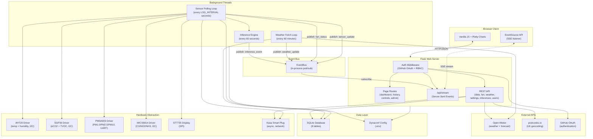
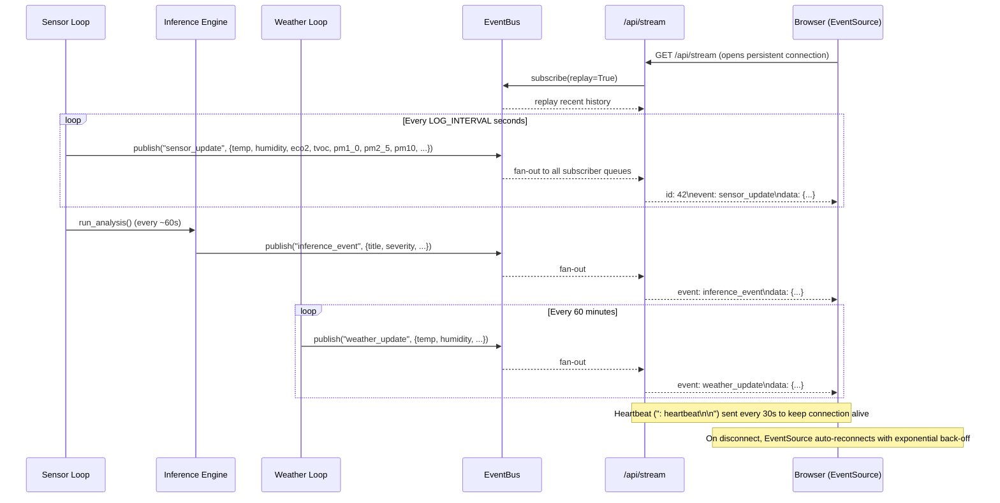
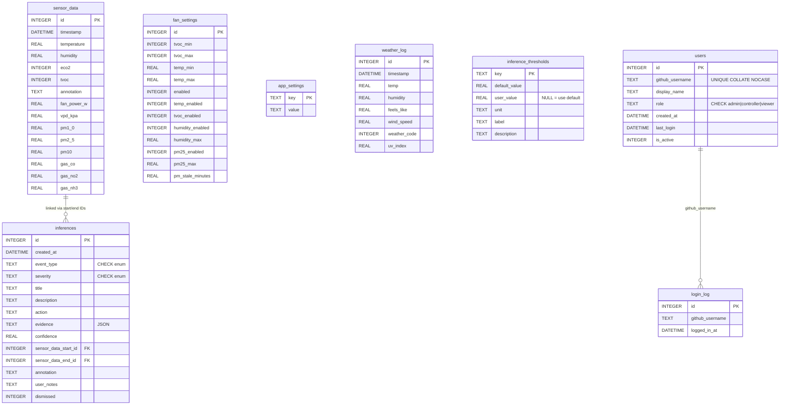
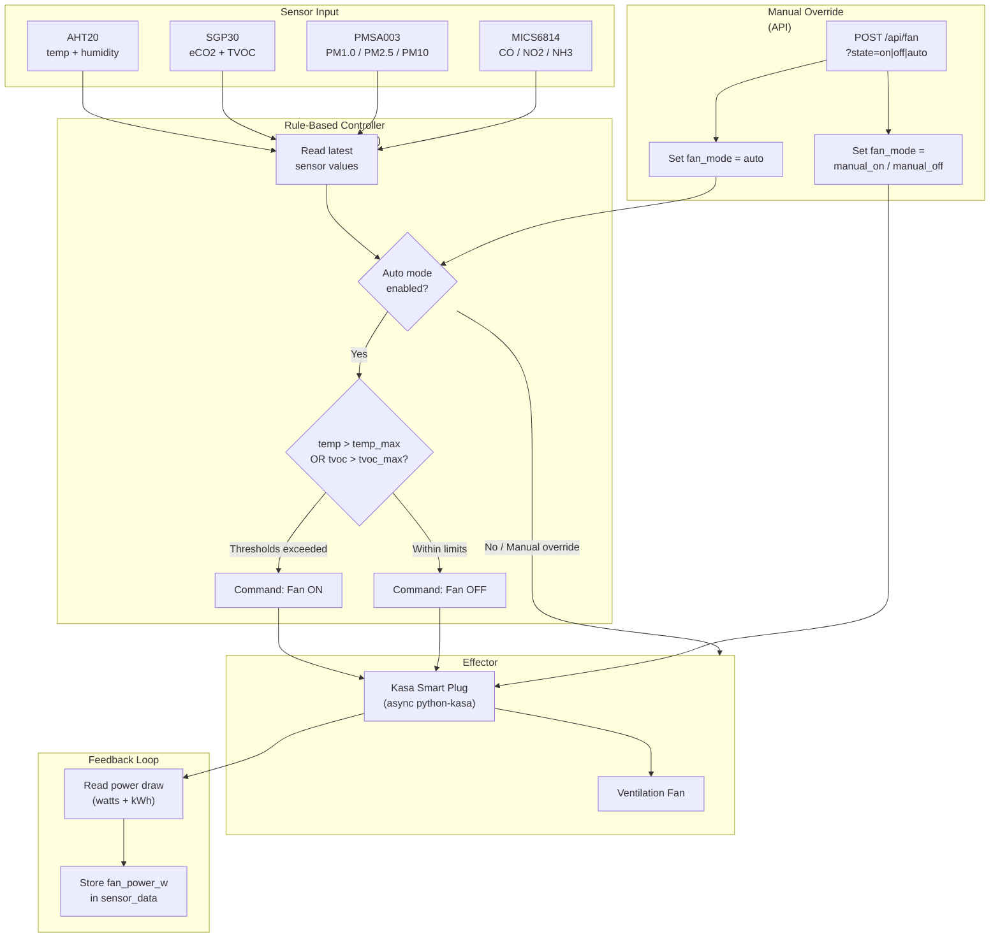
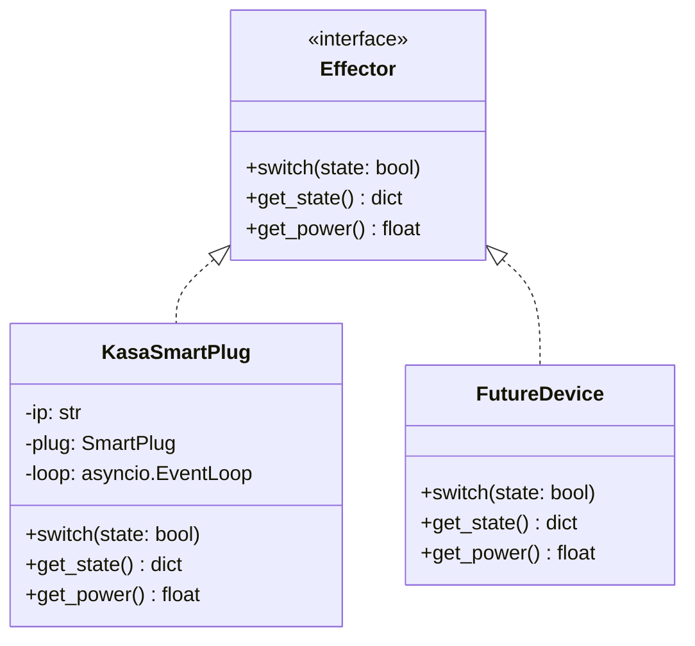

# MLSS Monitor: Mars Life Support Sensor Monitor

A lightweight environmental monitoring system for Raspberry Pi, designed as a prototype for Mars habitat life-support applications. Logs sensor data to SQLite, serves a live web dashboard with historical plots, controls effectors automatically via rule-based thresholds, and displays status on a small TFT screen.

A list of know issues and feature improvements including recomended fixes can be found here: [Bugs, Improvements and Roadmap](docs/Bugs_Improvements_and_Roadmap.md)
---

## Table of contents

- [Hardware](#hardware)
- [Features](#features)
- [Architecture](#architecture)
- [Database design](#database-design)
- [Effector control system](#effector-control-system)
- [Inference engine](#inference-engine)
- [FeatureVector](#featurevector)
- [Data flow](#data-flow)
- [Installation](#installation)
- [Running](#running)
- [Web interface](#web-interface)
- [API reference](#api-reference)
- [Development](#development)
- [Project structure](#project-structure)
- [Known limitations](#known-limitations)
- [Configuration reference](docs/CONFIGURATION.md)
- [Production deployment guide](docs/PRODUCTION.md)

---

## Hardware

| Component | Purpose |
|---|---|
| Raspberry Pi 4 | Host |
| Adafruit AHT20 | Temperature & humidity (I2C, 0x38) |
| Adafruit SGP30 | eCO2 & TVOC air quality (I2C, 0x58) |
| SB Components Air Monitoring HAT (PMSA003) | Particulate matter PM1.0/PM2.5/PM10 (UART) |
| Pimoroni MICS6814 Gas Sensor Breakout | CO, NO2 & NH3 gas detection (I2C, 0x04) |
| Adafruit BMP280 | Barometric pressure (I2C, 0x76) |
| 1.8" ST7735 TFT LCD | Local readout (SPI, 128x160) |
| TP-Link Kasa smart plug | Fan control (effector) |

### Wiring -- I2C sensors (daisy-chained)

| Signal | Pi GPIO | Wire colour | Connected to |
|---|---|---|---|
| 3.3V | Pin 1 | Red | AHT20 -> SGP30 |
| GND | Pin 6 | Black | AHT20 -> SGP30 |
| SDA | Pin 3 (GPIO2) | Blue | AHT20 -> SGP30 |
| SCL | Pin 5 (GPIO3) | Yellow | AHT20 -> SGP30 |

### Wiring -- ST7735 LCD (SPI)

| LCD pin | Pi pin | GPIO | Function |
|---|---|---|---|
| GND | 6 | -- | Ground |
| VCC | 1 | -- | 3.3V power |
| SCL | 23 | GPIO11 | SPI clock |
| SDA | 19 | GPIO10 | SPI MOSI |
| RES | 22 | GPIO25 | Reset |
| DC | 18 | GPIO24 | Data/command |
| CS | 24 | GPIO8 | Chip select |

### Wiring -- PMSA003 PM sensor (UART)

The SB Components Air Monitoring HAT sits directly on the Pi GPIO header. It uses the hardware UART (`/dev/serial0`) for data.

| HAT pin | Pi pin | GPIO | Function |
|---|---|---|---|
| VCC | 2 or 4 | -- | 5V power |
| GND | 6 | -- | Ground |
| TXD | 10 | GPIO15 (RXD) | Sensor TX → Pi RX |
| RXD | 8 | GPIO14 (TXD) | Pi TX → Sensor RX |

> **Important (Pi 4):** The hardware UART must be enabled via `raspi-config`. See the [UART setup](#uart-setup-for-pm-sensor) section under Installation.

### Wiring -- MICS6814 Gas Sensor (I2C)

The Pimoroni MICS6814 breakout uses I2C and can be daisy-chained with the AHT20 and SGP30.

| Signal | Pi GPIO | Wire colour | Connected to |
|---|---|---|---|
| 3.3V | Pin 1 | Red | MICS6814 3V3 |
| GND | Pin 6 | Black | MICS6814 GND |
| SDA | Pin 3 (GPIO2) | Blue | MICS6814 SDA |
| SCL | Pin 5 (GPIO3) | Yellow | MICS6814 SCL |

> **Note:** The sensor uses I2C address `0x04`. It measures three gas channels: **reducing** (CO), **oxidising** (NO2), and **NH3**. Readings are analogue resistance values -- compare trends rather than absolute numbers. The sensor benefits from a warm-up period of several minutes for stable readings.

---

## Features

- Gas detection (CO, NO2, NH3) via Pimoroni MICS6814 I2C sensor with historical trend plots
- Particulate matter monitoring (PM1.0, PM2.5, PM10) via PMSA003 UART sensor with WHO guideline colour coding
- Live sensor dashboard with configurable time range (15 min to all time)
- Auto fan control -- turns on when temperature or TVOC exceeds configurable thresholds
- Admin/settings page -- fan thresholds, auto mode toggle, location configuration
- Manual fan on/off override via API
- Data annotation -- mark points of interest directly on the chart
- CSV export of historical readings
- System health endpoint (CPU, memory, uptime, sensor status)
- Outdoor weather -- current conditions and 24-hour forecast via [Open-Meteo](https://open-meteo.com) (free, no key)
- UK postcode geocoding via [postcodes.io](https://postcodes.io) (e.g. `LS26`)
- Hourly weather logging with 7-day auto-cleanup
- GitHub OAuth 2.0 authentication (via `authlib`)
- Role-Based Access Control (RBAC) -- three roles: **admin**, **controller**, **viewer**
- User management UI under Settings -> Users -- admins can add/remove GitHub users and change roles
- Login audit log -- per-user login history visible to admins
- Environment inference engine -- continuously analyses sensor data to detect pollution events, threshold breaches, and trends
- Interactive dashboard card popups -- tap any card for detailed information about the metric, sensor, or calculation
- Real-time Server-Sent Events (SSE) -- sensor readings, fan status, inference alerts, and weather updates are pushed to the browser instantly via an in-process event bus, replacing most polling

---

## Architecture

MLSS Monitor follows a layered architecture with background processing threads, a Flask web server, hardware abstraction interfaces, and an in-process event bus for real-time push.

### System overview



### Real-time event flow (SSE)

The event bus decouples producers (background threads) from consumers (browser clients) using an in-process pub/sub pattern:



**Event types**:

| Event | Producer | Frequency | Payload |
|---|---|---|---|
| `sensor_update` | Sensor loop | Every LOG_INTERVAL (10s) | `{temperature, humidity, eco2, tvoc, fan_power_w, vpd_kpa, pm1_0, pm2_5, pm10, gas_co, gas_no2, gas_nh3}` |
| `fan_status` | Sensor loop (auto mode) | On state change | `{state, mode, power_w}` |
| `inference_event` | Inference engine | When detected | `{id, event_type, severity, title, description, action, confidence}` |
| `weather_update` | Weather loop | Every 60 min | `{temp, humidity, feels_like, wind_speed, weather_code, uv_index}` |

### Key design decisions

- **SSE over WebSockets** -- the data flow is overwhelmingly server-to-client. SSE is natively supported by browsers (`EventSource` with auto-reconnect), requires no new dependencies, and works through HTTP proxies. Fan commands and settings remain REST — bidirectional sockets would be overkill.
- **Event bus** (`event_bus.py`) -- a lightweight in-process pub/sub backed by per-subscriber `queue.Queue` instances. Thread-safe, zero dependencies, and decouples producers from the SSE transport. Maintains a rolling history (default 50 events) so late-joining clients receive recent state on connect.
- **Graceful degradation** -- the frontend falls back to polling for health and weather data. If the SSE connection drops, `EventSource` reconnects automatically with exponential back-off (1s to 30s). The REST API remains fully functional.
- **Background threads** -- two daemon threads run independently: one polls sensors and triggers the inference engine, the other fetches weather data hourly.
- **Async event loop** -- the Kasa smart plug uses `python-kasa` which is async. A dedicated `asyncio` event loop runs in the sensor polling thread for non-blocking plug control.
- **Shared state module** (`state.py`) -- holds mutable references to hardware objects, fan mode, the event bus, and the async event loop, allowing routes and background threads to coordinate.
- **Blueprint architecture** -- Flask routes are organised into ten blueprints for separation of concerns.
- **RBAC decorator** (`rbac.py`) -- `@require_role()` decorator enforces per-endpoint permission checks based on the authenticated user's role.

---

## Database design

MLSS uses a single SQLite file (`data/sensor_data.db`) with eight tables. Schema creation is idempotent -- `create_db()` uses `CREATE TABLE IF NOT EXISTS` and `ALTER TABLE` migrations, making it safe to call on every startup.



### Table summary

| Table | Purpose | Retention |
|---|---|---|
| `sensor_data` | One row per sensor poll (every `LOG_INTERVAL` seconds). Annotatable. | Indefinite -- export to CSV and prune manually if disk fills. |
| `fan_settings` | Single row -- current fan auto-mode thresholds. | Permanent config. |
| `app_settings` | Key/value store for location, energy rate, and other settings. | Permanent config. |
| `weather_log` | One row per hourly weather fetch from Open-Meteo. | Auto-purged after 7 days. |
| `inferences` | Environment inferences from the inference engine. Each row links to a range of `sensor_data` rows. | Indefinite -- dismiss to hide. |
| `inference_thresholds` | Configurable analysis thresholds with defaults and optional user overrides. | Permanent config. |
| `users` | Authorised GitHub users and their roles. Soft-deleted via `is_active = 0`. | Permanent -- admin-managed. |
| `login_log` | Append-only audit log of every successful login. | Indefinite. |

### Key design decisions

- **Single-row `fan_settings`** -- keeps retrieval trivial (`SELECT * ... LIMIT 1`) at the cost of not maintaining threshold change history.
- **`app_settings` as key/value** -- avoids schema migrations for each new config option; new keys are simply upserted.
- **`weather_log` rolling window** -- capping at 7 days keeps the database small (~168 rows max) while providing enough history for trend analysis.
- **`inferences` evidence as JSON TEXT** -- stores event-specific data in a JSON object, keeping the schema stable while remaining queryable via `json_extract()` in SQLite 3.38+.
- **`inference_thresholds` with user overrides** -- `user_value` column allows per-threshold customisation without touching defaults; `NULL` means use `default_value`.

---

## Effector control system

The effector (control) subsystem manages physical devices that act on the environment. Currently the only effector is a ventilation fan connected via a TP-Link Kasa smart plug, but the architecture supports adding further devices.

### Control flow



### Operating modes

| Mode | Trigger | Behaviour |
|---|---|---|
| **Auto** | `POST /api/fan?state=auto` | Fan state determined by threshold rules each polling cycle |
| **Manual On** | `POST /api/fan?state=on` | Fan forced on; auto rules suspended |
| **Manual Off** | `POST /api/fan?state=off` | Fan forced off; auto rules suspended |

### Auto-mode threshold rules

When auto mode is enabled, the background sensor polling loop evaluates each enabled rule against the current `fan_settings` thresholds. The fan turns **on** if any rule votes ON, and **off** otherwise.

| Rule | Setting fields | Behaviour |
|---|---|---|
| **Temperature** | `temp_enabled`, `temp_min`, `temp_max` | ON when temperature > `temp_max` |
| **TVOC** | `tvoc_enabled`, `tvoc_min`, `tvoc_max` | ON when TVOC > `tvoc_max` |
| **Humidity** | `humidity_enabled`, `humidity_max` | ON when humidity > `humidity_max` |
| **PM2.5** | `pm25_enabled`, `pm25_max` | ON when PM2.5 > `pm25_max` |

Each rule can be individually enabled/disabled. A disabled rule always abstains (NO_OPINION) so the fan state is determined by the remaining active rules.

**PM2.5 staleness cache** -- when the UART sensor fails to return data on a given cycle, the last successful reading is reused for up to `pm_stale_minutes` (default 10 minutes, configurable in Settings). This prevents the fan toggling on and off every few seconds during intermittent sensor dropouts. Readings older than the staleness window are discarded and the PM2.5 rule abstains.

Thresholds are configurable via the admin settings page or `POST /api/fan/settings`.

### Smart plug interface

The `KasaSmartPlug` class (`external_api_interfaces/kasa_smart_plug.py`) wraps `python-kasa` with:

| Method | Description |
|---|---|
| `switch(state: bool)` | Turn the plug on or off |
| `get_power()` | Read current power draw (watts) and daily energy (kWh) |
| `get_state()` | Return plug IP and on/off state |

All Kasa calls are async and dispatched via an `asyncio` event loop running in the sensor polling thread.

### Energy monitoring

The plug's energy meter provides real-time power draw (`fan_power_w`), which is logged alongside sensor data in every poll cycle. The admin page displays cumulative daily energy consumption and estimated cost based on a user-configured energy unit rate.

### Extensibility



New effectors can be added by implementing the same interface pattern (`switch`, `get_state`, `get_power`) and registering them in the background control loop. The `controls.html` template already provides a device-grid layout anticipating multiple controllable devices.

---

## Inference engine

The inference engine (`mlss_monitor/inference_engine.py`) continuously analyses incoming sensor data and generates actionable insights. It runs every ~60 seconds from the background logging thread and writes results to the `inferences` table.

### How it works

1. **Data window** -- each analysis cycle fetches the last 30 minutes of sensor readings from SQLite.
2. **Threshold loading** -- thresholds are refreshed from the `inference_thresholds` database table on every cycle, with hardcoded fallbacks for resilience.
3. **Detectors** -- nine independent detectors examine the data for specific patterns.
4. **Deduplication** -- each detector checks if an inference of the same type was already created within a cooldown window (1-24 hours depending on type).
5. **Confidence scoring** -- each inference includes a confidence value (0.0-1.0) based on how strongly the data supports the conclusion.
6. **Startup backfill** -- on application start, the engine generates missing hourly and daily summaries from historical data.

### Detectors

**Short-term detectors** (every ~60 seconds, last 30 minutes of data):

| Detector | Event type | Trigger condition |
|---|---|---|
| TVOC spike | `tvoc_spike` | TVOC rises > 2x rolling baseline AND above moderate threshold |
| eCO2 threshold | `eco2_elevated` / `eco2_danger` | eCO2 crosses cognitive impairment (1000 ppm) or danger (2000 ppm) thresholds |
| Temperature extreme | `temp_high` / `temp_low` | Sustained outside comfort zone (15-28 C) |
| Humidity extreme | `humidity_high` / `humidity_low` | Sustained outside ideal range (30-70%) |
| VPD extreme | `vpd_low` / `vpd_high` | Vapour pressure deficit outside plant-optimal range (0.4-1.6 kPa) |
| Correlated pollution | `correlated_pollution` | TVOC and eCO2 rising together (Pearson r > 0.6) |
| Rapid change | `rapid_temp_change` / `rapid_humidity_change` | Temperature swing > 3 C or humidity swing > 15% |
| Sustained poor air | `sustained_poor_air` | TVOC or eCO2 high for 10+ of last 12 readings |
| Annotation context | `annotation_context_<id>` | Links user annotations to notable sensor conditions |

**Hourly detectors** (every ~1 hour, last 60 minutes):

| Detector | Event type | Output |
|---|---|---|
| Hourly summary | `hourly_summary` | Statistical snapshot with averages, trends, stability assessment |

**Daily detectors** (every ~24 hours, last 24 hours):

| Detector | Event type | Output |
|---|---|---|
| Daily summary | `daily_summary` | Comprehensive report with environment score (0-100), time-in-zone percentages |
| Daily patterns | `daily_pattern` | Recurring pollution at specific hours |
| Overnight build-up | `overnight_buildup` | eCO2 rising > 200 ppm between 23:00-07:00 |

### Detection methods

The system uses a 4-layer detection architecture. Every inference carries a `detection_method` field indicating which layer fired it:

1. **Rule-based detection** — threshold rules declared in `config/rules.yaml` and evaluated by the `rule-engine` library. Fires immediately when a sensor crosses a threshold (e.g. TVOC > 500 ppb, eCO2 > 1000 ppm, temperature outside 15–28 °C). Low latency, high precision for known patterns.

2. **Statistical ML anomaly detection** — per-sensor [River `HalfSpaceTrees`](https://riverml.xyz/latest/api/anomaly/HalfSpaceTrees/) models (`AnomalyDetector`). Each model learns an individual channel's baseline via EMA and scores each new reading; scores above 0.75 trigger an inference. Requires ~1,440 readings per channel for cold-start. Detects unusual patterns in individual channels without labels.

3. **Deterministic fingerprint matching** — programmatic scoring against hand-crafted profiles in `config/fingerprints.yaml` (e.g. `personal_care`, `cooking`, `combustion`). Each fingerprint defines expected sensor states (`elevated`/`high`/`absent`/`normal`) and temporal criteria. Attribution score = `sensor_score × 0.6 + temporal_score × 0.4`. Fires autonomously when the AttributionEngine (`mlss_monitor/attribution/engine.py`) finds a fingerprint match above its confidence floor. Results are stored in `inference.evidence.attribution_source`.

4. **Trained ML fingerprint classifier** — a River `LogisticRegression` pipeline trained on user-tagged events. Users tag inference events with fingerprint labels constrained to the vocabulary in `config/fingerprints.yaml`. The classifier trains on the full 143-field `FeatureVector`. The model is persisted to `data/classifier.pkl` and auto-loaded on startup. After sufficient training samples, the classifier fires `ml_learned_<source>` events autonomously when its confidence exceeds 0.65 (overriding fingerprint when it disagrees if confidence ≥ 0.7).

The dashboard displays a coloured chip (grey = Rule, teal = Statistical, purple = ML) on each inference card and in the detail dialog. Fingerprint-matched events carry a "Rule" chip; their attribution source appears as a badge in the dialog.

### Attribution engine

The `AttributionEngine` (`mlss_monitor/attribution/engine.py`) scores fingerprints against each new FeatureVector in two modes:

**Hybrid mode (augments rule-fired events):** When a rule fires, the engine scores all fingerprints and blends with the ML classifier prediction:
- If classifier and top fingerprint agree: `conf = 0.6 × fp_score + 0.4 × ml_score`
- If they disagree: `conf = 0.6 × fp_score` (classifier suppresses confidence)
- If `ml_conf ≥ 0.7`: classifier overrides fingerprint disagreement
- The best match above its fingerprint's `confidence_floor` is stored as `attribution_source`

**Standalone ML mode:** When no rule fires but `ml_conf ≥ 0.65`, the engine fires `ml_learned_<source_id>` events autonomously. This allows the classifier to discover sources that rules cannot detect.

Example fingerprint sources:

| Source | Key sensor signals |
|---|---|
| Personal Care Products | Elevated TVOC, eCO2; PM channels normal |
| Cooking | PM2.5 spike with TVOC rise; CO resistance drop |
| Combustion | PM2.5 and TVOC both elevated and correlated; high PM2.5/PM10 ratio |
| Biological Off-gassing | Gradual TVOC rise, often overnight |
| Cleaning Products | Sharp TVOC spike; CO, NO2, NH3 resistance change |

### User tagging and incremental attribution training

User-applied tags are stored in the `event_tags` table and linked to the originating inference. Tag names are constrained to the controlled vocabulary of fingerprint IDs defined in `config/fingerprints.yaml`. When a new tag is added, the AttributionEngine retrains its River `LogisticRegression` classifier from all existing tagged feature vectors. See [docs/EVENT_TAGGING_FLOW.md](docs/EVENT_TAGGING_FLOW.md) for a flow description.

- A tagged event must include a `feature_vector` in its evidence to be used as training data.
- Tagging a historical range creates an `annotation_context_user_range` inference with both raw readings and a derived feature vector. The feature vector baseline is computed from the 60-minute pre-event median from the `sensor_data` table.
- The classifier encodes string labels internally (via `_StringLabelClassifier`) because River 0.23.0's `LogisticRegression` requires numeric targets.
- The trained model is saved to `data/classifier.pkl` after each training run and auto-loaded on startup.
- Fingerprint heuristics remain the primary signal; the trained classifier refines confidence and can fire `ml_learned_*` events autonomously once it accumulates sufficient samples (≥5 per label).

### Configurable thresholds

All inference thresholds are stored in the `inference_thresholds` table and can be customised via the admin settings page or `POST /api/settings/thresholds`. See the [Configuration reference](docs/CONFIGURATION.md#inference-thresholds) for the full list of threshold keys and defaults.

---

## FeatureVector

A `FeatureVector` is a structured snapshot of 143 derived sensor metrics computed from a window of raw readings, used as input to all statistical and ML detectors.

### Fields

**Per-sensor fields (10 sensors × 14 fields = 140)**

Each of the 10 sensor channels (`tvoc`, `eco2`, `temperature`, `humidity`, `pm1`, `pm25`, `pm10`, `co`, `no2`, `nh3`) has the following derived fields:

| Suffix | Description |
|---|---|
| `_current` | Latest raw reading |
| `_baseline` | EMA baseline updated continuously by the `AnomalyDetector` |
| `_slope_1m` | Rate of change over the last 1 minute |
| `_slope_5m` | Rate of change over the last 5 minutes |
| `_slope_30m` | Rate of change over the last 30 minutes |
| `_elevated_minutes` | Minutes the sensor has been above its elevated threshold |
| `_peak_ratio` | Peak value in the window divided by baseline |
| `_is_declining` | Boolean — reading is trending downward |
| `_decay_rate` | Rate at which the reading is falling from peak |
| `_pulse_detected` | Boolean — a short sharp spike was detected |
| `_acceleration` | Second derivative of the reading (change in slope) |
| `_peak_time_offset_s` | Seconds since the channel's peak within the analysis window |
| `_rise_time_s` | Seconds from start of rise to peak |
| `_slope_variance` | Variance of the 1-minute slopes within the window |

**Cross-sensor and derived fields (3)**

| Field | Description |
|---|---|
| `pearson_tvoc_eco2` | Pearson r between TVOC and eCO2 over the analysis window |
| `pm_ratio_25_10` | PM2.5 / PM10 ratio (combustion signature indicator) |
| `vpd_kpa` | Vapour pressure deficit derived from temperature and humidity |

### How it is computed

1. The `FeatureExtractor` fetches the last N readings (configurable; default 30 minutes).
2. Rolling baselines use the live EMA maintained by the `AnomalyDetector`. For historical event tagging, baselines are computed from the 60-minute pre-event median in the `sensor_data` table.
3. Temporal features (slopes, acceleration, rise time, peak timing, slope variance) are derived in-process — no external calls.
4. The resulting `FeatureVector` is passed to each registered detector and to the attribution engine.

See `mlss_monitor/feature_vector.py` and the spec at `docs/superpowers/specs/2026-03-31-smart-inference-engine-design.md`.

---

## Data flow

```
Sensor hardware
  │
  ▼
SensorPoller (background thread, every LOG_INTERVAL seconds)
  │  reads raw values from AHT20, SGP30, PMSA003, MICS6814
  ▼
NormalisedReading (dataclass)
  │  unit conversion, null handling, stale-PM detection
  ▼
HotTier (in-memory deque, 60 min, persisted to SQLite for restarts)
  │  merges all DataSource outputs into one reading/second
  ▼
FeatureExtractor
  │  computes baselines, ratios, slopes, Pearson correlations
  ▼
FeatureVector (143 fields)
  │
  ├──► [Layer 1] Rule engine (rule-engine + config/rules.yaml)    ──┐
  ├──► [Layer 2] FingerprintMatcher (config/fingerprints.yaml,    ──┤──► DetectionEngine
  │               sensor_score×0.6 + temporal_score×0.4)           │
  ├──► [Layer 3] AnomalyDetector (River HalfSpaceTrees,          ──┤
  │               one model per channel, EMA baseline)             │
  └──► [Layer 4] FingerprintClassifier (River LogisticRegression, ──┘       │
                  trained on user-tagged events, data/classifier.pkl)         │
                                                                   ▼          │
                                               AttributionEngine              │
                                                 │  fingerprint + classifier  │
                                                 ▼                            │
                                               Inference record               │
                                                 (saved to inferences table) ─┘
                                                     │
                                                     ▼
                                               EventBus.publish('inference_fired')
                                                     │
                                                     ▼
                                               SSE /api/stream  ──► Browser dashboard
                                               (inference_event pushed to all clients)
```

See spec files in `docs/superpowers/specs/` for full design documentation:
- `2026-03-31-smart-inference-engine-design.md` -- original engine architecture
- `2026-04-04-phase5-multivariate-actionable-inferences.md` -- multivariate ML models and actionable inference evidence
- `2026-04-04-phase6-display-ui-and-ml-insights.md` -- Detections & Insights UI, normal bands chart, and inference card enrichment

---

## Installation

### Prerequisites

- Raspberry Pi 4 running Raspberry Pi OS (Bookworm or Bullseye)
- Python 3.11+
- I2C enabled (the setup script handles this)
- UART enabled (required for the PM sensor -- see below)

### First-time setup

```bash
git clone https://github.com/Ryan-be/mars-air-quility.git
cd mars-air-quility
bash scripts/setup_pi.sh
```

The setup script:
1. Installs system build dependencies via `apt` (`python3-dev`, `libssl-dev`, `libjpeg-dev`, etc.)
2. Enables I2C if not already on -- **a reboot is required after this step**
3. Configures pip to use [piwheels](https://www.piwheels.org) (pre-built ARM wheels)
4. Installs [Poetry](https://python-poetry.org) if missing
5. Installs project dependencies, skipping heavy optional packages and dev tools
6. Creates the `data/` directory and initialises the SQLite database
7. Creates a default `.env` if one does not exist

> After setup, edit `.env` and configure your environment variables. See the [Configuration reference](docs/CONFIGURATION.md) for all available options.

### UART setup for PM sensor

The PMSA003 particulate matter sensor communicates via the hardware UART (`/dev/serial0`). On Raspberry Pi 4, this must be enabled manually:

```bash
sudo raspi-config
```

Navigate to **Interface Options → Serial Port**:
1. "Would you like a login shell to be accessible over serial?" → **No**
2. "Would you like the serial port hardware to be enabled?" → **Yes**

> **Important for Pi 4:** By default, Bluetooth uses the hardware UART (`ttyAMA0`), so `/dev/serial0` maps to the mini UART (`ttyS0`) which is too slow for the PMSA003. Add this to `/boot/config.txt` to disable Bluetooth and free the hardware UART:
> ```
> dtoverlay=disable-bt
> ```

Then reboot:

```bash
sudo reboot
```

After reboot, verify the serial port exists:

```bash
ls -l /dev/serial0
# Should show: /dev/serial0 -> ttyAMA0
```

> If it shows `ttyS0` instead, add `dtoverlay=disable-bt` to `/boot/config.txt` and reboot again.

### Serial port permissions

To access serial ports (PM sensor on UART), the user running the application needs permission:

```bash
# Add your user to the dialout group
sudo usermod -a -G dialout $USER

# Verify membership
groups $USER
```

**Log out and log back in** (or run `newgrp dialout`) for the group change to take effect.

> **Note:** On Pi 4, `/dev/serial0` is a symlink to `/dev/ttyAMA0` (the PL011 UART). The mini UART (`/dev/ttyS0`) is assigned to Bluetooth by default. If you need Bluetooth disabled, add `dtoverlay=disable-bt` to `/boot/config.txt`.

### Why piwheels?

Many packages with C extensions (Pillow, cryptography, cffi) do not ship pre-built ARM wheels on PyPI. Without piwheels, pip must compile from source on the Pi -- which is very slow and can fail due to missing system libraries or memory constraints. piwheels provides pre-compiled ARM wheels, reducing install time from tens of minutes to seconds.

piwheels is configured in `pyproject.toml` as a supplemental source, so Poetry will check it automatically.

### Manual install

```bash
pip config set global.extra-index-url https://www.piwheels.org/simple
poetry install --without visualization --without dev
mkdir -p data
poetry run python database/init_db.py
```

---

## Running

### Directly

```bash
poetry run python mlss_monitor/app.py
```

Dashboard available at `http://<pi-ip>:5000`.

### As a systemd service

```bash
# Edit mlss-monitor.service if your username or project path differs from masadmin
sudo cp mlss-monitor.service /etc/systemd/system/
sudo systemctl daemon-reload
sudo systemctl enable --now mlss-monitor

# Check status / follow logs
sudo systemctl status mlss-monitor
sudo journalctl -u mlss-monitor -f
```

---

## Web interface

| URL | Description | Min role |
|---|---|---|
| `/` | Live sensor dashboard | viewer |
| `/history` | Historical charts | viewer |
| `/controls` | Fan manual control | viewer (write: controller) |
| `/admin` | Settings & user management | admin |
| `/login` | Sign-in via GitHub OAuth | -- |
| `/system_health` | JSON system status | viewer |

### Roles

| Role | Permissions |
|---|---|
| **admin** | Full access -- settings, fan control, annotations, user management |
| **controller** | Operate fan, annotate data, dismiss inferences -- no settings changes |
| **viewer** | Read-only -- view all sensor, weather, and inference data |

The `MLSS_ALLOWED_GITHUB_USER` bootstrap account always has the **admin** role regardless of what is stored in the database. It serves as a permanent recovery mechanism.

---

## API reference

### Authentication

| Method | Endpoint | Description |
|---|---|---|
| `GET` | `/login` | Login page |
| `GET` | `/auth/github` | Initiate GitHub OAuth flow |
| `GET` | `/auth/callback` | GitHub OAuth callback |
| `GET` | `/logout` | Clear session |

### Sensor data

| Method | Endpoint | Min role | Description |
|---|---|---|---|
| `GET` | `/api/data?range=24h` | viewer | Sensor readings. `range`: `15m` `1h` `6h` `12h` `24h` `all` |
| `GET` | `/api/download?range=24h` | viewer | Download as CSV |
| `POST` | `/api/annotate?point=<id>` | controller | Add annotation -- body: `{"annotation": "text"}` |
| `DELETE` | `/api/annotate?point=<id>` | controller | Remove annotation |

### Fan control

| Method | Endpoint | Min role | Description |
|---|---|---|---|
| `POST` | `/api/fan?state=on\|off\|auto` | controller | Manual fan control or switch to auto mode |
| `GET` | `/api/fan/status` | viewer | Current plug state (power_w, today_kwh, mode) |
| `GET` | `/api/fan/settings` | viewer | Auto fan threshold settings |
| `POST` | `/api/fan/settings` | admin | Update settings -- body: `{"temp_max": 25.0, "tvoc_max": 600, "enabled": true}` |

### Weather

| Method | Endpoint | Min role | Description |
|---|---|---|---|
| `GET` | `/api/weather` | viewer | Current outdoor conditions (90-min DB cache) |
| `GET` | `/api/weather/forecast` | viewer | 24-hour hourly forecast |
| `GET` | `/api/weather/forecast/daily` | viewer | 14-day daily forecast |
| `GET` | `/api/weather/history` | viewer | Historical weather log |
| `GET` | `/api/geocode?q=<query>` | viewer | Geocode a place name or UK postcode |

### Settings

| Method | Endpoint | Min role | Description |
|---|---|---|---|
| `GET` | `/api/settings/location` | viewer | Get saved location |
| `POST` | `/api/settings/location` | admin | Save location -- body: `{"lat": 53.7, "lon": -1.5, "name": "LS26"}` |
| `GET` | `/api/settings/energy` | viewer | Get saved energy unit rate |
| `POST` | `/api/settings/energy` | admin | Save energy rate -- body: `{"unit_rate_pence": 28.5}` |
| `GET` | `/api/settings/thresholds` | viewer | Get inference thresholds |
| `POST` | `/api/settings/thresholds` | admin | Update thresholds |

### Inferences

| Method | Endpoint | Min role | Description |
|---|---|---|---|
| `GET` | `/api/inferences?limit=50` | viewer | List inferences. `dismissed=1` includes dismissed. |
| `GET` | `/api/inferences/categories` | viewer | List category names |
| `POST` | `/api/inferences/<id>/notes` | controller | Save user notes -- body: `{"notes": "text"}` |
| `POST` | `/api/inferences/<id>/dismiss` | controller | Dismiss an inference |

### User management

| Method | Endpoint | Min role | Description |
|---|---|---|---|
| `GET` | `/api/users` | admin | List all registered GitHub users |
| `POST` | `/api/users` | admin | Add user -- body: `{"github_username": "octocat", "role": "viewer"}` |
| `PATCH` | `/api/users/<id>/role` | admin | Change role -- body: `{"role": "controller"}` |
| `GET` | `/api/users/<id>/logins` | admin | Login history (last 20 entries) |
| `DELETE` | `/api/users/<id>` | admin | Deactivate a user |

### Real-time stream (SSE)

| Method | Endpoint | Min role | Description |
|---|---|---|---|
| `GET` | `/api/stream` | viewer | SSE stream -- persistent connection pushing `sensor_update`, `fan_status`, `inference_event`, `weather_update` events |
| `GET` | `/api/stream/history` | viewer | JSON array of recent events (last 50). Optional `?event=sensor_update` filter. |

**SSE wire format** (per the [SSE spec](https://html.spec.whatwg.org/multipage/server-sent-events.html)):
```
id: 42
event: sensor_update
data: {"temperature": 22.5, "humidity": 55.0, "eco2": 620, "tvoc": 85, "fan_power_w": 4.2, "vpd_kpa": 1.12, "pm1_0": 5, "pm2_5": 8, "pm10": 12, "gas_co": 1.23, "gas_no2": 0.45, "gas_nh3": 2.10}

```

---

## Development

### Running tests

```bash
poetry install --with dev
poetry run pytest tests/ -v
```

Tests are organised into the following files:

| File | Covers |
|---|---|
| `tests/test_fan_settings.py` | DB layer round-trips, API GET/POST, admin page |
| `tests/test_async.py` | Thread-loop integration, async dispatch patterns, error handling |
| `tests/test_pi_resilience.py` | Sensor failures, DB init idempotency, `/proc/uptime` fallback, background thread survival |
| `tests/test_open_meteo.py` | Geocoding (UK postcode, outcode, place name), current weather, forecast |
| `tests/test_daily_forecast.py` | 14-day daily forecast API -- keys, URL params, error propagation |
| `tests/test_weather_history.py` | Weather history DB function -- filtering, ordering, required keys |
| `tests/test_mics6814.py` | MICS6814 gas sensor interface, init/read, database integration |
| `tests/test_rbac.py` | User DB, login log, role enforcement on all write endpoints |

Hardware libraries (`board`, `busio`, `adafruit_*`) are stubbed in `tests/conftest.py` so all tests run on any machine.

### Linting

```bash
poetry run pip install pylint
poetry run pylint $(git ls-files '*.py')
```

### Optional visualisation dependencies

`pandas` and `matplotlib` are not used by the web app. If you need them for offline data analysis:

```bash
poetry install --with visualization
```

---

## Project structure

```
mlss_monitor/
  app.py                      Flask app factory, hardware init, background loops
  state.py                    Shared mutable state (fan mode, hardware refs, event bus, event loop)
  event_bus.py                In-process pub/sub for SSE -- thread-safe, rolling history
  rbac.py                     Role-Based Access Control -- require_role() decorator
  inference_engine.py         Environment analysis -- 9 detectors, pollution event flagging
  routes/
    __init__.py               Blueprint registration (10 blueprints)
    auth.py                   GitHub OAuth login/logout, DB role lookup
    pages.py                  Page routes (dashboard, history, controls, admin)
    api_data.py               Sensor data API (fetch, CSV download, annotations)
    api_fan.py                Fan control API (toggle, status, settings)
    api_weather.py            Weather API (current, hourly/daily forecast, history, geocode)
    api_settings.py           Settings API (location, energy rate, thresholds)
    api_inferences.py         Inference API (list, notes, dismiss)
    api_users.py              User management API (list, add, role change, login log, deactivate)
    api_stream.py             SSE streaming endpoint + event history API
    system.py                 System health endpoint
database/
  db_logger.py                SQLite read/write helpers
  init_db.py                  Schema creation -- safe to re-run on existing DB
  user_db.py                  User & login_log CRUD operations
  import_csv_to_db.py         One-off CSV import utility
sensor_interfaces/
  aht20.py                    AHT20 temperature/humidity driver
  sgp30.py                    SGP30 eCO2/TVOC driver (15 s warm-up on startup)
  display.py                  ST7735 TFT display driver
  mics6814.py                 Pimoroni MICS6814 gas sensor driver (CO, NO2, NH3)
  sb_components_pm_sensor.py  Particulate matter sensor driver
external_api_interfaces/
  kasa_smart_plug.py          Async TP-Link Kasa plug control
  open_meteo.py               Open-Meteo weather + forecast + UK geocoding client
templates/
  base.html                   Shared layout (nav bar, auth controls)
  dashboard.html              Live sensor dashboard with forecasts
  history.html                Tabbed historical charts (sensors, particulate, environment, correlation, patterns)
  controls.html               Device control hub (fan, future devices)
  admin.html                  Settings (tabbed) -- fan, energy, location, user management
  login.html                  Sign-in page (GitHub OAuth)
static/
  css/
    base.css                  Shared reset, nav, cards, light/dark toggle, mobile fixes
    dashboard.css             Dashboard-specific layout and components
    history.css               Tab bar, chart info popups, correlation styles
    controls.css              Device grid and control card styles
    admin.css                 Settings page styles
  js/
    dashboard.js              Boot, SSE connection, weather/forecast, card popups, inference feed
    history.js                Tab switching, lazy chart rendering, data fetch
    insights.js               Derived calculations, weather + forecast rendering
    charts.js                 Plotly sensor chart rendering (temp, hum, eco2, tvoc)
    charts_env.js             Environment charts (indoor/outdoor overlay, VPD, fan state)
    charts_correlation.js     Time-brush, scatter plots, regression, inference engine
                              -- drag the brush chart to zoom into a window; the scatter
                              plots and inference panel update to show only that selection.
                              Zoom is preserved across data polling cycles (only destroyed
                              by Reset button, page navigation, or browser refresh).
    charts_patterns.js        Pattern analysis (hour-of-day heatmap, daily temp range)
    controls.js               Device control page (SSE fan status, status dot)
    fan.js                    Fan control API calls
    health.js                 System health polling
    theme.js                  Light/dark mode toggle
scripts/
  setup_pi.sh                 First-run setup script for Raspberry Pi
tests/
  conftest.py                 Pytest fixtures, hardware + auth stubs
  test_fan_settings.py        Fan settings DB and API tests
  test_async.py               Async dispatch and thread-loop tests
  test_pi_resilience.py       Pi-specific resilience tests
  test_open_meteo.py          Open-Meteo client unit tests
  test_daily_forecast.py      Daily forecast API tests
  test_weather_history.py     Weather history DB function tests
  test_mics6814.py            MICS6814 gas sensor -- interface, init, read, DB integration
  test_rbac.py                RBAC -- user DB, login log, role enforcement on all write endpoints
  test_event_bus.py           EventBus pub/sub, history, thread safety tests
  test_sse.py                 SSE endpoint, wire format, auth, history API tests
docs/
  CONFIGURATION.md            Full configuration reference
  PRODUCTION.md               Production deployment guide
config.py                     Dynaconf configuration loader
mlss-monitor.service          systemd unit file
.env.example                  Template for environment variables
```

---

## Known limitations

| Issue | Detail |
|---|---|
| `data/` directory must exist before starting | SQLite will fail if the directory is missing. The setup script creates it; for manual installs run `mkdir -p data`. |
| `RPi.GPIO` not in `pyproject.toml` | This Pi-only package fails to build on non-Pi platforms so it is excluded from the lock file. The setup script installs it via `poetry run pip install RPi.GPIO`. For manual installs run that command after `poetry install`. |
| SGP30 15 s warm-up | The first few eCO2/TVOC readings after power-on may be inaccurate -- this is normal sensor behaviour. |
| PMSA003 UART must be enabled | The PM sensor requires the hardware UART to be enabled via `raspi-config` on Pi 4. Without it, `/dev/serial0` does not exist and PM readings will be null. See the [UART setup](#uart-setup-for-pm-sensor) section. |
| MICS6814 readings are relative | The gas sensor outputs analogue resistance values, not calibrated ppm concentrations. Compare trends rather than treating readings as absolute measurements. The sensor benefits from a warm-up period of several minutes. |
| Kasa `SmartPlug` API deprecated | The `python-kasa` library has deprecated `SmartPlug` in favour of `IotPlug`. A migration warning appears on startup; functionality is unaffected for now. |
| Flask dev server | `app.run()` uses Flask's single-threaded development server. For production, use gunicorn behind nginx -- see the [Production deployment guide](docs/PRODUCTION.md). |
