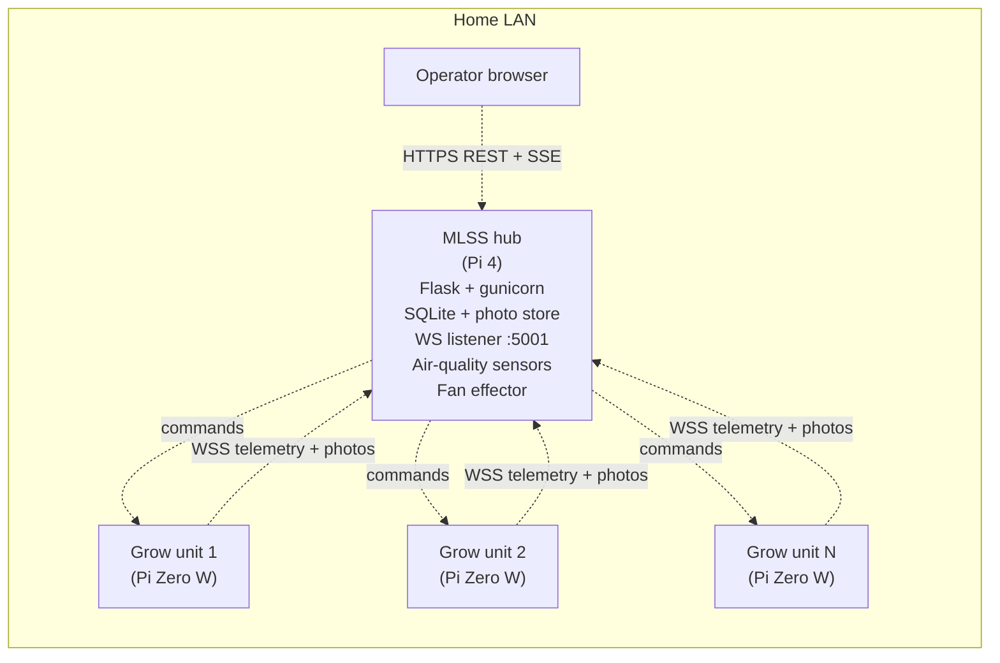
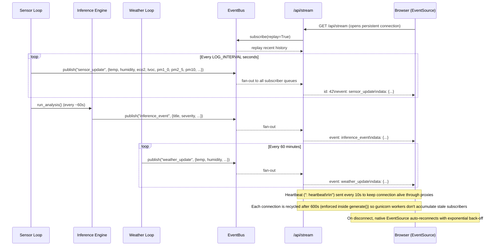
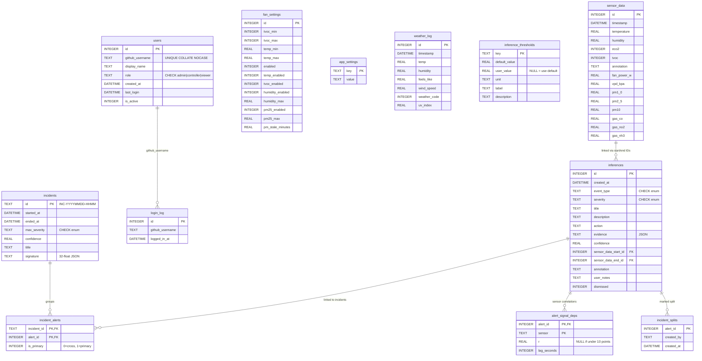
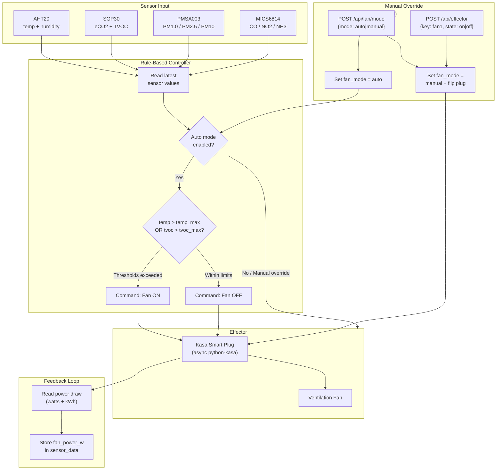
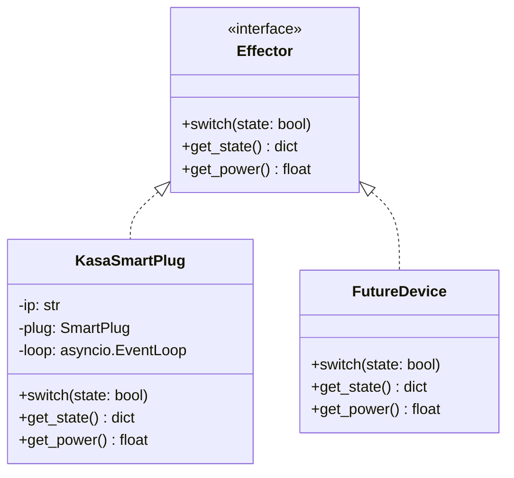

# MLSS Monitor: Mars Life Support Sensor Monitor

MLSS is a **distributed environmental monitoring system** for the home, pitched as a prototype for Mars-habitat life-support. A central **MLSS hub** (Raspberry Pi 4 with air-quality sensors, a fan effector, and a Flask/gunicorn web dashboard) talks to **N edge Plant Grow Units** (Pi Zero W with soil moisture, camera, pump, and grow-light) over authenticated WSS. The hub provides one operator UI, one auth model, one SQLite store, and one place to back up everything; the edge units run their own safety + PID loops locally so plants survive an MLSS outage. The web UI is built with [AstroUXDS](https://astrouxds.com), NASA / Lockheed Martin's open-source space-mission design system.

A list of know issues and feature improvements including recomended fixes can be found here: [Bugs, Improvements and Roadmap](docs/Bugs_Improvements_and_Roadmap.md)

> **First time setting up a Plant Grow Unit?**
> Start with [docs/PLANT_GROW_UNIT_SETUP.md](docs/PLANT_GROW_UNIT_SETUP.md)
> — that's the deployment-critical path: prerequisites, the
> `/boot/mlss-grow.yaml` file, the install one-liner, sense-only-mode
> deployment posture, and token rotation / decommission flows. Hardware
> wiring is in [docs/PLANT_GROW_UNIT_HARDWARE.md](docs/PLANT_GROW_UNIT_HARDWARE.md).
---

## Table of contents

- [Distributed architecture](#distributed-architecture)
- [Hardware](#hardware)
- [Features](#features)
- [Architecture](#architecture)
- [Database design](#database-design)
- [Effector control system](#effector-control-system)
- [Inference engine](#inference-engine)
- [Incident correlation graph](#incident-correlation-graph)
- [FeatureVector](#featurevector)
- [Data flow](#data-flow)
- [Plant Grow Units](#plant-grow-units)
- [Installation](#installation)
- [Running](#running)
- [Web interface](#web-interface)
- [API reference](#api-reference)
- [Development](#development)
- [Project structure](#project-structure)
- [Known limitations](#known-limitations)
- [Documentation map](#documentation)
- [Database reference](docs/DATABASE.md)
- [Configuration reference](docs/CONFIGURATION.md)
- [Production deployment guide](docs/PRODUCTION.md)

---

## Distributed architecture

MLSS is no longer a single-Pi air-quality monitor. The **MLSS hub** is one
Raspberry Pi 4 that runs Flask + gunicorn, owns the SQLite store and photo
archive, hosts the operator browser UI, and acts as the WS broker. Around
it, **N edge Plant Grow Units** — each a Pi Zero W with a soil-moisture
sensor, optional camera, water pump, and grow-light — run their own local
safety loop and PID watering on a 30-second tick. The link between them is
an authenticated WSS connection (per-unit bearer token, TLS pinned to the
hub's self-signed cert): telemetry + photos + capabilities flow up,
commands flow down, and if the WS drops the unit buffers everything to a
local SQLite + JPEG outbox and drains it oldest-first on reconnect. The
unit's local safety loop means **plants don't depend on the hub being
healthy moment-to-moment** — and the hub means one dashboard, one auth
model, one place to back up everything.



Air-quality monitoring (AHT20 / SGP30 / PMSA003 / MICS6814) is one input
class into the hub; plant grow units are another. The
[Architecture](#architecture) section drills into the in-hub layering;
[Plant Grow Units](#plant-grow-units) and
[docs/PLANT_GROW_UNIT_ARCHITECTURE.md](docs/PLANT_GROW_UNIT_ARCHITECTURE.md)
cover the edge tier.

---

## Hardware

| Component | Purpose |
|---|---|
| Raspberry Pi 4 | Host |
| Adafruit AHT20 | Temperature & humidity (I2C, 0x38) |
| Adafruit SGP30 | eCO2 & TVOC air quality (I2C, 0x58) |
| SB Components Air Monitoring HAT (PMSA003) | Particulate matter PM1.0/PM2.5/PM10 (UART) |
| Pimoroni MICS6814 Gas Sensor Breakout | CO, NO2 & NH3 gas detection (I2C, 0x04) |
| 1.8" ST7735 TFT LCD | Local readout (SPI, 128x160) |
| TP-Link Kasa smart plug | Fan control (effector) |

### Wiring -- I2C sensors (daisy-chained)

| Signal | Pi GPIO | Wire colour | Connected to |
|---|---|---|---|
| 3.3V | Pin 1 | Red | AHT20 -> SGP30 |
| GND | Pin 6 | Black | AHT20 -> SGP30 |
| SDA | Pin 3 (GPIO2) | Blue | AHT20 -> SGP30 |
| SCL | Pin 5 (GPIO3) | Yellow | AHT20 -> SGP30 |

### Wiring -- ST7735 LCD (SPI)

| LCD pin | Pi pin | GPIO | Function |
|---|---|---|---|
| GND | 6 | -- | Ground |
| VCC | 1 | -- | 3.3V power |
| SCL | 23 | GPIO11 | SPI clock |
| SDA | 19 | GPIO10 | SPI MOSI |
| RES | 22 | GPIO25 | Reset |
| DC | 18 | GPIO24 | Data/command |
| CS | 24 | GPIO8 | Chip select |

### Wiring -- PMSA003 PM sensor (UART)

The SB Components Air Monitoring HAT sits directly on the Pi GPIO header. It uses the hardware UART (`/dev/serial0`) for data.

| HAT pin | Pi pin | GPIO | Function |
|---|---|---|---|
| VCC | 2 or 4 | -- | 5V power |
| GND | 6 | -- | Ground |
| TXD | 10 | GPIO15 (RXD) | Sensor TX → Pi RX |
| RXD | 8 | GPIO14 (TXD) | Pi TX → Sensor RX |

> **Important (Pi 4):** The hardware UART must be enabled via `raspi-config`. See the [UART setup](#uart-setup-for-pm-sensor) section under Installation.

### Wiring -- MICS6814 Gas Sensor (I2C)

The Pimoroni MICS6814 breakout uses I2C and can be daisy-chained with the AHT20 and SGP30.

| Signal | Pi GPIO | Wire colour | Connected to |
|---|---|---|---|
| 3.3V | Pin 1 | Red | MICS6814 3V3 |
| GND | Pin 6 | Black | MICS6814 GND |
| SDA | Pin 3 (GPIO2) | Blue | MICS6814 SDA |
| SCL | Pin 5 (GPIO3) | Yellow | MICS6814 SCL |

> **Note:** The sensor uses I2C address `0x04`. It measures three gas channels: **reducing** (CO), **oxidising** (NO2), and **NH3**. Readings are analogue resistance values -- compare trends rather than absolute numbers. The sensor benefits from a warm-up period of several minutes for stable readings.

---

## Features

- Gas detection (CO, NO2, NH3) via Pimoroni MICS6814 I2C sensor with historical trend plots
- Particulate matter monitoring (PM1.0, PM2.5, PM10) via PMSA003 UART sensor with WHO guideline colour coding
- Live sensor dashboard with configurable time range (15 min to all time)
- Auto fan control -- turns on when temperature or TVOC exceeds configurable thresholds
- Admin/settings page -- fan thresholds, auto mode toggle, location configuration
- Manual fan on/off override via API
- Data annotation -- mark points of interest directly on the chart
- CSV export of historical readings
- System health endpoint (CPU, memory, uptime, sensor status)
- Outdoor weather -- current conditions and 24-hour forecast via [Open-Meteo](https://open-meteo.com) (free, no key)
- UK postcode geocoding via [postcodes.io](https://postcodes.io)
- Hourly weather logging with 7-day auto-cleanup
- GitHub OAuth 2.0 authentication (via `authlib`)
- Role-Based Access Control (RBAC) -- three roles: **admin**, **controller**, **viewer**
- User management UI under Settings -> Users -- admins can add/remove GitHub users and change roles
- Login audit log -- per-user login history visible to admins
- Environment inference engine -- continuously analyses sensor data to detect pollution events, threshold breaches, and trends
- **Incident correlation graph** -- inferences are sessionised into incidents (30-minute silence gaps delimit them) and visualised as a [Cytoscape.js](https://js.cytoscape.org) graph with a timeline layout inside each cluster (x = minutes from incident start, y = severity lane), plus a narrative panel, timestamped causal sequence, and cosine-similarity match to past incidents with a plain-English "why similar" explanation
- Interactive dashboard card popups -- tap any card for detailed information about the metric, sensor, or calculation
- Real-time Server-Sent Events (SSE) -- sensor readings, fan status, inference alerts, and weather updates are pushed to the browser instantly via an in-process event bus, replacing most polling
- **AstroUXDS** web-component design system -- dashboard, history, controls, admin, login, and inference-engine config pages all use NASA / Lockheed Martin's [Astro UXDS](https://astrouxds.com) for a consistent dark space-mission look (deep navy / charcoal background, cyan accents, Roboto typography)
- Per-event sparkline panels -- each detected event on the history page opens a slide-in inference panel with a Plotly sparkline showing the relevant channels around the event timestamp (range events get a shaded "Tagged range" rectangle; point events get a dashed "Event" line)
- **Plant Grow Units** — remote Pi Zero W satellites, each managing one growing area (single plant, microgreens tray, etc.) with soil moisture sensing, PID-driven watering, configurable light schedule, and timelapse photography. See the [Plant Grow Units](#plant-grow-units) section below for the full doc set.

---

## Architecture

MLSS Monitor follows a layered architecture with background processing threads, a Flask web server, hardware abstraction interfaces, and an in-process event bus for real-time push. In production the WSGI app is served by **gunicorn** (entry point `mlss_monitor.wsgi:application`, configured via `gunicorn.conf.py`); the bare Flask development server is used only when running locally. The frontend is a vanilla JS + Plotly application built on the [AstroUXDS](https://astrouxds.com) web-component library (loaded from CDN in `templates/base.html`).

### System overview

```mermaid
flowchart TB
    subgraph Client["Browser Client"]
        UI["Vanilla JS + Plotly Charts"]
        ES["EventSource API<br/>(SSE listener)"]
    end

    subgraph Flask["Flask Web Server"]
        direction TB
        Auth["Auth Middleware<br/>(GitHub OAuth + RBAC)"]
        Pages["Page Routes<br/>(dashboard, history,<br/>controls, admin, grow)"]
        API["REST API<br/>(data, fan, weather,<br/>settings, inferences,<br/>users, grow)"]
        SSE["/api/stream<br/>(Server-Sent Events)"]
        WSListener["WS listener :5001<br/>(per-unit bearer auth)"]
    end

    subgraph EventBusBox["Event Bus"]
        Bus["EventBus<br/>(in-process pub/sub)"]
    end

    subgraph Background["Background Threads"]
        SensorLoop["Sensor Polling Loop<br/>(every LOG_INTERVAL seconds)"]
        WeatherLoop["Weather Fetch Loop<br/>(every 60 minutes)"]
        InferenceEng["Inference Engine<br/>(every 60 seconds)"]
        GrowDispatch["Grow command dispatch<br/>+ photo ingest"]
    end

    subgraph Hardware["Hardware Abstraction"]
        AHT20["AHT20 Driver<br/>(temp + humidity, I2C)"]
        SGP30["SGP30 Driver<br/>(eCO2 + TVOC, I2C)"]
        PMSA003["PMSA003 Driver<br/>(PM1.0/PM2.5/PM10, UART)"]
        MICS6814["MICS6814 Driver<br/>(CO/NO2/NH3, I2C)"]
        Display["ST7735 Display<br/>(SPI)"]
        Kasa["Kasa Smart Plug<br/>(async, network)"]
    end

    subgraph GrowEdge["Edge Plant Grow Units"]
        Pi1["Pi Zero W<br/>safety loop + PID<br/>(per unit)"]
    end

    subgraph Data["Data Layer"]
        SQLite["SQLite Database<br/>(~26 tables: sensor_data,<br/>inferences, incidents,<br/>users, grow_*)"]
        PhotoStore["Photo store<br/>(/var/lib/mlss/grow_images/)"]
        Config["Dynaconf Config<br/>(.env)"]
    end

    subgraph External["External APIs"]
        OpenMeteo["Open-Meteo<br/>(weather + forecast)"]
        Postcodes["postcodes.io<br/>(UK geocoding)"]
        GitHub["GitHub OAuth<br/>(authentication)"]
    end

    UI <-->|HTTP/JSON| Flask
    ES <-.->|SSE stream| SSE
    Auth --> Pages
    Auth --> API
    Auth --> SSE
    SensorLoop -->|publish: sensor_update| Bus
    SensorLoop -->|publish: fan_status| Bus
    WeatherLoop -->|publish: weather_update| Bus
    InferenceEng -->|publish: inference_event| Bus
    Bus -->|subscribe| SSE
    SensorLoop --> AHT20
    SensorLoop --> SGP30
    SensorLoop --> PMSA003
    SensorLoop --> MICS6814
    SensorLoop --> Display
    SensorLoop --> Kasa
    SensorLoop --> InferenceEng
    SensorLoop --> SQLite
    WeatherLoop --> OpenMeteo
    WeatherLoop --> SQLite
    API --> SQLite
    API --> Kasa
    API --> OpenMeteo
    API --> Postcodes
    Auth --> GitHub
    Flask --> Config
    Background --> Config
    WSListener <-.WSS.-> Pi1
    GrowDispatch --> WSListener
    WSListener --> SQLite
    WSListener --> PhotoStore
```



### Real-time event flow (SSE)

The event bus decouples producers (background threads) from consumers (browser clients) using an in-process pub/sub pattern:



**Event types**:

| Event | Producer | Frequency | Payload |
|---|---|---|---|
| `sensor_update` | Sensor loop | Every LOG_INTERVAL (10s) | `{temperature, humidity, eco2, tvoc, fan_power_w, vpd_kpa, pm1_0, pm2_5, pm10, gas_co, gas_no2, gas_nh3}` |
| `fan_status` | Sensor loop (auto mode) | On state change | `{state, mode, power_w}` |
| `inference_event` | Inference engine | When detected | `{id, event_type, severity, title, description, action, confidence}` |
| `weather_update` | Weather loop | Every 60 min | `{temp, humidity, feels_like, wind_speed, weather_code, uv_index}` |

### Key design decisions

- **SSE over WebSockets** -- the data flow is overwhelmingly server-to-client. SSE is natively supported by browsers (`EventSource` with auto-reconnect), requires no new dependencies, and works through HTTP proxies. Fan commands and settings remain REST — bidirectional sockets would be overkill.
- **Event bus** (`event_bus.py`) -- a lightweight in-process pub/sub backed by per-subscriber `queue.Queue` instances. Thread-safe, zero dependencies, and decouples producers from the SSE transport. Maintains a rolling history (default 50 events) so late-joining clients receive recent state on connect.
- **Graceful degradation** -- the frontend falls back to polling for health and weather data. If the SSE connection drops, `EventSource` reconnects automatically with exponential back-off (1s to 30s). The REST API remains fully functional.
- **Background threads** -- two daemon threads run independently: one polls sensors and triggers the inference engine, the other fetches weather data hourly.
- **Async event loop** -- the Kasa smart plug uses `python-kasa` which is async. A dedicated `asyncio` event loop runs in the sensor polling thread for non-blocking plug control.
- **Shared state module** (`state.py`) -- holds mutable references to hardware objects, fan mode, the event bus, and the async event loop, allowing routes and background threads to coordinate.
- **Blueprint architecture** -- Flask routes are organised into per-concern blueprints (auth, pages, system, plus one blueprint per API surface — air-quality data, fan, weather, settings, inferences, incidents, insights, tags, stream, users, and the `grow_*` family for the edge units). New endpoints land in a fresh blueprint rather than bloating an existing one.
- **RBAC decorator** (`rbac.py`) -- `@require_role()` decorator enforces per-endpoint permission checks based on the authenticated user's role.
- **gunicorn in production, Flask dev server locally** -- the WSGI entry point is `mlss_monitor.wsgi:application`. `gunicorn.conf.py` pins the deployment to a single `gthread` worker with 32 threads, `timeout = 0` (per-connection lifetime is enforced inside the SSE generator instead, since gthread workers must not be killed mid-stream), and `preload_app = True` so background services start once before the worker forks. SSL cert/key paths are read from the same dynaconf keys as the Flask dev server, so HTTPS works in both modes. See [PRODUCTION.md](docs/PRODUCTION.md) for the rationale.
- **Thread-safe service bootstrap** -- `_start_background_services()` in `mlss_monitor/app.py` uses a `threading.Lock` plus a `threading.Event` to be idempotent and TOCTOU-safe under both gunicorn's preload and Flask's debug-mode reloader. The anomaly detector cold-start (River `learn_one()` over the warm-up window is CPU-heavy) is deferred onto a 20-second `Timer` so it does not compete with gunicorn binding the listening socket.
- **Database query layer in `db_logger.py`** -- route handlers no longer open raw `sqlite3` connections. `get_sensor_data_range`, `get_hot_tier_range`, `get_pre_event_baselines`, and `get_baselines_7d_ago` are public functions that go through `_connect()` (WAL mode + busy-timeout). The `idx_sensor_data_timestamp` index added in `init_db.py` accelerates these range queries. Range bounds use the same `YYYY-MM-DDTHH:MM:SS.ffffffZ` shape the writer stores, so lexicographic comparison is correct.
- **AstroUXDS frontend** -- see the [User interface](#user-interface) section below.

### User interface

The browser frontend is built on **[AstroUXDS](https://astrouxds.com)** -- NASA / Lockheed Martin's open-source space-mission UI design system. AstroUXDS provides accessible, theme-able primitives that fit the project's "Mars life-support" framing without any bespoke design work for common controls.

- Loaded as web components from CDN in `templates/base.html`:
  ```html
  <script type="module" src="https://cdn.jsdelivr.net/npm/@astrouxds/astro-web-components/dist/astro-web-components/astro-web-components.esm.js"></script>
  ```
- Components in active use include `rux-tab`, `rux-tab-panel`, `rux-tab-group`, `rux-tooltip`, `rux-notification`, `rux-accordion`, `rux-clock`, and `rux-monitoring-icon`.
- Dark space-mission theme (deep navy / charcoal background, cyan accents) with Roboto typography from Google Fonts.
- All page-specific styling in `static/css/base.css` (and per-page CSS files) layers project-specific styles -- cards, sparklines, slide-in inference panels, the time-brush chart -- on top of the AstroUXDS design tokens.
- Charts remain Plotly; AstroUXDS wraps the chrome (nav, tabs, dialogs, notifications) around them.

---

## Database design

MLSS uses a single SQLite file (`data/sensor_data.db`) with ~26 tables — the air-quality / inference / incident set seeded by `database/init_db.py`, plus the `grow_*` family for the edge Plant Grow Units seeded by `database/grow_schema.py`. Schema creation is idempotent -- `create_db()` uses `CREATE TABLE IF NOT EXISTS` and `ALTER TABLE` migrations, making it safe to call on every startup. The ER diagram below shows the primary inference / incident tables; the grow-unit schema (units, capabilities, telemetry, photos, watering events, journal entries, errors, timelapse jobs, plant profiles, light windows, medium defaults) is documented in detail in [docs/DATABASE.md](docs/DATABASE.md).



### Table summary

| Table | Purpose | Retention |
|---|---|---|
| `sensor_data` | One row per sensor poll (every `LOG_INTERVAL` seconds). Annotatable. | Indefinite -- export to CSV and prune manually if disk fills. |
| `fan_settings` | Single row -- current fan auto-mode thresholds. | Permanent config. |
| `app_settings` | Key/value store for location, energy rate, and other settings. | Permanent config. |
| `weather_log` | One row per hourly weather fetch from Open-Meteo. | Auto-purged after 7 days. |
| `inferences` | Environment inferences from the inference engine. Each row links to a range of `sensor_data` rows. | Indefinite -- dismiss to hide. |
| `inference_thresholds` | Configurable analysis thresholds with defaults and optional user overrides. | Permanent config. |
| `users` | Authorised GitHub users and their roles. Soft-deleted via `is_active = 0`. | Permanent -- admin-managed. |
| `login_log` | Append-only audit log of every successful login. | Indefinite. |
| `incidents` | Sessionised groupings of inferences, separated by a 30-minute silence gap. Columns: `id` (format `INC-YYYYMMDD-HHMM`), `started_at`, `ended_at`, `max_severity`, `confidence`, `title`, `signature` (32-float JSON vector for similarity search). Rebuilt idempotently via `INSERT OR REPLACE` whenever a new inference arrives. | Follows `inferences` -- no separate purge. |
| `incident_alerts` | Many-to-many link between `incidents` and `inferences` with `is_primary` flag (0 = cross-incident context like hourly summaries, 1 = primary alert). | Rebuilt on each regroup. |
| `alert_signal_deps` | Pearson r correlation between an alert and each of the 10 sensor channels within the incident window, plus `lag_seconds`. `r` is `NULL` (not 0.0) when there were fewer than 10 clean data points. | Rebuilt on each regroup. |
| `event_tags` | User-applied source tags attached to inferences via the event-tagging flow. Tag names are constrained to the fingerprint IDs in `config/fingerprints.yaml`. Used by the AttributionEngine to retrain its River classifier. See [docs/EVENT_TAGGING_FLOW.md](docs/EVENT_TAGGING_FLOW.md). | Indefinite. |
| `incident_splits` | One row per alert that an operator has marked as "start a new incident here". Respected by the grouper on every regroup so operator overrides survive algorithm changes. | Indefinite; manual only. |
| `hot_tier` | Rolling 1-second-resolution sensor buffer (last ~2 hours) used by the inference engine for fine-grained analysis windows and by the grouper for Pearson r computation. | Auto-trimmed by row count. |

### Key design decisions

- **Single-row `fan_settings`** -- keeps retrieval trivial (`SELECT * ... LIMIT 1`) at the cost of not maintaining threshold change history.
- **`app_settings` as key/value** -- avoids schema migrations for each new config option; new keys are simply upserted.
- **`weather_log` rolling window** -- capping at 7 days keeps the database small (~168 rows max) while providing enough history for trend analysis.
- **`inferences` evidence as JSON TEXT** -- stores event-specific data in a JSON object, keeping the schema stable while remaining queryable via `json_extract()` in SQLite 3.38+.
- **`inference_thresholds` with user overrides** -- `user_value` column allows per-threshold customisation without touching defaults; `NULL` means use `default_value`.
- **`incidents` rebuilt idempotently via `INSERT OR REPLACE`** -- the grouper can run on every new inference without duplicating rows. Incident IDs are deterministic (`INC-YYYYMMDD-HHMM` from the earliest alert), so re-running on the same data produces the same table state.
- **`alert_signal_deps.r` nullable on purpose** -- `NULL` signals "fewer than 10 clean data points", distinct from `0.0` (which would mean no correlation despite sufficient data). This distinction matters when rendering per-sensor Pearson r in the node overlay.

---

## Effector control system

The effector (control) subsystem manages physical devices that act on the environment. Currently the only effector is a ventilation fan connected via a TP-Link Kasa smart plug, but the architecture supports adding further devices.

### Control flow



### Operating modes

| Mode | Trigger | Behaviour |
|---|---|---|
| **Auto** | `POST /api/fan/mode` body `{"mode": "auto"}` | Fan state determined by threshold rules each polling cycle |
| **Manual On** | `POST /api/effector` body `{"key": "fan1", "state": "on"}` | Fan forced on; implicitly switches the mode to manual |
| **Manual Off** | `POST /api/effector` body `{"key": "fan1", "state": "off"}` | Fan forced off; implicitly switches the mode to manual |

### Auto-mode threshold rules

When auto mode is enabled, the background sensor polling loop evaluates each enabled rule against the current `fan_settings` thresholds. The fan turns **on** if any rule votes ON, and **off** otherwise.

| Rule | Setting fields | Behaviour |
|---|---|---|
| **Temperature** | `temp_enabled`, `temp_min`, `temp_max` | ON when temperature > `temp_max` |
| **TVOC** | `tvoc_enabled`, `tvoc_min`, `tvoc_max` | ON when TVOC > `tvoc_max` |
| **Humidity** | `humidity_enabled`, `humidity_max` | ON when humidity > `humidity_max` |
| **PM2.5** | `pm25_enabled`, `pm25_max` | ON when PM2.5 > `pm25_max` |

Each rule can be individually enabled/disabled. A disabled rule always abstains (NO_OPINION) so the fan state is determined by the remaining active rules.

**PM2.5 staleness cache** -- when the UART sensor fails to return data on a given cycle, the last successful reading is reused for up to `pm_stale_minutes` (default 10 minutes, configurable in Settings). This prevents the fan toggling on and off every few seconds during intermittent sensor dropouts. Readings older than the staleness window are discarded and the PM2.5 rule abstains.

Thresholds are configurable via the admin settings page or `POST /api/fan/settings`.

### Smart plug interface

The `KasaSmartPlug` class (`external_api_interfaces/kasa_smart_plug.py`) wraps `python-kasa` with:

| Method | Description |
|---|---|
| `switch(state: bool)` | Turn the plug on or off |
| `get_power()` | Read current power draw (watts) and daily energy (kWh) |
| `get_state()` | Return plug IP and on/off state |

All Kasa calls are async and dispatched via an `asyncio` event loop running in the sensor polling thread.

### Energy monitoring

The plug's energy meter provides real-time power draw (`fan_power_w`), which is logged alongside sensor data in every poll cycle. The admin page displays cumulative daily energy consumption and estimated cost based on a user-configured energy unit rate.

### Extensibility



New effectors can be added by implementing the same interface pattern (`switch`, `get_state`, `get_power`) and registering them in the background control loop. The `controls.html` template already provides a device-grid layout anticipating multiple controllable devices.

---

## Inference engine

The inference engine (`mlss_monitor/inference_engine.py`) continuously analyses incoming sensor data and generates actionable insights. It runs every ~60 seconds from the background logging thread and writes results to the `inferences` table.

### How it works

1. **Data window** -- each analysis cycle fetches the last 30 minutes of sensor readings from SQLite.
2. **Threshold loading** -- thresholds are refreshed from the `inference_thresholds` database table on every cycle, with hardcoded fallbacks for resilience.
3. **Detectors** -- nine independent detectors examine the data for specific patterns.
4. **Deduplication** -- each detector checks if an inference of the same type was already created within a cooldown window (1-24 hours depending on type).
5. **Confidence scoring** -- each inference includes a confidence value (0.0-1.0) based on how strongly the data supports the conclusion.
6. **Startup backfill** -- on application start, the engine generates missing hourly and daily summaries from historical data.

### Detectors

**Short-term detectors** (every ~60 seconds, last 30 minutes of data):

| Detector | Event type | Trigger condition |
|---|---|---|
| TVOC spike | `tvoc_spike` | TVOC rises > 2x rolling baseline AND above moderate threshold |
| eCO2 threshold | `eco2_elevated` / `eco2_danger` | eCO2 crosses cognitive impairment (1000 ppm) or danger (2000 ppm) thresholds |
| Temperature extreme | `temp_high` / `temp_low` | Sustained outside comfort zone (15-28 C) |
| Humidity extreme | `humidity_high` / `humidity_low` | Sustained outside ideal range (30-70%) |
| VPD extreme | `vpd_low` / `vpd_high` | Vapour pressure deficit outside plant-optimal range (0.4-1.6 kPa) |
| Correlated pollution | `correlated_pollution` | TVOC and eCO2 rising together (Pearson r > 0.6) |
| Rapid change | `rapid_temp_change` / `rapid_humidity_change` | Temperature swing > 3 C or humidity swing > 15% |
| Sustained poor air | `sustained_poor_air` | TVOC or eCO2 high for 10+ of last 12 readings |
| Annotation context | `annotation_context_<id>` | Links user annotations to notable sensor conditions |

**Hourly detectors** (every ~1 hour, last 60 minutes):

| Detector | Event type | Output |
|---|---|---|
| Hourly summary | `hourly_summary` | Statistical snapshot with averages, trends, stability assessment |

**Daily detectors** (every ~24 hours, last 24 hours):

| Detector | Event type | Output |
|---|---|---|
| Daily summary | `daily_summary` | Comprehensive report with environment score (0-100), time-in-zone percentages |
| Daily patterns | `daily_pattern` | Recurring pollution at specific hours |
| Overnight build-up | `overnight_buildup` | eCO2 rising > 200 ppm between 23:00-07:00 |

### Detection methods

The system uses a 4-layer detection architecture. Every inference carries a `detection_method` field indicating which layer fired it:

1. **Rule-based detection** — threshold rules declared in `config/rules.yaml` and evaluated by the `rule-engine` library. Fires immediately when a sensor crosses a threshold (e.g. TVOC > 500 ppb, eCO2 > 1000 ppm, temperature outside 15–28 °C). Low latency, high precision for known patterns.

2. **Statistical ML anomaly detection** — per-sensor [River `HalfSpaceTrees`](https://riverml.xyz/latest/api/anomaly/HalfSpaceTrees/) models (`AnomalyDetector`). Each model learns an individual channel's baseline via EMA and scores each new reading; scores above 0.75 trigger an inference. Requires ~1,440 readings per channel for cold-start. Detects unusual patterns in individual channels without labels.

3. **Deterministic fingerprint matching** — programmatic scoring against hand-crafted profiles in `config/fingerprints.yaml` (e.g. `personal_care`, `cooking`, `combustion`). Each fingerprint defines expected sensor states (`elevated`/`high`/`absent`/`normal`) and temporal criteria. Attribution score = `sensor_score × 0.6 + temporal_score × 0.4`. Fires autonomously when the AttributionEngine (`mlss_monitor/attribution/engine.py`) finds a fingerprint match above its confidence floor. Results are stored in `inference.evidence.attribution_source`.

4. **Trained ML fingerprint classifier** — a River `LogisticRegression` pipeline trained on user-tagged events. Users tag inference events with fingerprint labels constrained to the vocabulary in `config/fingerprints.yaml`. The classifier trains on the full 143-field `FeatureVector`. The model is persisted to `data/classifier.pkl` and auto-loaded on startup. After sufficient training samples, the classifier fires `ml_learned_<source>` events autonomously when its confidence exceeds 0.65 (overriding fingerprint when it disagrees if confidence ≥ 0.7).

The dashboard displays a coloured chip (grey = Rule, teal = Statistical, purple = ML) on each inference card and in the detail dialog. Fingerprint-matched events carry a "Rule" chip; their attribution source appears as a badge in the dialog.

### Attribution engine

The `AttributionEngine` (`mlss_monitor/attribution/engine.py`) scores fingerprints against each new FeatureVector in two modes:

**Hybrid mode (augments rule-fired events):** When a rule fires, the engine scores all fingerprints and blends with the ML classifier prediction:
- If classifier and top fingerprint agree: `conf = 0.6 × fp_score + 0.4 × ml_score`
- If they disagree: `conf = 0.6 × fp_score` (classifier suppresses confidence)
- If `ml_conf ≥ 0.7`: classifier overrides fingerprint disagreement
- The best match above its fingerprint's `confidence_floor` is stored as `attribution_source`

**Standalone ML mode:** When no rule fires but `ml_conf ≥ 0.65`, the engine fires `ml_learned_<source_id>` events autonomously. This allows the classifier to discover sources that rules cannot detect.

Example fingerprint sources:

| Source | Key sensor signals |
|---|---|
| Personal Care Products | Elevated TVOC, eCO2; PM channels normal |
| Cooking | PM2.5 spike with TVOC rise; CO resistance drop |
| Combustion | PM2.5 and TVOC both elevated and correlated; high PM2.5/PM10 ratio |
| Biological Off-gassing | Gradual TVOC rise, often overnight |
| Cleaning Products | Sharp TVOC spike; CO, NO2, NH3 resistance change |

### User tagging and incremental attribution training

User-applied tags are stored in the `event_tags` table and linked to the originating inference. Tag names are constrained to the controlled vocabulary of fingerprint IDs defined in `config/fingerprints.yaml`. When a new tag is added, the AttributionEngine retrains its River `LogisticRegression` classifier from all existing tagged feature vectors. See [docs/EVENT_TAGGING_FLOW.md](docs/EVENT_TAGGING_FLOW.md) for a flow description.

- A tagged event must include a `feature_vector` in its evidence to be used as training data.
- Tagging a historical range creates an `annotation_context_user_range` inference with both raw readings and a derived feature vector. The feature vector baseline is computed from the 60-minute pre-event median from the `sensor_data` table.
- The classifier encodes string labels internally (via `_StringLabelClassifier`) because River 0.23.0's `LogisticRegression` requires numeric targets.
- The trained model is saved to `data/classifier.pkl` after each training run and auto-loaded on startup.
- Fingerprint heuristics remain the primary signal; the trained classifier refines confidence and can fire `ml_learned_*` events autonomously once it accumulates sufficient samples (≥5 per label).

### Configurable thresholds

All inference thresholds are stored in the `inference_thresholds` table and can be customised via the admin settings page or `POST /api/settings/thresholds`. See the [Configuration reference](docs/CONFIGURATION.md#inference-thresholds) for the full list of threshold keys and defaults.

---

## Incident correlation graph

Individual inferences are noisy in isolation. When the room gets warm at noon, CO₂, TVOC and humidity all move together and the inference engine fires three or four alerts within a minute. MLSS groups those into a single *incident* — a cluster of correlated alerts — and surfaces them on the `/incidents` page as a [Cytoscape.js](https://js.cytoscape.org) graph that reads left-to-right across time.

### Grouping

Incidents are formed by connected components of a *causal graph* built over primary alerts. The algorithm lives in `mlss_monitor/incident_grouper.py` as a composition of pure functions, each independently unit-tested in `tests/test_incident_grouper.py`.

- **`edge_probability(a, b)`** — returns P(link) between two alerts. P=1.0 when the gap is ≤ 30 min; linearly decays to 0.0 at 4 h; always 0.0 if the alerts don't share a sensor with |r| ≥ 0.5 and matching sign. Full formula documented at the top of the function in-source.
- **`build_edges(alerts, split_markers)`** — computes all pairwise edges with P > `MIN_EDGE_P_SERVER` (0.05). Suppresses any edge whose later alert has an entry in the `incident_splits` table (operator splits).
- **`connected_components(alerts, edges)`** — union-find over the edge set. Output: list of alert-lists, one per component. Singletons become single-alert incidents.
- **`incident_confidence(edges_in_component)`** — min edge P in the component, or 1.0 for singletons. Interpretation: "the chain is only as trustworthy as its weakest link". Persisted in `incidents.confidence`.

Operators can override a false merge with `POST /api/incidents/<id>/split` (body `{alert_id}`); the marker persists in `incident_splits` and the grouper respects it on every subsequent regroup. `POST /api/incidents/<id>/unsplit` removes a marker. Both endpoints trigger a full regroup.

The frontend exposes a slider (persisted per-user in `localStorage`) that filters which edges render. Raising the slider also runs a client-side `connectedComponents` pass to preview the subdivision that *would* result at that threshold; a `[Commit these splits]` button turns the preview into persisted split markers via a batch of `/split` calls.

### The incidents page (`/incidents`)

A 3-column layout:

- **Left** — incident list with date · time range · duration · severity · alert count per card. Toolbar filters by window (`1h`/`6h`/`24h`/`7d`/`30d`), severity, and free text, plus severity-count pills ("5 Critical · 12 Warning · 8 Info") and a summary strip showing the top-3 firing sensors and a 24-bucket hour-of-day histogram of when incidents typically start.
- **Centre** — Cytoscape canvas with a timeline layout inside each cluster: x = minutes from incident start (normalised over the span), y = severity lane (critical/warning/info). Alerts firing at the same time in the same lane are stacked vertically via a slot-finding algorithm so nothing overlaps. Node shape encodes detection method (ellipse/diamond/hexagon/pentagon/round-rectangle = threshold/ml/statistical/fingerprint/summary). Node border encodes severity (AstroUXDS palette: critical `#ff3838`, warning `#fc8c2f`, info `#2dccff`). Chronological arrows connect primary alerts in temporal order. Cross-incident alerts (`hourly_summary`, `daily_summary`, `annotation_context_*`) are pinned to a band below the cluster grid with deterministic hash-based x-spread. Graph controls: **All**, **Selected**, **Reset** positions, plus layout toggle (Manual / Physics / Tree / Circle).
- **Right** — narrative panel (`{observed, inferred, impact}` English prose with timestamps from `mlss_monitor/incidents_narrative.py`), a timestamped causal ribbon of primary alerts with `+Nm` delta labels, and a similar-past-incidents list. Each similar entry includes a `why` string from `explain_similarity` naming the top matching signature axes (e.g. `"Matches on: severity:critical, method:ml, eCO2."`). Clicking an alert node opens an inline overlay with full details including per-sensor Pearson r correlations coloured by sign.

Ghost clusters (unselected incidents) are rendered at reduced opacity but their nodes are visible; clicking any node in a ghost cluster navigates to that incident. Details are fetched progressively in the background and cached per session to keep navigation snappy.

Source: `mlss_monitor/incident_grouper.py` (composition of pure functions, each unit-tested in `tests/test_incident_grouper.py`) and `mlss_monitor/incidents_narrative.py` (English-prose builder for the narrative panel).

---

## FeatureVector

A `FeatureVector` is a structured snapshot of 143 derived sensor metrics computed from a window of raw readings, used as input to all statistical and ML detectors.

> Not to be confused with the 32-float *incident similarity signature* described in [Incident correlation graph](#incident-correlation-graph). The FeatureVector here is a **live per-reading** object fed into the detectors; the incident signature is a **post-hoc per-incident** summary used for cosine-similarity matching against past incidents.

### Fields

**Per-sensor fields (10 sensors × 14 fields = 140)**

Each of the 10 sensor channels (`tvoc`, `eco2`, `temperature`, `humidity`, `pm1`, `pm25`, `pm10`, `co`, `no2`, `nh3`) has the following derived fields:

| Suffix | Description |
|---|---|
| `_current` | Latest raw reading |
| `_baseline` | EMA baseline updated continuously by the `AnomalyDetector` |
| `_slope_1m` | Rate of change over the last 1 minute |
| `_slope_5m` | Rate of change over the last 5 minutes |
| `_slope_30m` | Rate of change over the last 30 minutes |
| `_elevated_minutes` | Minutes the sensor has been above its elevated threshold |
| `_peak_ratio` | Peak value in the window divided by baseline |
| `_is_declining` | Boolean — reading is trending downward |
| `_decay_rate` | Rate at which the reading is falling from peak |
| `_pulse_detected` | Boolean — a short sharp spike was detected |
| `_acceleration` | Second derivative of the reading (change in slope) |
| `_peak_time_offset_s` | Seconds since the channel's peak within the analysis window |
| `_rise_time_s` | Seconds from start of rise to peak |
| `_slope_variance` | Variance of the 1-minute slopes within the window |

**Cross-sensor and derived fields (3)**

| Field | Description |
|---|---|
| `pearson_tvoc_eco2` | Pearson r between TVOC and eCO2 over the analysis window |
| `pm_ratio_25_10` | PM2.5 / PM10 ratio (combustion signature indicator) |
| `vpd_kpa` | Vapour pressure deficit derived from temperature and humidity |

### How it is computed

1. The `FeatureExtractor` fetches the last N readings (configurable; default 30 minutes).
2. Rolling baselines use the live EMA maintained by the `AnomalyDetector`. For historical event tagging, baselines are computed from the 60-minute pre-event median in the `sensor_data` table.
3. Temporal features (slopes, acceleration, rise time, peak timing, slope variance) are derived in-process — no external calls.
4. The resulting `FeatureVector` is passed to each registered detector and to the attribution engine.

See `mlss_monitor/feature_vector.py` for the implementation.

---

## Data flow

Two ingest paths land in the same SQLite store: the in-process
**air-quality pipeline** running on the hub, and the **WS listener** that
receives telemetry + photos from each edge grow unit.

### Air-quality pipeline (on the hub)

```
Sensor hardware
  │
  ▼
SensorPoller (background thread, every LOG_INTERVAL seconds)
  │  reads raw values from AHT20, SGP30, PMSA003, MICS6814
  ▼
NormalisedReading (dataclass)
  │  unit conversion, null handling, stale-PM detection
  ▼
HotTier (in-memory deque, 60 min, persisted to SQLite for restarts)
  │  merges all DataSource outputs into one reading/second
  ▼
FeatureExtractor
  │  computes baselines, ratios, slopes, Pearson correlations
  ▼
FeatureVector (143 fields)
  │
  ├──► [Layer 1] Rule engine (rule-engine + config/rules.yaml)    ──┐
  ├──► [Layer 2] FingerprintMatcher (config/fingerprints.yaml,    ──┤──► DetectionEngine
  │               sensor_score x 0.6 + temporal_score x 0.4)        │
  ├──► [Layer 3] AnomalyDetector (River HalfSpaceTrees,           ──┤
  │               one model per channel, EMA baseline)              │
  └──► [Layer 4] FingerprintClassifier (River LogisticRegression, ──┘       │
                  trained on user-tagged events, data/classifier.pkl)         │
                                                                   ▼          │
                                               AttributionEngine              │
                                                 │  fingerprint + classifier  │
                                                 ▼                            │
                                               Inference record               │
                                                 (saved to inferences table) ─┘
                                                     │
                                                     ▼
                                               EventBus.publish('inference_fired')
                                                     │
                                                     ▼
                                               SSE /api/stream  ──► Browser dashboard
                                               (inference_event pushed to all clients)
```

### Grow-unit ingest (one path per edge Pi)

```
Pi Zero W mlss-grow service
  │  safety loop (30 s tick) + PID + camera, all running locally
  ▼
WSS frame (text: telemetry  /  binary: photo header + JPEG  /  text: capabilities)
  │  bearer-token auth, TLS pinned to the hub's self-signed cert
  │  buffered to local SQLite + JPEG outbox if WS drops;
  │  drains oldest-first on reconnect
  ▼
WS listener  (mlss_monitor/routes/api_grow_ws.py + mlss_monitor/grow/handlers.py)
  │  validates against mlss_contracts schemas
  │  joins each photo to the nearest grow_telemetry row (±60 s) at ingest
  ▼
grow_telemetry / grow_photos / grow_watering_events / grow_unit_capabilities
  (SQLite tables + /var/lib/mlss/grow_images/ JPEG store)
  │
  ▼
Browser /grow pages  <-- polled REST  (/api/grow/units,
                                       /api/grow/units/<id>,
                                       /api/grow/units/<id>/history,
                                       photo endpoints)
```

Sources of truth in the codebase: `mlss_monitor/inference_engine.py`,
`mlss_monitor/detection_engine.py`, `mlss_monitor/attribution/`,
`mlss_monitor/feature_vector.py`, the YAML rule + fingerprint
catalogues under `config/`, and `mlss_monitor/grow/` +
`mlss_monitor/routes/api_grow_ws.py` for the WS listener.

---

## Plant Grow Units

The MLSS server can host a fleet of Raspberry Pi Zero W "grow units" —
each with sensors (soil moisture, ambient lux, soil temperature, …) and
optional actuators (water pump, grow light) — that report telemetry over
authenticated WSS and receive control commands. Per-unit PID watering
runs on the Pi itself so plants survive an MLSS outage; telemetry is
buffered locally and replays on reconnect. The `/grow` tab on the main
dashboard shows the fleet; each unit has its own detail page with Live,
**Configure** (with a **Diagnostics** subtab), and **History** tabs.
Live includes a **plant happiness** indicator (soil temp + moisture
tiles colour-coded against per-plant + per-phase ideal/tolerated/critical
thresholds). Configure covers PID tunables, light windows, the
**calibration wizard** (with live polling and a manual-input escape
hatch), and a 3-click safety override; Diagnostics shows firmware
version, connection log, sensor sanity, buffer inspector, and a
danger-zone for destructive ops. History shows long-range moisture
charts with axes/legend, a **photo timelapse**, and a **plant journal**
for operator notes pinned to a timestamp. Moisture pct is
**computed on read** from the unit's current calibration, so
recalibration instantly re-frames the entire visible history without a
DB rewrite. A fleet-wide **`/grow/errors`** page lists every
error/warning row with filter + resolve/snooze actions. A household-wide
**Settings → Grow** page covers enrollment-key rotation, default
tunables, the plant profile editor, and holiday mode.

| Doc | Audience | Content |
|---|---|---|
| [User guide](docs/PLANT_GROW_UNIT_USAGE.md) | Operator | Day-to-day operation: tabs, controls, soak window, sense-only mode, calibration wizard, plant happiness, troubleshooting |
| [Hardware BOM + wiring](docs/PLANT_GROW_UNIT_HARDWARE.md) | Builder | Components, wiring tables, power split, block diagram, bench tests |
| [Pi setup + first-boot enrolment](docs/PLANT_GROW_UNIT_SETUP.md) | Installer | One-line install, SHA256 wheel verify, TLS cert pinning, enrolment flow, decommission |
| [Architecture deep-dive](docs/PLANT_GROW_UNIT_ARCHITECTURE.md) | Developer | System diagrams, WS protocol, ABCs, capability watchdog, buffer housekeeping, config-on-reconnect-pull, compute-on-read pct, plant-happiness algorithm |
| [SD-card image build](docs/PI_IMAGE_BUILD.md) | Maintainer | pi-gen wrapper that bakes wheels into a flashable image |
| [Release process](docs/RELEASE_PROCESS.md) | Maintainer | Local-only wheel build flow + version bumps for `mlss-grow` / `mlss-contracts` |
| [3D-printable enclosure](docs/grow_unit_enclosure/README.md) | Builder | OpenSCAD parametric model, print settings, assembly |
| [Firmware package readme](grow_unit/README.md) | Developer | Per-module map of the firmware package |
| [Contracts package readme](contracts/README.md) | Developer | Shared pydantic schemas (`mlss_contracts`) used by both server and firmware |

---

## Database

Both server-side state and the on-Pi outbox use SQLite (WAL mode,
idempotent migrations, additive-only schema policy).

Two unrelated things in this project both go by the name "outbox" —
worth disambiguating up-front:

- **On-Pi (firmware) outbox** —
  `grow_unit/src/mlss_grow/buffer.py`, lives on each Pi Zero at
  `/var/lib/mlss-grow/buffer.sqlite`. Buffers WS frames (telemetry,
  events, capabilities) that couldn't be sent because the link to MLSS
  was down, and replays them on reconnect. Photos are a parallel
  filesystem-backed buffer, not in this DB.
- **Hub-side backup outbox** —
  `outbox_changes` / `outbox_blobs` / `outbox_delete_scope` tables
  inside the hub's own `data/sensor_data.db`, driven by
  `mlss_monitor/backup/`. Pointer tables (not row copies) populated by
  the `@tee_to_outbox` decorator in the same transaction as every live
  write to a replicated table; drained by the background worker out to
  the off-Pi Postgres + S3 backup target. Disabled by default — admins
  configure + enable from `/admin/backup`; see
  [docs/BACKUP.md](docs/BACKUP.md) for the operator guide.

- [Schema reference](docs/DATABASE.md) — every table, every column, indexes, retention/eviction policies, the override cascade for tunables
- [JSON storage audit](docs/JSON_STORAGE_AUDIT.md) — current state of JSON-in-TEXT-column usage + roadmap for promotion to typed columns

---

## Installation

### Prerequisites

- Raspberry Pi 4 running Raspberry Pi OS (Bookworm or Bullseye)
- Python 3.11+
- I2C enabled (the setup script handles this)
- UART enabled (required for the PM sensor -- see below)
- `ffmpeg` -- required for grow-unit time-lapse video rendering (Phase 4
  feature; see the History tab on `/grow/<id>`). Install on the MLSS
  server with:
  ```bash
  sudo apt install ffmpeg
  ```
  If missing, the time-lapse runner logs a clear `WARNING` at startup
  (visible in `journalctl -u mlss-monitor`), `bin/deploy` prints a yellow
  warning, the POST endpoint returns `503 ffmpeg_not_installed`, and any
  jobs created out-of-band are marked `failed` with
  `error_message='ffmpeg_not_installed'`. The rest of the system is
  unaffected — install the package and restart the service to enable.

### First-time setup

```bash
git clone https://github.com/Ryan-be/mars-air-quility.git
cd mars-air-quility
bash scripts/setup_pi.sh
```

The setup script:
1. Installs system build dependencies via `apt` (`python3-dev`, `libssl-dev`, `libjpeg-dev`, etc.)
2. Enables I2C if not already on -- **a reboot is required after this step**
3. Configures pip to use [piwheels](https://www.piwheels.org) (pre-built ARM wheels)
4. Installs [Poetry](https://python-poetry.org) if missing
5. Installs project dependencies, skipping heavy optional packages and dev tools
6. Creates the `data/` directory and initialises the SQLite database
7. Creates a default `.env` if one does not exist

> After setup, edit `.env` and configure your environment variables. See the [Configuration reference](docs/CONFIGURATION.md) for all available options.

### UART setup for PM sensor

The PMSA003 particulate matter sensor communicates via the hardware UART (`/dev/serial0`). On Raspberry Pi 4, this must be enabled manually:

```bash
sudo raspi-config
```

Navigate to **Interface Options → Serial Port**:
1. "Would you like a login shell to be accessible over serial?" → **No**
2. "Would you like the serial port hardware to be enabled?" → **Yes**

Then reboot:

```bash
sudo reboot
```

After reboot, verify the serial port exists:

```bash
ls -l /dev/serial0
# Should show: /dev/serial0 -> ttyAMA0
```

> **Note:** On Pi 4, `/dev/serial0` is a symlink to `/dev/ttyAMA0` (the PL011 UART). The mini UART (`/dev/ttyS0`) is assigned to Bluetooth by default. If you need Bluetooth disabled, add `dtoverlay=disable-bt` to `/boot/config.txt`.

### Why piwheels?

Many packages with C extensions (Pillow, cryptography, cffi) do not ship pre-built ARM wheels on PyPI. Without piwheels, pip must compile from source on the Pi -- which is very slow and can fail due to missing system libraries or memory constraints. piwheels provides pre-compiled ARM wheels, reducing install time from tens of minutes to seconds.

piwheels is configured in `pyproject.toml` as a supplemental source, so Poetry will check it automatically.

### Manual install

```bash
pip config set global.extra-index-url https://www.piwheels.org/simple
poetry install --without visualization --without dev
mkdir -p data
poetry run python database/init_db.py
```

---

## Running

### Development (Flask dev server)

```bash
poetry run python mlss_monitor/app.py
```

Dashboard available at `http://<pi-ip>:5000` (or `https://...` if `SSL_CERT_FILE` / `SSL_KEY_FILE` are configured). Use this only for local iteration -- the Werkzeug dev server is single-threaded and unsuitable for production.

### Production (gunicorn)

```bash
poetry run gunicorn -c gunicorn.conf.py mlss_monitor.wsgi:application
```

The configuration in `gunicorn.conf.py` is deliberate -- single `gthread` worker, 32 threads, `timeout = 0`, `preload_app = True`, plus a `post_fork` hook that starts background services inside the worker (not the master). See [Key design decisions](#key-design-decisions) and [PRODUCTION.md](docs/PRODUCTION.md) for the rationale (the short version: SSE plus a single in-process event bus, hot tier and detector model set requires exactly one worker process, and SSE connections park a thread each so the pool must be sized for headroom).

### As a systemd service

```bash
# Edit mlss-monitor.service if your username or project path differs from the shipped default
sudo cp mlss-monitor.service /etc/systemd/system/
sudo systemctl daemon-reload
sudo systemctl enable --now mlss-monitor

# Check status / follow logs
sudo systemctl status mlss-monitor
sudo journalctl -u mlss-monitor -f
```

The shipped `mlss-monitor.service` invokes gunicorn with the conf file above. Do not replace `ExecStart` with `python -m mlss_monitor.app` for a production unit.

### Redeploying after a code change

Once the systemd unit is installed, redeploy with the bundled script:

```bash
bin/deploy
```

This runs `git pull --ff-only`, `poetry install --without dev`, rebuilds the
grow firmware wheels if `grow_unit/`, `contracts/`, or
`scripts/build_grow_wheel.sh` changed (or on first deploy), and
`sudo systemctl restart mlss-monitor`. It uses `set -euo pipefail` so any
failed step aborts before bouncing the service. Use this in preference to
`git pull && sudo systemctl restart mlss-monitor` — that older shorthand
skips the poetry install and the wheel rebuild.

### Running off SD vs. USB SSD

The MLSS server's SQLite WAL plus sensor / weather / inference / photo writes
will wear out a consumer SD card in 2-6 months. For 24/7 stability, migrate
the root filesystem onto a USB-attached SSD. See
[`docs/USB_SSD_BOOT_GUIDE.md`](docs/USB_SSD_BOOT_GUIDE.md) for the full
hardware list and migration recipe (live `rsync`, no data loss, ~30 minutes).
Pi Zero W grow units don't need this — they're write-light enough that SD is
fine.

---

## Web interface

| URL | Description | Min role |
|---|---|---|
| `/` | Live sensor dashboard | viewer |
| `/history` | Historical charts | viewer |
| `/incidents` | Incident correlation graph — Cytoscape timeline + narrative + similar-past panel | viewer |
| `/controls` | Fan manual control | viewer (write: controller) |
| `/admin` | Settings & user management | admin |
| `/grow` | Plant grow unit fleet — per-unit cards, status pills, holiday-mode banner | viewer |
| `/grow/<id>` | Per-unit detail — Live / Configure (+ Diagnostics subtab) / History tabs | viewer (write: controller / admin) |
| `/grow/errors` | Fleet-wide grow error log — filter + resolve / snooze | viewer (write: admin) |
| `/grow/settings` | Household-wide grow settings — enrollment key, plant profiles, holiday mode, defaults | admin |
| `/login` | Sign-in via GitHub OAuth | -- |
| `/system_health` | JSON system status | viewer |

### Roles

| Role | Permissions |
|---|---|
| **admin** | Full access -- settings, fan control, annotations, user management |
| **controller** | Operate fan, annotate data, dismiss inferences -- no settings changes |
| **viewer** | Read-only -- view all sensor, weather, and inference data |

The `MLSS_ALLOWED_GITHUB_USER` bootstrap account always has the **admin** role regardless of what is stored in the database. It serves as a permanent recovery mechanism.

---

## API reference

### Authentication

| Method | Endpoint | Description |
|---|---|---|
| `GET` | `/login` | Login page |
| `GET` | `/auth/github` | Initiate GitHub OAuth flow |
| `GET` | `/auth/callback` | GitHub OAuth callback |
| `GET` | `/logout` | Clear session |

### Sensor data

| Method | Endpoint | Min role | Description |
|---|---|---|---|
| `GET` | `/api/data?range=24h&format=json` | viewer | Sensor readings. `range`: `15m` `1h` `6h` `12h` `24h` `all`. `format=csv` streams the same window as a CSV download. |
| `POST` | `/api/annotate?point=<id>` | controller | Add annotation -- body: `{"annotation": "text"}` |
| `DELETE` | `/api/annotate?point=<id>` | controller | Remove annotation |

### Effectors (generic)

| Method | Endpoint | Min role | Description |
|---|---|---|---|
| `GET` | `/api/effectors` | viewer | Snapshot of every registered effector (state + live power draw) |
| `POST` | `/api/effector` | controller | Toggle an effector -- body: `{"key": "fan1", "state": "on"\|"off"}` |

### Fan control

| Method | Endpoint | Min role | Description |
|---|---|---|---|
| `POST` | `/api/fan/mode` | controller | Switch between auto and manual -- body: `{"mode": "auto"\|"manual"}`. Use `/api/effector` to flip the plug on or off. |
| `GET` | `/api/fan/status` | viewer | Current plug state (power_w, today_kwh, mode) |
| `GET` | `/api/fan/settings` | viewer | Auto fan threshold settings |
| `POST` | `/api/fan/settings` | admin | Update settings -- body: `{"temp_max": 25.0, "tvoc_max": 600, "enabled": true}` |

### Weather

| Method | Endpoint | Min role | Description |
|---|---|---|---|
| `GET` | `/api/weather` | viewer | Current outdoor conditions (90-min DB cache) |
| `GET` | `/api/weather/forecast?resolution=hourly` | viewer | 24-hour hourly forecast (default) |
| `GET` | `/api/weather/forecast?resolution=daily` | viewer | 14-day daily forecast |
| `GET` | `/api/weather/history` | viewer | Historical weather log |
| `GET` | `/api/geocode?q=<query>` | viewer | Geocode a place name or UK postcode |

### Settings

| Method | Endpoint | Min role | Description |
|---|---|---|---|
| `GET` | `/api/settings/location` | viewer | Get saved location |
| `POST` | `/api/settings/location` | admin | Save location -- body: `{"lat": 51.5, "lon": -0.1, "name": "SW1A"}` |
| `GET` | `/api/settings/energy` | viewer | Get saved energy unit rate |
| `POST` | `/api/settings/energy` | admin | Save energy rate -- body: `{"unit_rate_pence": 28.5}` |
| `GET` | `/api/settings/thresholds` | viewer | Get inference thresholds |
| `POST` | `/api/settings/thresholds` | admin | Update thresholds |

### Inferences

| Method | Endpoint | Min role | Description |
|---|---|---|---|
| `GET` | `/api/inferences?limit=50` | viewer | List inferences. `dismissed=1` includes dismissed. |
| `GET` | `/api/inferences/categories` | viewer | List category names |
| `GET` | `/api/inferences/<id>/sparkline` | viewer | Channel data around the event for the slide-in inference panel sparkline (merges downsampled `sensor_data` + 1-sec `hot_tier` rows; X-axis is ISO timestamps, range events get a "Tagged range" rectangle and point events get an "Event" line) |
| `PATCH` | `/api/inferences/<id>` | controller | Partial update -- body: `{"notes": "text"}` and/or `{"dismissed": true}` (at least one required) |

### Incidents

| Method | Endpoint | Min role | Description |
|---|---|---|---|
| `GET` | `/api/incidents?window=24h&severity=all&q=&limit=50` | viewer | List incidents with counts + summary. `window` must be one of `15m`, `1h`, `6h`, `12h`, `24h`, `14d` (or legacy `7d`/`30d`); unknown values return 400. |
| `GET` | `/api/incidents/<id>` | viewer | Full incident detail — alerts, causal_sequence, narrative, similar, edges (`[{from, to, p, shared_sensors}]`), plus `operator_split` + `split_alert_id` when the earliest alert is itself a split marker. |
| `POST` | `/api/incidents/<id>/split` | controller | Body `{alert_id: int}`. Adds an `incident_splits` row and triggers a regroup. |
| `POST` | `/api/incidents/<id>/unsplit` | controller | Body `{alert_id: int}`. Removes a split marker and triggers a regroup. |

Incidents are sessionised by a 30-minute silence gap and persisted in three tables (see [Database design](#database-design)). The grouping is handled by a background daemon (`mlss_monitor/incident_grouper.py`) that subscribes to `new_inference` events on the in-process event bus and re-groups on a 60-second safety-net interval.

### User management

| Method | Endpoint | Min role | Description |
|---|---|---|---|
| `GET` | `/api/users` | admin | List all registered GitHub users |
| `POST` | `/api/users` | admin | Add user -- body: `{"github_username": "octocat", "role": "viewer"}` |
| `PATCH` | `/api/users/<id>/role` | admin | Change role -- body: `{"role": "controller"}` |
| `GET` | `/api/users/<id>/logins` | admin | Login history (last 20 entries) |
| `DELETE` | `/api/users/<id>` | admin | Deactivate a user |

### Plant Grow Units

Full deep-dive in [docs/PLANT_GROW_UNIT_ARCHITECTURE.md](docs/PLANT_GROW_UNIT_ARCHITECTURE.md);
this is the endpoint surface only. The persistent telemetry channel itself is a
WebSocket at `wss://<host>:5001/api/grow/<unit_id>/ws` (bearer-token auth), not
listed here because it isn't called by browsers.

**Fleet + per-unit state**

| Method | Endpoint | Min role | Description |
|---|---|---|---|
| `GET` | `/api/grow/units` | viewer | Fleet list with status + last-known telemetry |
| `GET` | `/api/grow/units/<id>` | viewer | Per-unit detail: capabilities, overrides, calibration, light windows, **plant happiness** zones for soil temp + moisture |
| `DELETE` | `/api/grow/units/<id>` | admin | Soft-decommission (`is_active=0`); preserves history |
| `POST` | `/api/grow/units/<id>/identify` | controller | 10 s grow-light blink |
| `POST` | `/api/grow/units/<id>/water-now` | controller | Pulse the pump (body `{"duration_s": 5}`, hard-capped at 30 s) |
| `POST` | `/api/grow/units/<id>/snap-photo` | controller | Out-of-band photo capture |
| `POST` | `/api/grow/units/<id>/light-toggle` | controller | Flip current light state for 60 min override |
| `POST` | `/api/grow/units/<id>/clear-buffer` | admin | Push `clear_buffer` to wipe the unit's local outbox |
| `DELETE` | `/api/grow/units/<id>/photos` | admin | Delete all photos (DB rows + JPEG files) for a unit |
| `POST` | `/api/grow/units/<id>/rotate-token` | admin | Mint new bearer token; returns raw once |
| `GET` | `/api/grow/units/<id>/token/peek-once` | admin | Reveal a freshly-rotated token once, then delete the stash |

**Configure tab**

| Method | Endpoint | Min role | Description |
|---|---|---|---|
| `PUT` | `/api/grow/units/<id>/profile` | controller | Change `plant_type` / `current_phase` / `medium_type` (phase change stamps `phase_set_by='user'`) |
| `PUT` | `/api/grow/units/<id>/pid` | controller | Per-unit PID overrides (`target_pct`, `kp/ki/kd`, `min_pulse_s`, `max_pulse_s`, `soak_window_min`) |
| `PUT` | `/api/grow/units/<id>/light_windows` | controller | Replace all light windows for one (unit, phase) |
| `GET` | `/api/grow/units/<id>/calibration` | viewer | Current dry/wet raw values |
| `PUT` | `/api/grow/units/<id>/calibration` | controller | Save dry/wet raw (recalibration instantly re-frames history via compute-on-read) |
| `PUT` | `/api/grow/units/<id>/photo_schedule` | controller | Set `start_hour` / `end_hour` (NULL,NULL = 24/7) |
| `POST` | `/api/grow/units/<id>/safety_override` | admin | Bypass PID + soak window; synchronous push, audit-trailed in `grow_errors` |
| `GET` | `/api/grow/units/<id>/config` | (firmware bearer) | Firmware pull of resolved config — overrides + calibration + light windows + holiday mode |
| `GET` | `/api/grow/units/<id>/diagnostics` | viewer | Firmware version, connection log, sensor sanity, buffer summary |

**History + photos + timelapse**

| Method | Endpoint | Min role | Description |
|---|---|---|---|
| `GET` | `/api/grow/units/<id>/history?range=24h\|7d\|30d\|90d\|all` | viewer | Moisture series + watering events; pct recomputed from current calibration on every request (compute-on-read) |
| `GET` | `/api/grow/units/<id>/photo/latest?size=thumb\|small\|medium` | viewer | Most-recent JPEG (optional thumbnail size) |
| `GET` | `/api/grow/units/<id>/photos?range=…` | viewer | Index of photos in range for the timelapse scrubber |
| `GET` | `/api/grow/units/<id>/photos/<photo_id>?size=…` | viewer | Single JPEG (thumbnail-friendly) |
| `POST` | `/api/grow/units/<id>/timelapse` | controller | Queue a timelapse render (body `{range, fps}`); requires `ffmpeg` |
| `GET` | `/api/grow/units/<id>/timelapse` | viewer | List recent timelapse jobs for this unit |
| `GET` | `/api/grow/timelapse/<job_id>` | viewer | Job status (`queued/running/complete/failed`) |
| `GET` | `/api/grow/timelapse/<job_id>/video` | viewer | Stream the rendered MP4 (404 until `complete`) |

**Plant journal** (Phase 4 #7 — operator notes pinned to a timestamp on a unit)

| Method | Endpoint | Min role | Description |
|---|---|---|---|
| `GET` | `/api/grow/units/<id>/journal` | viewer | List journal entries for one unit (newest first) |
| `POST` | `/api/grow/units/<id>/journal` | controller | Create entry (body `{timestamp_utc, body}`); author = session user |
| `PATCH` | `/api/grow/units/<id>/journal/<entry_id>` | controller (author) / admin | Edit body; stamps `updated_at` |
| `DELETE` | `/api/grow/units/<id>/journal/<entry_id>` | controller (author) / admin | Remove entry |

**Settings → Grow + fleet-wide errors**

| Method | Endpoint | Min role | Description |
|---|---|---|---|
| `GET` | `/api/grow/plant-profiles` | controller | List every plant_profile row (shipped + custom) |
| `PUT` | `/api/grow/plant-profiles/<id>` | admin | Update a plant profile (shipped rows ARE editable) |
| `POST` | `/api/grow/enrollment-key/rotate` | admin | Generate a new enrollment key; returns raw once |
| `GET` | `/api/grow/enrollment-key/peek-once` | admin | Reveal a freshly-rotated enrollment key once |
| `GET` | `/api/grow/settings/holiday-mode` | viewer | Read household-wide holiday flag |
| `PUT` | `/api/grow/settings/holiday-mode` | admin | Toggle holiday mode (suspends pumps fleet-wide) |
| `GET` | `/api/grow/errors` | viewer | Fleet-wide error log (filter: severity / kind / resolved / range) |
| `PATCH` | `/api/grow/errors/<id>` | admin | Resolve or snooze an error row |

**Enrollment + firmware distribution**

| Method | Endpoint | Min role | Description |
|---|---|---|---|
| `POST` | `/api/grow/enroll` | (enrollment key) | First-boot enrolment — idempotent by `hardware_serial`, returns per-unit bearer token |
| `GET` | `/api/grow/install.sh` | public | Pi-side installer script (cert-pinning + SHA256 verify) |
| `GET` | `/api/grow/dist/<filename>` | public | Wheels, systemd unit, and `latest` manifest used by `install.sh` |

### Real-time stream (SSE)

| Method | Endpoint | Min role | Description |
|---|---|---|---|
| `GET` | `/api/stream` | viewer | SSE stream -- persistent connection pushing `sensor_update`, `fan_status`, `inference_event`, `weather_update` events |
| `GET` | `/api/stream/history` | viewer | JSON array of recent events (last 50). Optional `?event=sensor_update` filter. |

**SSE wire format** (per the [SSE spec](https://html.spec.whatwg.org/multipage/server-sent-events.html)):
```
id: 42
event: sensor_update
data: {"temperature": 22.5, "humidity": 55.0, "eco2": 620, "tvoc": 85, "fan_power_w": 4.2, "vpd_kpa": 1.12, "pm1_0": 5, "pm2_5": 8, "pm10": 12, "gas_co": 1.23, "gas_no2": 0.45, "gas_nh3": 2.10}

```

---

## Development

### Running tests

```bash
poetry install --with dev
poetry run pytest tests/ -v
```

Tests are grouped by tier:

| Directory | Covers |
|---|---|
| `tests/` (top-level) | Hub-side unit + integration: fan, sensor drivers, anomaly + multivar anomaly, feature extractor, detection engine, inference evidence, incident grouper + narrative + signature features, similarity explain, hot tier (incl. concurrency + persistence), SSE (incl. integration), event bus, RBAC, OAuth + CSRF, rule + threshold engine, db_logger, pages, weather (Open-Meteo + history + forecast), config round-trip, post-fork bootstrap, HTTPS |
| `tests/attribution/` | Fingerprint scorer + loader + AttributionEngine (rule/ML hybrid) |
| `tests/grow_server/` | Hub-side grow surface: API endpoints (units, config, errors, diagnostics, journal, settings, timelapse, danger zone, token rotation, photos), WS handshake + auth + commands, schema seeds, enrollment + key reveal, public-under-OAuth guard, photo thumbnails, e2e smoke, install / deploy scripts, and the architecture / setup / usage doc invariants |
| `tests/grow_unit/` | Firmware-side: actuators, sensors (base + seesaw), buffer + photo_buffer, camera, config + config_sync (+ apply), dispatch, enrol (incl. TLS), install.sh, light_budget + light_schedule, package installability, pid, safety_loop + safety_override, service (+ capabilities), state_persistence, systemd unit, ws_client (incl. TLS) + ws_protocol |
| `tests/contracts/` | `mlss_contracts` pydantic schemas: capabilities, config payloads, enums, plant profiles, validators, WS messages (telemetry + other), package installability |
| `tests/js/` | Browser-side components (`.mjs`): grow card, calibration wizard, diagnostics panel, history panel, journal editor, light windows editor, moisture chart, photo lightbox + timelapse, PID editor, plant profiles editor, profile editor, quick controls, safety override, schedule bar, sensor map, status pill, stat tile, token + enrollment-key rotators, … |

Hardware libraries (`board`, `busio`, `adafruit_*`, `picamera2`, etc.) are stubbed in `tests/conftest.py` so the suites run on any machine. JS component tests under `tests/js/` use Node's built-in test runner — `node --test tests/js/*.mjs`.

### Linting

```bash
poetry run pip install pylint
poetry run pylint $(git ls-files '*.py')
```

### Optional visualisation dependencies

`pandas` and `matplotlib` are not used by the web app. If you need them for offline data analysis:

```bash
poetry install --with visualization
```

---

## Project structure

The repo is one git tree but **three independently-installable Python
packages** — `mlss_monitor` (the hub), `mlss_grow` (the edge firmware), and
`mlss_contracts` (shared pydantic schemas used by both). The hub installs
`mlss_contracts` as a path dep but never `mlss_grow`; the Pi Zero installs
`mlss_grow` + `mlss_contracts` as wheels built by
`scripts/build_grow_wheel.sh` and served from `/api/grow/dist/`.

```
mars-air-quility/
├── mlss_monitor/             # MLSS hub: Flask app, blueprints, sensor poller,
│   │                         #   inference + incident engine, grow API + WS listener
│   ├── app.py                #   Flask app factory + thread-safe background-service bootstrap
│   ├── wsgi.py               #   gunicorn entry (mlss_monitor.wsgi:application)
│   ├── routes/               #   per-concern blueprints (auth, pages, api_*, api_grow_*)
│   ├── grow/                 #   server-side grow logic (WS registry, handlers, photo storage,
│   │                         #     auth, capability watchdog, timelapse jobs)
│   ├── data_sources/         #   sensor source abstraction (AHT20, SGP30, PM, MICS6814, weather)
│   ├── attribution/          #   fingerprint scorer + River-based ML classifier
│   ├── backup/               #   off-Pi backup pipeline (see docs/BACKUP.md). outbox helpers +
│   │                         #     @tee_to_outbox decorator, settings, Postgres + S3 clients,
│   │                         #     and a daemon-thread worker (state machine + exponential
│   │                         #     backoff + hot-reload via event bus + status emission).
│   │                         #     Wired into _start_background_services; only spawns
│   │                         #     when backup is enabled in config.
│   ├── event_bus.py          #   in-process pub/sub for SSE
│   ├── inference_engine.py   #   short/hourly/daily detectors
│   ├── incident_grouper.py   #   sessionises inferences into incidents
│   └── …                     #   (anomaly_detector, feature_extractor, fan_controller, …)
│
├── grow_unit/                # mlss_grow firmware package (Pi Zero W only)
│   ├── pyproject.toml        #   own Poetry env (picamera2 / RPi.GPIO live here, never in the hub)
│   ├── install.sh            #   first-boot installer (cert-pinned + SHA256-verified wheel pull)
│   ├── src/mlss_grow/        #   service, ws_client, safety_loop, pid, light_schedule,
│   │                         #     light_budget, camera, photo_buffer, buffer, enrol,
│   │                         #     config + config_sync, dispatch, sensors/, actuators/
│   └── systemd/mlss-grow.service
│
├── contracts/                # mlss_contracts shared schemas
│   └── src/mlss_contracts/   #   pydantic models for WS messages, capabilities,
│                             #     config payloads, plant profiles, enums
│
├── database/                 # Hub SQLite layer
│   ├── init_db.py            #   air-quality / inference / incident tables (idempotent)
│   ├── grow_schema.py        #   grow_* tables (units, capabilities, telemetry, photos,
│   │                         #     watering, journal, errors, timelapse, plant_profiles, …)
│   ├── db_logger.py          #   read/write helpers (route handlers go through this layer)
│   ├── user_db.py            #   users + login_log CRUD
│   └── import_csv_to_db.py
│
├── sensor_interfaces/        # Hub-side sensor drivers (AHT20, SGP30, ST7735, MICS6814,
│                             #   sb_components_pm_sensor)
├── external_api_interfaces/  # Kasa smart plug + Open-Meteo / postcodes.io client
│
├── config/                   # YAML rule + fingerprint + anomaly catalogues
├── templates/                # Jinja2 templates (dashboard, history, incidents, controls,
│                             #   admin, login, grow fleet + per-unit detail + errors + settings)
├── static/
│   ├── css/                  # per-page styles on top of AstroUXDS tokens
│   ├── js/                   # vanilla JS (Plotly + Cytoscape + custom components)
│   └── grow_dist/            # baked wheels + manifest served to grow units at /api/grow/dist/
│
├── scripts/
│   ├── setup_pi.sh           # first-run hub setup
│   ├── build_grow_wheel.sh   # build mlss-grow + mlss-contracts wheels
│   ├── build_local_wheels.sh
│   ├── build_pi_image.sh     # pi-gen wrapper for flashable SD-card image
│   ├── stage-mlss-grow/      # pi-gen stage hooks (00-install-mlss-grow, prerun.sh, EXPORT_IMAGE)
│   ├── generate_certs.py
│   ├── migrate_categories.py
│   └── prepare_pypi_release.py
│
├── bin/
│   └── deploy                # systemctl-aware deploy script (pull + poetry install +
│                             #   wheel rebuild + restart, set -euo pipefail)
│
├── tests/
│   ├── attribution/          # fingerprint scorer, loader, engine unit tests
│   ├── grow_server/          # hub-side grow API + WS + schema + auth + e2e
│   ├── grow_unit/            # firmware-side: actuators, sensors, ws_client, safety_loop,
│   │                         #   pid, light_*, buffer, photo_buffer, enrol (+ TLS), service
│   ├── contracts/            # pydantic schema round-trip + installability
│   ├── js/                   # browser-side component tests (.mjs)
│   ├── conftest.py           # hardware + auth stubs
│   └── test_*.py             # hub-side unit + integration tests (anomaly, fan, sse,
│                             #   incident grouper, narrative, similarity, hot tier, …)
│
├── docs/                     # User-facing docs (server + grow-unit doc set, see Documentation
│                             #   section at the bottom of this readme for the canonical list)
│
├── config.py                 # dynaconf loader
├── gunicorn.conf.py          # single gthread worker, preload_app, post_fork bootstrap
├── mlss-monitor.service      # systemd unit
├── pyproject.toml            # hub's Poetry env (no firmware deps)
├── package.json              # JS dev-dep manifest for the test_*.mjs suite
└── .env.example
```

> **Off-Pi backup pipeline** (`mlss_monitor/backup/`, on this branch):
> the hub-side companion to the firmware-side WS outbox in
> `grow_unit/src/mlss_grow/buffer.py`. Hub-side outbox tables in the
> existing SQLite, a `@tee_to_outbox` decorator + allowlist lint test
> so every write to a replicated table enqueues a pointer in the same
> transaction, Postgres + S3 clients, a daemon-thread worker with a
> state machine (`DISABLED/IDLE/DRAINING/BACKOFF/PAUSED`), exponential
> backoff (1 s → 600 s cap), hot-reload via the event bus, status
> emission, an admin API + UI at `/admin/backup`, and the
> `_start_background_services` wiring that only spawns workers when
> backup is enabled. See [docs/BACKUP.md](docs/BACKUP.md) for the
> operator guide.

---

## Known limitations

| Issue | Detail |
|---|---|
| `data/` directory must exist before starting | SQLite will fail if the directory is missing. The setup script creates it; for manual installs run `mkdir -p data`. |
| `RPi.GPIO` not in `pyproject.toml` | This Pi-only package fails to build on non-Pi platforms so it is excluded from the lock file. The setup script installs it via `poetry run pip install RPi.GPIO`. For manual installs run that command after `poetry install`. |
| SGP30 15 s warm-up | The first few eCO2/TVOC readings after power-on may be inaccurate -- this is normal sensor behaviour. |
| PMSA003 UART must be enabled | The PM sensor requires the hardware UART to be enabled via `raspi-config` on Pi 4. Without it, `/dev/serial0` does not exist and PM readings will be null. See the [UART setup](#uart-setup-for-pm-sensor) section. |
| MICS6814 readings are relative | The gas sensor outputs analogue resistance values, not calibrated ppm concentrations. Compare trends rather than treating readings as absolute measurements. The sensor benefits from a warm-up period of several minutes. |
| Kasa `SmartPlug` API deprecated | The `python-kasa` library has deprecated `SmartPlug` in favour of `IotPlug`. A migration warning appears on startup; functionality is unaffected for now. |
| Flask dev server is for development only | `python mlss_monitor/app.py` runs Werkzeug's single-threaded dev server. Production deployments must use the shipped `gunicorn.conf.py` + `mlss_monitor.wsgi:application` entry point (single `gthread` worker, `preload_app = True`, `timeout = 0`) behind nginx -- see [PRODUCTION.md](docs/PRODUCTION.md). |

---

## Documentation

Every user-facing document in the repo, organised by topic:

**MLSS server (air-quality side)**

- [docs/CONFIGURATION.md](docs/CONFIGURATION.md) — env-var reference for the MLSS server
- [docs/DATABASE.md](docs/DATABASE.md) — schema reference for both `sensor_data.db` and the on-Pi `buffer.sqlite`
- [docs/PRODUCTION.md](docs/PRODUCTION.md) — nginx, TLS, OAuth, firewall, gunicorn pre-launch checklist
- [docs/BACKUP.md](docs/BACKUP.md) — off-Pi backup pipeline operator guide
- [docs/USB_SSD_BOOT_GUIDE.md](docs/USB_SSD_BOOT_GUIDE.md) — migrate the MLSS server from SD to USB SSD
- [docs/EVENT_TAGGING_FLOW.md](docs/EVENT_TAGGING_FLOW.md) — how user range-tags flow into the ML attribution training
- [docs/JSON_STORAGE_AUDIT.md](docs/JSON_STORAGE_AUDIT.md) — JSON-in-TEXT-column audit + promotion roadmap

**Plant Grow Unit subsystem**

- [docs/PLANT_GROW_UNIT_HARDWARE.md](docs/PLANT_GROW_UNIT_HARDWARE.md) — BOM, wiring tables, power split, block diagram
- [docs/PLANT_GROW_UNIT_SETUP.md](docs/PLANT_GROW_UNIT_SETUP.md) — first-boot install, TLS cert pinning, decommission
- [docs/PLANT_GROW_UNIT_USAGE.md](docs/PLANT_GROW_UNIT_USAGE.md) — day-to-day operator guide
- [docs/PLANT_GROW_UNIT_ARCHITECTURE.md](docs/PLANT_GROW_UNIT_ARCHITECTURE.md) — system design, diagrams, WS protocol, compute-on-read, plant happiness, capability watchdog
- [docs/PI_IMAGE_BUILD.md](docs/PI_IMAGE_BUILD.md) — build a flashable SD-card image
- [docs/RELEASE_PROCESS.md](docs/RELEASE_PROCESS.md) — local-only wheel build flow for `mlss-grow` and `mlss-contracts`
- [docs/grow_unit_enclosure/README.md](docs/grow_unit_enclosure/README.md) — 3D-printable parametric enclosure
- [grow_unit/README.md](grow_unit/README.md) — firmware package module map
- [contracts/README.md](contracts/README.md) — shared pydantic schemas package

**Roadmap + planning**

- [docs/Bugs_Improvements_and_Roadmap.md](docs/Bugs_Improvements_and_Roadmap.md) — known issues, deferred work, future sensors

> Plans and specs under `docs/superpowers/` are internal planning artefacts (not user-facing); they aren't linked here and may go out of date as work lands.
