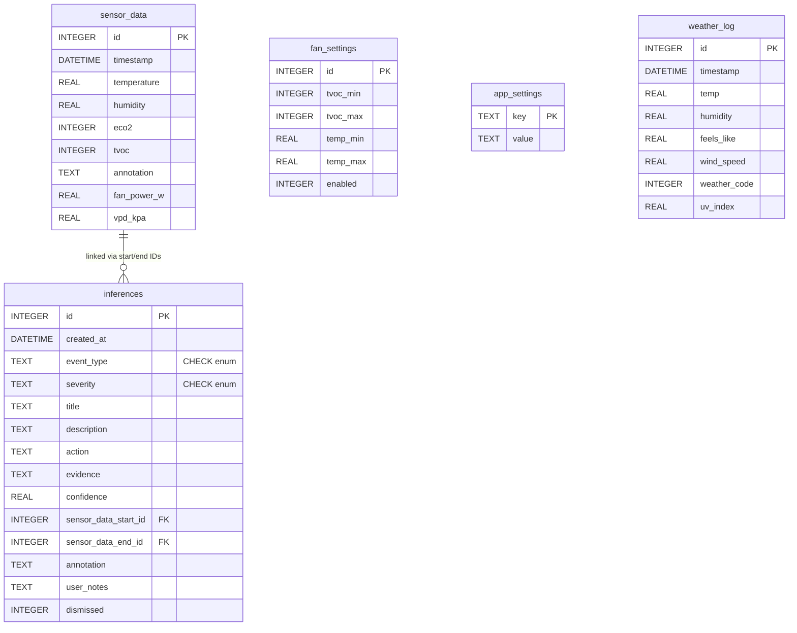

# MLSS Monitor: Mars Life Support Sensor Monitor

A lightweight environmental monitoring system for Raspberry Pi, designed as a prototype for Mars habitat applications. Logs sensor data to SQLite, serves a live web dashboard with historical plots, controls a fan automatically via a Kasa smart plug, and displays status on a small TFT screen.

---

## Hardware

| Component | Purpose |
|---|---|
| Raspberry Pi 4 | Host |
| Adafruit AHT20 | Temperature & humidity (I2C) |
| Adafruit SGP30 | eCO2 & TVOC air quality (I2C) |
| 1.8" ST7735 TFT LCD | Local readout (SPI, 128×160) |
| TP-Link Kasa smart plug | Fan control |

### Wiring — I2C sensors (daisy-chained)

| Signal | Pi GPIO | Wire colour | Connected to |
|---|---|---|---|
| 3.3V | Pin 1 | Red | AHT20 → SGP30 |
| GND | Pin 6 | Black | AHT20 → SGP30 |
| SDA | Pin 3 (GPIO2) | Blue | AHT20 → SGP30 |
| SCL | Pin 5 (GPIO3) | Yellow | AHT20 → SGP30 |

### Wiring — ST7735 LCD (SPI)

| LCD pin | Pi pin | GPIO | Function |
|---|---|---|---|
| GND | 6 | — | Ground |
| VCC | 1 | — | 3.3V power |
| SCL | 23 | GPIO11 | SPI clock |
| SDA | 19 | GPIO10 | SPI MOSI |
| RES | 22 | GPIO25 | Reset |
| DC | 18 | GPIO24 | Data/command |
| CS | 24 | GPIO8 | Chip select |

---

## Features

- Live sensor dashboard with configurable time range (15 min → all time)
- Auto fan control — turns on when temperature or TVOC exceeds configurable thresholds
- Admin/settings page — fan thresholds, auto mode toggle, location configuration
- Manual fan on/off override via API
- Data annotation — mark points of interest directly on the chart
- CSV export of historical readings
- System health endpoint (CPU, memory, uptime, sensor status)
- Outdoor weather — current conditions and 24-hour forecast via [Open-Meteo](https://open-meteo.com) (free, no key)
- UK postcode geocoding via [postcodes.io](https://postcodes.io) (e.g. `LS26`)
- Hourly weather logging with 7-day auto-cleanup
- Session-based authentication with GitHub OAuth 2.0 (via `authlib`) and optional local username/password
- Environment inference engine — continuously analyses sensor data to detect pollution events, threshold breaches, and trends
- Interactive dashboard card popups — tap any card for detailed information about the metric, sensor, or calculation

---

## Installation

### Prerequisites

- Raspberry Pi running Raspberry Pi OS (Bookworm or Bullseye)
- Python 3.11+
- I2C enabled (the setup script handles this)

### First-time setup

```bash
git clone https://github.com/Ryan-be/mars-air-quility.git
cd mars-air-quility
bash scripts/setup_pi.sh
```

The setup script:
1. Installs system build dependencies via `apt` (`python3-dev`, `libssl-dev`, `libjpeg-dev`, etc.)
2. Enables I2C if not already on — **a reboot is required after this step**
3. Configures pip to use [piwheels](https://www.piwheels.org) (pre-built ARM wheels — see below)
4. Installs [Poetry](https://python-poetry.org) if missing
5. Installs project dependencies, skipping heavy optional packages and dev tools
6. Creates the `data/` directory and initialises the SQLite database
7. Creates a default `.env` if one does not exist

> After setup, edit `.env` and set `FAN_KASA_SMART_PLUG_IP` to your plug's IP address.

### Why piwheels?

Many packages with C extensions (Pillow, cryptography, cffi) do not ship pre-built ARM wheels on PyPI. Without piwheels, pip must compile from source on the Pi — which is very slow and can fail due to missing system libraries or memory constraints. piwheels provides pre-compiled ARM wheels for the most common packages, reducing install time from tens of minutes to seconds.

piwheels is configured in `pyproject.toml` as a supplemental source, so Poetry will check it automatically.

### Manual install

```bash
pip config set global.extra-index-url https://www.piwheels.org/simple
poetry install --without visualization --without dev
mkdir -p data
poetry run python database/init_db.py
```

---

## Configuration

Settings are read from `.env` via [Dynaconf](https://www.dynaconf.com) with prefix `MLSS_`. Copy `.env.example` to `.env` and fill in your values.

| Variable | Default | Description |
|---|---|---|
| `ENV_FOR_DYNACONF` | `production` | Dynaconf environment name |
| `LOG_INTERVAL` | `10` | Sensor polling interval (seconds) |
| `LOG_FILE` | `data/log.csv` | Legacy log path |
| `DB_FILE` | `data/sensor_data.db` | SQLite database path |
| `FAN_KASA_SMART_PLUG_IP` | `192.168.1.63` | IP of the Kasa smart plug |
| `MLSS_SECRET_KEY` | dev fallback | Flask session secret — **must be set in production** |
| `MLSS_GITHUB_CLIENT_ID` | *(unset)* | GitHub OAuth App client ID |
| `MLSS_GITHUB_CLIENT_SECRET` | *(unset)* | GitHub OAuth App client secret |
| `MLSS_ALLOWED_GITHUB_USER` | *(unset = any)* | Restrict login to one GitHub username |
| `MLSS_AUTH_USERNAME` | *(unset)* | Local login username (alternative to GitHub OAuth) |
| `MLSS_AUTH_PASSWORD` | *(unset)* | Local login password |

> **Auth note:** authentication is disabled when none of the `MLSS_` auth variables are set — safe for LAN-only use. Set at least one method before exposing to the internet.

---

## Running

### Directly

```bash
poetry run python mlss_monitor/app.py
```

Dashboard available at `http://<pi-ip>:5000`.

### As a systemd service

```bash
# Edit the service file if your username or project path differs from masadmin
sudo cp mlss-monitor.service /etc/systemd/system/
sudo systemctl daemon-reload
sudo systemctl enable --now mlss-monitor

# Check status / follow logs
sudo systemctl status mlss-monitor
sudo journalctl -u mlss-monitor -f
```

---

## Web interface

| URL | Description |
|---|---|
| `/` | Live sensor dashboard |
| `/admin` | Settings — fan thresholds, auto mode, location |
| `/login` | Sign-in page (GitHub OAuth or local credentials) |
| `/system_health` | JSON system status |

## API reference

| Method | Endpoint | Description |
|---|---|---|
| `GET` | `/api/data?range=24h` | Sensor readings. `range`: `15m` `1h` `6h` `12h` `24h` `all` |
| `GET` | `/api/download?range=24h` | Download as CSV |
| `POST` | `/api/annotate?point=<id>` | Add annotation — body: `{"annotation": "text"}` |
| `DELETE` | `/api/annotate?point=<id>` | Remove annotation |
| `POST` | `/api/fan?state=on\|off\|auto` | Manual fan control or switch to auto mode |
| `GET` | `/api/fan/status` | Current plug state |
| `GET` | `/api/fan/settings` | Auto fan threshold settings |
| `POST` | `/api/fan/settings` | Update settings — body: `{"temp_max": 25.0, "tvoc_max": 600, "enabled": true, ...}` |
| `GET` | `/api/weather` | Current outdoor conditions (90-min DB cache) |
| `GET` | `/api/weather/forecast` | 24-hour hourly forecast from Open-Meteo |
| `GET` | `/api/geocode?q=<query>` | Geocode a place name or UK postcode |
| `GET` | `/api/settings/location` | Get saved location |
| `POST` | `/api/settings/location` | Save location — body: `{"lat": 53.7, "lon": -1.5, "name": "LS26"}` |
| `GET` | `/api/settings/energy` | Get saved energy unit rate |
| `POST` | `/api/settings/energy` | Save energy unit rate — body: `{"rate_pence": 28.5}` |
| `GET` | `/api/inferences?limit=50` | List environment inferences (most recent first). `dismissed=1` includes dismissed. |
| `POST` | `/api/inferences/<id>/notes` | Save user notes on an inference — body: `{"notes": "text"}` |
| `POST` | `/api/inferences/<id>/dismiss` | Dismiss an inference (hides from default list) |

---

## Database design

MLSS uses a single SQLite file (`data/sensor_data.db`) with five tables.



### Table notes

| Table | Purpose | Retention |
|---|---|---|
| `sensor_data` | One row per sensor poll (every `LOG_INTERVAL` seconds). Annotatable. | Indefinite — export to CSV and prune manually if disk fills. |
| `fan_settings` | Single row — current fan auto-mode thresholds. | Permanent config. |
| `app_settings` | Key/value store. Holds `location_lat`, `location_lon`, `location_name`, `energy_unit_rate_pence`. | Permanent config. |
| `weather_log` | One row per hourly weather fetch from Open-Meteo. | Auto-purged after 7 days by `_weather_log_loop`. |
| `inferences` | Environment inferences generated by the inference engine. Each row links to a range of `sensor_data` rows, stores evidence JSON, confidence score, and optional user notes. | Indefinite — dismiss to hide, or delete manually. |

### Key design decisions

- **`CREATE TABLE IF NOT EXISTS` + `ALTER TABLE` migrations** — `create_db()` is idempotent and safe to call on startup, making schema migrations automatic on new deployments or after updates.
- **Single-row `fan_settings`** — keeps settings retrieval trivial (`SELECT * … LIMIT 1`) at the cost of not maintaining a history of threshold changes.
- **`app_settings` as a key/value table** — avoids repeated schema migrations for each new configuration option; new keys are simply upserted.
- **`weather_log` rolling window** — capping at 7 days keeps the database small (≈ 168 rows max) while providing enough history for trend analysis.
- **`inferences` evidence as JSON TEXT** — the `evidence` column stores a JSON object with key-value pairs specific to each event type. This avoids needing separate columns for every possible metric while keeping data queryable via `json_extract()` in SQLite 3.38+.

---

## Inference engine

The inference engine (`mlss_monitor/inference_engine.py`) continuously analyses incoming sensor data and generates actionable insights about your environment. It runs every ~60 seconds from the background logging thread and writes results to the `inferences` table.

### How it works

1. **Data window** — each analysis cycle fetches the last 30 minutes of sensor readings from SQLite.
2. **Detectors** — nine independent detectors examine the data for specific patterns:

**Short-term detectors** (run every ~60 seconds, analyse last 30 minutes):

| Detector | Event type | What it looks for |
|---|---|---|
| TVOC spike | `tvoc_spike` | Sudden TVOC rise > 2× the rolling baseline and above the moderate threshold |
| eCO₂ threshold | `eco2_elevated` / `eco2_danger` | eCO₂ crossing the cognitive impairment or danger thresholds |
| Temperature extreme | `temp_high` / `temp_low` | Temperature sustained outside the comfort zone |
| Humidity extreme | `humidity_high` / `humidity_low` | Humidity sustained outside the ideal range |
| VPD extreme | `vpd_low` / `vpd_high` | Vapour pressure deficit outside the plant-optimal range |
| Correlated pollution | `correlated_pollution` | TVOC and eCO₂ rising together (Pearson r > 0.6) — suggests a common source |
| Rapid change | `rapid_temp_change` / `rapid_humidity_change` | Temperature swing > 3°C or humidity swing > 15% within a short window |
| Sustained poor air | `sustained_poor_air` | TVOC or eCO₂ high for 10+ of the last 12 readings |
| Annotation context | `annotation_context_<id>` | Links user annotations to notable sensor conditions |

**Hourly detectors** (run every ~1 hour, analyse last 60 minutes):

| Detector | Event type | What it looks for |
|---|---|---|
| Hourly summary | `hourly_summary` | Full statistical summary — averages, trends, stability assessment, and issue count |

**Daily detectors** (run every ~24 hours, analyse last 24 hours):

| Detector | Event type | What it looks for |
|---|---|---|
| Daily summary | `daily_summary` | Comprehensive report with environment score (0–100), time-in-zone percentages, VPD analysis, and annotation count |
| Daily patterns | `daily_pattern` | Recurring pollution at specific hours (e.g. cooking at 18:00, morning commute) |
| Overnight build-up | `overnight_buildup` | eCO₂ rising > 200 ppm between 23:00–07:00 (closed bedroom pattern) |

3. **Startup backfill** — on application start, the engine immediately checks for missing hourly and daily summaries. If the last hourly summary is >1 hour old or the last daily summary is >23 hours old, it analyses historical data from the database and generates the missing reports. This means you get long-term insights immediately after a restart, without waiting for new data.
4. **Deduplication** — each detector checks if an inference of the same type was already created within a cooldown window (1–24 hours depending on type) before saving a new one.
4. **Confidence scoring** — each inference includes a confidence value (0.0–1.0) based on how strongly the data supports the conclusion.
5. **Annotation awareness** — detectors check for user annotations on nearby data points and include them as context in the inference.

### Thresholds

All thresholds are defined as constants at the top of `inference_engine.py`:

| Constant | Default | Unit | Used by |
|---|---|---|---|
| `TVOC_HIGH` | 500 | ppb | TVOC spike (WHO "high") |
| `TVOC_MODERATE` | 250 | ppb | TVOC spike, sustained poor air (WHO "good" ceiling) |
| `ECO2_COGNITIVE` | 1000 | ppm | eCO₂ threshold (cognitive impairment) |
| `ECO2_DANGER` | 2000 | ppm | eCO₂ threshold (headaches, drowsiness) |
| `TEMP_HIGH` | 28.0 | °C | Temperature extreme |
| `TEMP_LOW` | 15.0 | °C | Temperature extreme |
| `HUM_HIGH` | 70.0 | % | Humidity extreme (mould risk) |
| `HUM_LOW` | 30.0 | % | Humidity extreme (dry air) |
| `VPD_LOW` | 0.4 | kPa | VPD extreme (saturated air) |
| `VPD_HIGH` | 1.6 | kPa | VPD extreme (plant stress) |
| `SPIKE_FACTOR` | 2.0 | × | Multiplier above rolling mean for spike detection |
| `MIN_READINGS` | 6 | count | Minimum data points required before analysis runs |

To customise thresholds, edit the constants in `mlss_monitor/inference_engine.py`. A future release may expose these via the admin settings page.

### Inference output

Each inference stored in the database includes:

- **event_type** — constrained enum via CHECK: `tvoc_spike`, `eco2_danger`, `eco2_elevated`, `correlated_pollution`, `sustained_poor_air`, `mould_risk`, `temp_high`, `temp_low`, `humidity_high`, `humidity_low`, `vpd_low`, `vpd_high`, `rapid_temp_change`, `rapid_humidity_change`, `hourly_summary`, `daily_summary`, `daily_pattern`, `overnight_buildup`, or `annotation_context_*`
- **severity** — constrained enum via CHECK: `info`, `warning`, or `critical`
- **title** — human-readable one-line summary
- **description** — plain-English explanation of what was detected and why it matters
- **action** — recommended steps to address the issue
- **evidence** — JSON object with the specific data points that triggered the inference
- **confidence** — 0.0–1.0 score indicating how strongly the data supports the conclusion
- **sensor_data_start_id / end_id** — links to the range of sensor readings analysed
- **annotation** — any user annotations found on the relevant data points
- **user_notes** — editable field for users to add their own observations via the dashboard

---

## Productionisation checklist

These steps are required before safely exposing MLSS to the internet.

### ✅ Application-level safeguards (implemented in code)

| Feature | Status |
|---|---|
| GitHub OAuth login flow (`/auth/github`, `/auth/callback`) | ✅ Implemented |
| Local username/password login (`/login`) | ✅ Implemented |
| Session guard — redirects unauthenticated users | ✅ Implemented |
| `MLSS_ALLOWED_GITHUB_USER` filtering | ✅ Implemented |
| `MLSS_SECRET_KEY` loaded from config/env | ✅ Implemented |
| Startup log confirms auth status (`🔒 Auth ENABLED`) | ✅ Implemented |
| Weather log rolling window (auto-purge > 7 days) | ✅ Implemented |
| CI pipeline — separate lint + test workflows | ✅ Implemented |
| Pylint 10/10 score enforced in CI | ✅ Implemented |
| Unit test suite (fan settings, async, resilience, open-meteo, forecasts, weather history) | ✅ Implemented |

### 🔐 Authentication & secrets (deployment)

#### Why a plain `.env` is not enough

If a threat actor gets shell access (e.g. via a compromised SSH key or a vulnerability in another service), a `.env` file sitting in the project directory is readable by any process running as that user — including an interactive shell. They can simply `cat .env` and harvest your GitHub OAuth credentials and `SECRET_KEY` instantly.

The fix is to **separate non-secret config from secrets**, and store secrets in a root-owned file that the service process can read at runtime but an attacker's shell session cannot.

#### Recommended approach — root-owned secrets file + systemd `EnvironmentFile`

This works on any Raspberry Pi OS installation (no extra software needed):

**1. Create a dedicated secrets file outside the project directory**

```bash
sudo mkdir -p /etc/mlss
sudo touch /etc/mlss/secrets.env
sudo chmod 600 /etc/mlss/secrets.env   # only root can read/write
sudo chown root:root /etc/mlss/secrets.env
```

**2. Populate it with your real secrets (edit as root)**

```bash
sudo nano /etc/mlss/secrets.env
```

```ini
MLSS_SECRET_KEY=replace-with-output-of-python3-c-import-secrets-print-secrets-token_hex-32
MLSS_GITHUB_CLIENT_ID=your_client_id
MLSS_GITHUB_CLIENT_SECRET=your_client_secret
MLSS_ALLOWED_GITHUB_USER=your_github_username
```

Generate a strong secret key with:
```bash
python3 -c "import secrets; print(secrets.token_hex(32))"
```

**3. Keep `.env` for non-secret config only**

Your `.env` (in the project directory) should contain only things you don't mind being seen:
```ini
ENV_FOR_DYNACONF=production
LOG_INTERVAL=10
LOG_FILE=data/log.csv
DB_FILE=data/sensor_data.db
FAN_KASA_SMART_PLUG_IP=192.168.1.x
```

Never put `MLSS_SECRET_KEY`, `MLSS_GITHUB_CLIENT_ID`, or `MLSS_GITHUB_CLIENT_SECRET` in `.env`.

**4. Reference the secrets file in the systemd unit**

The service file uses `EnvironmentFile=/etc/mlss/secrets.env`. systemd reads the file as root before dropping privileges to the service user, so the service gets the vars injected into its environment without the service user ever being able to read the file directly.

See [`mlss-monitor.service`](mlss-monitor.service) — it already includes this `EnvironmentFile` directive.

**5. What this protects against**

| Threat | Protected? |
|---|---|
| Attacker with shell as service user (`masadmin`) | ✅ `/etc/mlss/secrets.env` is root-owned `600` — they cannot read it |
| `cat .env` from the project directory | ✅ Secrets are no longer in `.env` |
| Reading vars from `/proc/<pid>/environ` | ⚠️ Readable by the process owner — if attacker *is* the service user, env vars are visible there. Mitigate by running as a dedicated low-privilege user with no login shell. |
| Offline SD card clone | ⚠️ Root-owned files are readable if you mount the card as root. Use `systemd-creds` (see below) to protect against this. |

#### Advanced: `systemd-creds` (encryption at rest)

Raspberry Pi OS Bookworm ships systemd 252, which supports `systemd-creds`. This encrypts secrets with a key derived from the machine's identity, so they cannot be read even if someone clones the SD card.

```bash
# Encrypt each secret (run as root, once)
sudo systemd-creds encrypt --name=MLSS_SECRET_KEY -
# (paste the value, press Ctrl+D — outputs a ciphertext blob)
```

Then in the service unit, replace `EnvironmentFile` with `SetCredentialEncrypted=` directives and read them via `$CREDENTIALS_DIRECTORY`. This is the highest protection level available without a TPM module or external vault. See [systemd.exec(5) — Credentials](https://www.freedesktop.org/software/systemd/man/systemd.exec.html#Credentials) for details.

For most home Pi deployments the root-owned file approach (steps 1–4 above) provides a strong, practical security boundary without added complexity.

#### Checklist

- [ ] **Set `MLSS_SECRET_KEY`** to a cryptographically random value in `/etc/mlss/secrets.env`.
- [ ] **Configure GitHub OAuth** — create an OAuth App at `https://github.com/settings/developers`. Set callback URL to your domain (`https://yourdomain.com/auth/callback`).
- [ ] **Set `MLSS_ALLOWED_GITHUB_USER`** to restrict access to your account only.
- [ ] `/etc/mlss/secrets.env` is owned `root:root` with mode `600`.
- [ ] `.env` in the project directory contains **no secrets** — only non-sensitive config.
- [ ] Confirm startup log shows `🔒 Auth ENABLED` before opening firewall.

### 🌐 TLS / HTTPS (nginx reverse proxy)

Running Flask directly on port 5000 over plain HTTP is not safe on the internet.
Use **nginx** as a reverse proxy with a TLS certificate from Let's Encrypt.

1. **Install nginx and certbot**
   ```bash
   sudo apt install nginx certbot python3-certbot-nginx -y
   ```

2. **Create an nginx site config** at `/etc/nginx/sites-available/mlss`:
   ```nginx
   server {
       listen 80;
       server_name yourdomain.com;
       return 301 https://$host$request_uri;
   }

   server {
       listen 443 ssl;
       server_name yourdomain.com;

       ssl_certificate     /etc/letsencrypt/live/yourdomain.com/fullchain.pem;
       ssl_certificate_key /etc/letsencrypt/live/yourdomain.com/privkey.pem;
       ssl_protocols       TLSv1.2 TLSv1.3;
       ssl_ciphers         HIGH:!aNULL:!MD5;

       # Rate limiting — protects login endpoint
       limit_req_zone $binary_remote_addr zone=login:10m rate=5r/m;

       location /login {
           limit_req zone=login burst=10 nodelay;
           proxy_pass http://127.0.0.1:5000;
           proxy_set_header Host $host;
           proxy_set_header X-Real-IP $remote_addr;
           proxy_set_header X-Forwarded-For $proxy_add_x_forwarded_for;
           proxy_set_header X-Forwarded-Proto $scheme;
       }

       location / {
           proxy_pass http://127.0.0.1:5000;
           proxy_set_header Host $host;
           proxy_set_header X-Real-IP $remote_addr;
           proxy_set_header X-Forwarded-For $proxy_add_x_forwarded_for;
           proxy_set_header X-Forwarded-Proto $scheme;
       }
   }
   ```

3. **Enable and obtain certificate**
   ```bash
   sudo ln -s /etc/nginx/sites-available/mlss /etc/nginx/sites-enabled/
   sudo nginx -t
   sudo systemctl reload nginx
   sudo certbot --nginx -d yourdomain.com
   ```

4. **Auto-renew** (certbot installs a cron/timer automatically — verify with):
   ```bash
   sudo certbot renew --dry-run
   ```

### 🌍 Domain / DDNS

You need a hostname that points to your public IP. Options:

| Option | Cost | Notes |
|---|---|---|
| [DuckDNS](https://www.duckdns.org) | Free | `yourname.duckdns.org` — update script runs on Pi via cron |
| [No-IP](https://www.noip.com) | Free tier | Similar to DuckDNS |
| Custom domain | ~£10/yr | Point an A record at your public IP; best with a static IP or DDNS |

DuckDNS cron update (every 5 minutes):
```bash
# Add to crontab -e
*/5 * * * * curl -s "https://www.duckdns.org/update?domains=yourname&token=YOUR_TOKEN&ip=" > /dev/null
```

### 🔥 Firewall (ufw)

Block direct access to the Flask port; only allow nginx traffic:

```bash
sudo ufw allow OpenSSH
sudo ufw allow 'Nginx Full'   # 80 + 443
sudo ufw deny 5000            # block Flask from external access
sudo ufw enable
sudo ufw status
```

### 🛡️ Additional hardening

- [ ] **fail2ban** — auto-ban IPs with repeated failed logins:
  ```bash
  sudo apt install fail2ban -y
  # Configure /etc/fail2ban/jail.local for nginx
  ```
- [ ] **Unattended upgrades** — keep OS patched automatically:
  ```bash
  sudo apt install unattended-upgrades -y
  sudo dpkg-reconfigure unattended-upgrades
  ```
- [ ] **SSH key-only auth** — disable password SSH login (`PasswordAuthentication no` in `/etc/ssh/sshd_config`).
- [ ] **DB backups** — add a cron job to copy `data/sensor_data.db` to a safe location:
  ```bash
  # Add to crontab -e
  0 3 * * * cp ~/mars-air-quality/data/sensor_data.db ~/backups/sensor_$(date +\%Y\%m\%d).db
  ```
- [ ] **Log rotation** — ensure journald or a logrotate config is set so logs don't fill the SD card.
- [ ] **Flask `SESSION_COOKIE_SECURE=True`** — ensure session cookies are HTTPS-only (set once TLS is in place).

### ✅ Pre-launch checklist summary

| # | Task | Done |
|---|---|---|
| 1 | `/etc/mlss/secrets.env` created, owned `root:root`, mode `600` | ☐ |
| 2 | `MLSS_SECRET_KEY` set to random 32-byte hex in `/etc/mlss/secrets.env` | ☐ |
| 3 | GitHub OAuth App created with HTTPS callback URL | ☐ |
| 4 | `MLSS_ALLOWED_GITHUB_USER` set in `/etc/mlss/secrets.env` | ☐ |
| 5 | `.env` in project directory contains no secrets (only non-sensitive config) | ☐ |
| 6 | nginx installed and reverse-proxying port 5000 | ☐ |
| 7 | TLS certificate obtained from Let's Encrypt | ☐ |
| 8 | HTTPS redirect in nginx (port 80 → 443) | ☐ |
| 9 | Rate limiting on `/login` in nginx config | ☐ |
| 10 | Port 5000 blocked in ufw | ☐ |
| 11 | fail2ban installed and configured for nginx | ☐ |
| 12 | SSH key-only auth enabled | ☐ |
| 13 | Unattended upgrades enabled | ☐ |
| 14 | Daily DB backup cron job | ☐ |
| 15 | `🔒 Auth ENABLED — GitHub OAuth` confirmed in service log | ☐ |
| 16 | End-to-end test: login → dashboard → logout from external network | ☐ |

---

## Development

### Running tests

```bash
poetry install --with dev
poetry run pytest tests/ -v
```

Tests are organised into four files:

| File | Covers |
|---|---|
| `tests/test_fan_settings.py` | DB layer round-trips, API GET/POST, admin page |
| `tests/test_async.py` | thread_loop integration, async dispatch patterns, error handling |
| `tests/test_pi_resilience.py` | Sensor failures, DB init idempotency, `/proc/uptime` fallback, background thread survival |
| `tests/test_open_meteo.py` | Geocoding (UK postcode, outcode, place name), current weather, forecast |
| `tests/test_daily_forecast.py` | 14-day daily forecast API — keys, URL params, error propagation |
| `tests/test_weather_history.py` | Weather history DB function — filtering, ordering, required keys |

Hardware libraries (`board`, `busio`, `adafruit_*`) are stubbed in `tests/conftest.py` so all tests run on any machine.

### Linting

```bash
poetry run pip install pylint
poetry run pylint $(git ls-files '*.py')
```

### Optional visualization dependencies

`pandas` and `matplotlib` are not used by the web app. If you need them for data analysis:

```bash
poetry install --with visualization
```

---

## Project structure

```
mlss_monitor/
  app.py                      Flask app factory, hardware init, background loops
  state.py                    Shared mutable state (fan mode, hardware refs, event loop)
  inference_engine.py         Environment analysis — 9 detectors, pollution event flagging
  routes/
    __init__.py               Blueprint registration (8 blueprints)
    auth.py                   Login, logout, GitHub OAuth
    pages.py                  Page routes (dashboard, history, controls, admin)
    api_data.py               Sensor data API (fetch, CSV download, annotations)
    api_fan.py                Fan control API (toggle, status, settings)
    api_weather.py            Weather API (current, hourly/daily forecast, history, geocode)
    api_settings.py           Settings API (location, energy rate)
    api_inferences.py         Inference API (list, notes, dismiss)
    system.py                 System health endpoint
database/
  db_logger.py                SQLite read/write helpers
  init_db.py                  Schema creation — safe to re-run on existing DB
  import_csv_to_db.py         One-off CSV import utility
sensor_interfaces/
  aht20.py                    AHT20 temperature/humidity driver
  sgp30.py                    SGP30 eCO2/TVOC driver (15 s warm-up on startup)
  display.py                  ST7735 TFT display driver
  sb_components_pm_sensor.py  Particulate matter sensor driver
external_api_interfaces/
  kasa_smart_plug.py          Async TP-Link Kasa plug control
  open_meteo.py               Open-Meteo weather + forecast + UK geocoding client
templates/
  base.html                   Shared layout (nav bar, auth controls)
  dashboard.html              Live sensor dashboard with forecasts
  history.html                Tabbed historical charts (sensors, environment, correlation, patterns)
  controls.html               Device control hub (fan, future devices)
  admin.html                  Settings — fan thresholds, energy rate, location
  login.html                  Sign-in page (GitHub OAuth + local credentials)
static/
  css/
    base.css                  Shared reset, nav, cards, light/dark toggle, mobile fixes
    dashboard.css             Dashboard-specific layout and components
    history.css               Tab bar, chart info popups, correlation brush/inference styles
    controls.css              Device grid and control card styles
    admin.css                 Settings page styles
  js/
    dashboard.js              Boot, data polling, weather/forecast, card popups, inference feed
    history.js                Tab switching, lazy chart rendering, data fetch
    insights.js               Derived calculations, weather + forecast rendering
    charts.js                 Plotly sensor chart rendering (temp, hum, eco2, tvoc)
    charts_env.js             Environment charts (indoor/outdoor overlay, abs humidity, dew point, fan state, VPD)
    charts_correlation.js     Time-brush, scatter plots, regression, inference engine
    charts_patterns.js        Pattern analysis (hour-of-day heatmap, daily temp range)
    controls.js               Device control page (fan polling, status dot)
    fan.js                    Fan control API calls
    health.js                 System health polling
    theme.js                  Light/dark mode toggle
scripts/
  setup_pi.sh                 First-run setup script for Raspberry Pi
tests/
  conftest.py                 Pytest fixtures, hardware + auth stubs
  test_fan_settings.py        Fan settings DB and API tests
  test_async.py               Async dispatch and thread-loop tests
  test_pi_resilience.py       Pi-specific resilience tests
  test_open_meteo.py          Open-Meteo client unit tests
  test_daily_forecast.py      Daily forecast API tests
  test_weather_history.py     Weather history DB function tests
config.py                     Dynaconf configuration loader
mlss-monitor.service          systemd unit file
.env.example                  Template for environment variables
```

---

## Known limitations

| Issue | Detail |
|---|---|
| `data/` directory must exist before starting | SQLite will fail if the directory is missing. The setup script creates it; for manual installs run `mkdir -p data`. |
| `RPi.GPIO` not in `pyproject.toml` | This Pi-only package fails to build on non-Pi platforms so it is excluded from the lock file. The setup script installs it via `poetry run pip install RPi.GPIO`. For manual installs run that command after `poetry install`. |
| SGP30 15 s warm-up | The first few eCO2/TVOC readings after power-on may be inaccurate — this is normal sensor behaviour. |
| Kasa `SmartPlug` API deprecated | The `python-kasa` library has deprecated `SmartPlug` in favour of `IotPlug`. A migration warning appears on startup; functionality is unaffected for now. |
| Flask dev server | `app.run()` uses Flask's single-threaded development server. For production, use gunicorn behind nginx: `poetry run gunicorn -w 2 -b 127.0.0.1:5000 "mlss_monitor.app:app"` |
